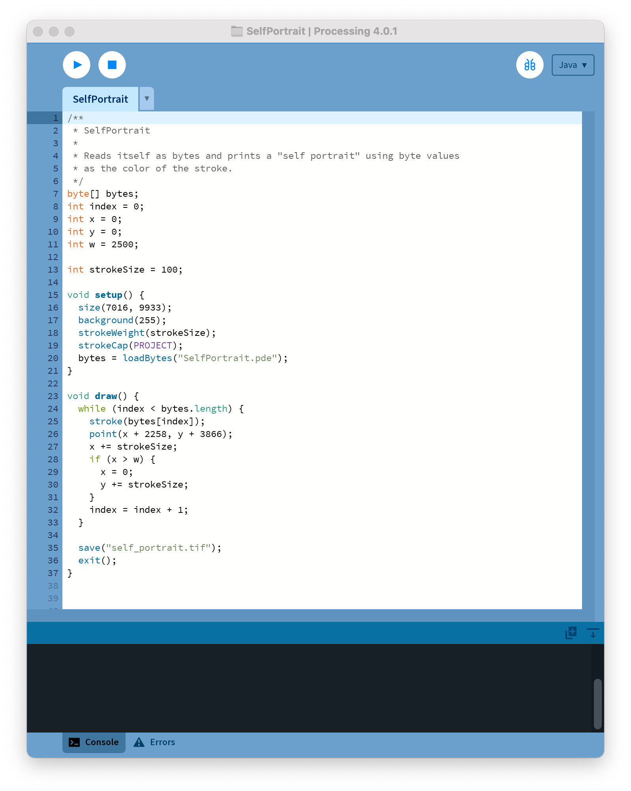
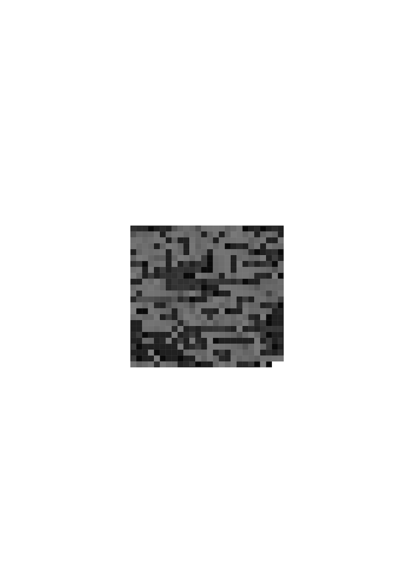

These works are some highlights from earlier versions of the course.

- Introduction to Creative Coding
- Software Studies: Programming for Artists
- Programming for Artists
- Programming for Visual Artists

## Open Processing Classes

- [2021 Introduction to Creative Coding](https://openprocessing.org/class/70856)
- [2020 Introduction to Creative Coding](https://openprocessing.org/class/65461)
- [2019 Fall Programming for Artists](https://openprocessing.org/class/60756)
- [2019 Spring Programming for Artists](https://openprocessing.org/class/59452)
- [2019 Programming for Visual Artists](https://openprocessing.org/class/59452)
- [2018 Programming for Visual Artists](https://openprocessing.org/class/57535)
- [2018 Programming for Sculptors](https://openprocessing.org/class/57204)
- [2017 November Programming for Artists](https://openprocessing.org/class/56916)
- [2017 Fall Programming for Artists](https://openprocessing.org/class/56725)
- [2017 Programming for Visual Artists](https://openprocessing.org/class/56054)
- [2017 Programming for Sculptors](https://openprocessing.org/class/55905)
- [2016 Programming for Artists](https://openprocessing.org/class/55664)

## 2021

### Katie Ballinger: Kaleido

[See the project from the Demo Day website](https://medialabdemoday.aalto.fi/portfolio/katie-ballinger-kaleido/)

### Utu Kärki: SelfPortrait

An example of that highlights well this idea of creating a computational poem. This is a program that reads itself (the .pde file containing the code) and draws the bytes as squares where the color is the byte converted into a grayscale value. The work was shown as two posters: one with the code and the other with the self portrait.

## 2020

<iframe src="https://openprocessing.org/sketch/986464/embed/?plusEmbedHash=NDk3ZjhiMjRiM2E1NTkxZjQ3YmNjZDY1NGRlMGQ0M2M0ZjQyMDY5MGVkMTVjMmQ5M2U3NmE0MDIxOTMzNTZhODIyYTViNGEwYzg2ZjU4NWZkNjhkNjdhYmRiMDkxZGQ5NDFiMjFkNDdiMTFlYWMwYzViNDc3ZGNiOGViNTAxNDlxWnZ6VVFFWnZjekM1MytxK1BoKzRZbk9pT3lLR1FwcndXa3pEaVpiV0xWWkZEQVJRMXhUQnBCdGlWS1NzckZyNDVROUxER0MwOUs2V0pGS0dMOTJiUT09&plusEmbedTitle=true" width="100%" height="600"></iframe>

<iframe src="https://openprocessing.org/sketch/986661/embed/?plusEmbedHash=MzQ1YmEwNzAyNDUyNTUxNzEzMTc2NGM5MTFiZjEyOTRlZmJhMGUyNzA0YjkxOTU1NzA3M2ZiYTUwOGM2NmVjZTkxMzJhNmQwYTNiZjJjMmU5Yjg4ODc5NjdlMjhmOWI1YjM5OWU2M2JiODRjNDZjNWE1NWU4OWYwMThjYjZjNDBIYm1tUXd0UWllSWhidDlBV1BtY3pJVVlFZmF4WXpUbFE2TVRtMjR4L0Mxa0xZdFM3VktMSTRuMUtBc25hVTc3cnJDaE9XazdFbVdCNW4yb3ZINW9tdz09&plusEmbedTitle=true" width="100%" height="600"></iframe>

## 2019

### Anssi Alhopuro: Room With a Cat

Sound synthesis with Pure Data and visuals with Processing. The two programs are connected using OSC.



### Anze Bratus: Motion Controlled Sample Player



## 2018

### Joonas Väänänen: Gem Runner

Joonas created a really clever simple game. One of the highlights of the project was that he had implemented a level designer using a text file.

### Jongbin Kim

<iframe src="https://openprocessing.org/sketch/528048/embed/?plusEmbedHash=MTI2MTRjZGZlODdhOThiYmQ3NmU0ODIzOGVmNDk2ZjJkYTE1MjhjODc3NzJiNjc1YmQ3ZDNiYzY0Nzc5Y2Y5OGQwMmMwMGZjZDQyNTI0YTJmYjI4MGYzYWYyNDJiMjUxZGUyMWJhYmJlYWU4MzFhN2QwZTMzZTYyMjA2NDhmNDF3KzE1a0dSYzhabGM5QnMzVGpkczR1NDFVSmlGV05FeGlZb29PZldGOFBmZ1Y0VUltVS9XN0JSSEFmZ3ZONE0wdzZoRm1MWEdtU1I3Z2J1TnZzMzlrdz09&plusEmbedTitle=true" width="100%" height="600"></iframe>

### Hyoeun Park

<iframe src="https://openprocessing.org/sketch/527651/embed/?plusEmbedHash=MjcxYzk5NzA0OWRjMmM2ODM4NWY5MTc3ZDU1OThiNzdmNGE0ZTYyZjYyYzhmMzc4NGE1MDU0ZTM3MDI3OTU4MjYzOGNmNzg4ZDQwZWRjMDdlMWM0ZmYwMDI3MDM1ZTU5YTQ0MDYyZTVjNjA4MWNmMGI4ZDhjZTIzMDY2NmQ3MDlVanJqNTR6SGxWdkFQdHRZTjdOanlNME5yZjFOTVRtSFY1MGV2Mi84SHp6MjlhS1ZlaWs4dDBqbW1TMHJkWUZDMURubDJEVVFlQnUyZzY0LzR2L204dz09&plusEmbedTitle=true" width="100%" height="600"></iframe>

### Miila

<iframe src="https://openprocessing.org/sketch/527442/embed/?plusEmbedHash=MTBkNGExYzg5Y2RiMzMxYjYyNzRhMzliYzU4YTYyY2ZhM2FiMjY1ODczN2UwMDc3ZGU0MDgwZDRlMTIxMjYwNTU0Yjk1ZTM3OWQ5MzViMzZiY2U1NDk4ODkwNDY1MGRlMWIwOWFjZDUxNTJmOWI5ZThmNDRiZmFiYjA3NDJmNTJvYUkrNWllbXFPcVY5SmZXYm4rY01xWTRaTzRCYzhSVmNMVFUrT3ZPd2xaUmVFSHd4TEUrYWNlVFk3TzZRdjJqbDdvbi9KaGpORUh4U2VhOWMvb2JyUT09&plusEmbedTitle=true" width="100%" height="600"></iframe>