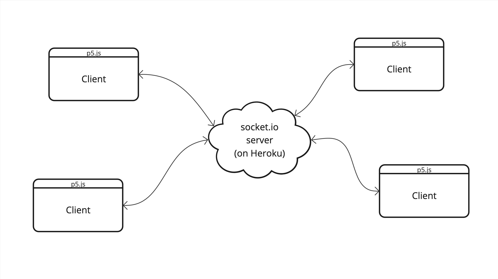


- November 14, 2024
- 9:15–12:00
- Room 3448 (Marsio)


---

## Mobile phone sensors

Many mobile phones have built-in sensors (accelerometers, gyroscopes, compass etc.). You are able to access some of this data in your p5.js sketch. [See the Events section from the p5.js reference.](https://p5js.org/reference/#group-Events)

We are going to use the rotation values today:

- [rotationX](https://p5js.org/reference/#/p5/rotationX)
- [rotationY](https://p5js.org/reference/#/p5/rotationY)
- [rotationZ](https://p5js.org/reference/#/p5/rotationZ) (only if your device has a compass)

- [My example](https://editor.p5js.org/mnstri/sketches/3FMgL5M0f)

### Request Permission (iOS 13)

On some devices, you are able to just use the sensor data directly. On Apple mobile devices that are running iOS 13 or higher, you need to specifically ask for the permission to use the sensors.

```js
let button;
function setup() {
  createCanvas(400, 400);
  button = createButton("Click to allow access to sensor");
  button.mousePressed(DeviceOrientationEvent.requestPermission);
}

function draw() {
  background(220);
  text(rotationY, 100,100);
  let x = map(rotationY,-90,90,0,width);
  let y = map(rotationX,-90,90,0,height);
  circle(x,y,50);
}
```

---

## Websockets

[](./img/socketio.jpg)

### socket.io library

Import the socket.io library to your sketch by adding the following line to your `index.html` file.

```js
<script src="https://cdnjs.cloudflare.com/ajax/libs/socket.io/2.3.0/socket.io.js"></script>
```

### Server

For this class I have made a simple server that receives all incoming messages and broadcasts them to the other clients. See the link in MyCourses. The coding train tutorial shows how you could make your own server.

- [This is the code for the serve I used](https://github.com/mnstri/node-socket.io/tree/main)
- [Documentation here](https://devcenter.heroku.com/articles/node-websockets#option-2-socket-io)

### Client | p5.js code

```js
let socket;

function setup() {
  createCanvas(windowWidth, windowHeight);
  socket = io.connect(""); //Add the server url here. You can find it from Mycourses.
  socket.on('mouse', gotData);
}

function draw() {
  //background(220);
}

function mouseDragged() {
  let data = {
    x: mouseX,
    y: mouseY,
  };
  socket.emit("mouse", data);
  // Draw a circle with the defined color
  fill(255,0,0);
  noStroke();
  ellipse(data.x, data.y, 20, 20);
}

function gotData(data) {
  console.log("Got: " + data.x + " " + data.y);
  // Draw a blue circle
  fill(data.c);
  noStroke();
  ellipse(data.x, data.y, 20, 20);
}
```