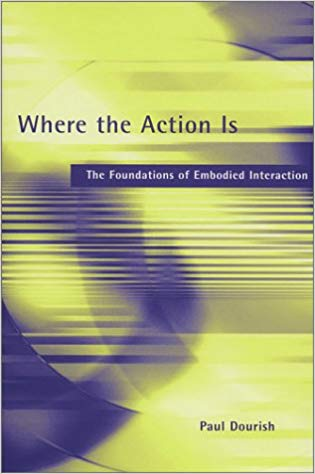

# Week 01 | Introduction

---

## Thursday, March 3, 2022

### Introduction

[See the home page of the course for basic information of the course.](../)

### Examples from previous years

[Go here to see some examples from previous years](../showcase/)

### A Brief History of Human-Computer Interaction

Presentation file coming soon: 

### Homework

#### TouchDesigner Basics

**Those of you who are not taking Audiovisual Studio**, get familiar with TouchDesigner, we are going to use that as our tool for exploring many of the technologies. I will generally also provide code examples and other materials for other programming environments and languages, but the main tool we are going to use is TouchDesigner. Watch at minimum this video:

<iframe src="https://aalto.cloud.panopto.eu/Panopto/Pages/Embed.aspx?id=51dc3ede-cf7d-47e9-ad5e-acdf0126d2e3&amp;autoplay=false&amp;offerviewer=true&amp;showtitle=true&amp;showbrand=false&amp;start=0&amp;interactivity=all" style="border: 1px solid #464646;" allowfullscreen="" allow="autoplay" width="100%" height="405"></iframe>

And at least the first hour of this one:



This video from Ben Voigt explains all of the basic functionality and beyond of TouchDesigner. I highly recommend watching it. We will cover many of these things as we go along, but here are many of the basic techniques all in one video. It is also quite helpful to come back to this one every now and then once you have learned some things already. You will learn many things that you missed the first time you watched it.

---

## Friday, March 4, 2022

### Inspiration





[Imogen Heap: MiMU Gloves](https://mimugloves.com/)

### Embodied Interaction

- Dourish, Paul. [Where the Action Is](https://mitpress.mit.edu/books/where-action)

### Affordances

[What are Affordances?](https://www.interaction-design.org/literature/topics/affordances)

### Proxemics and Proxemic Interaction

A field of study that deals with how people use and arrange space around them, and what type of interactions and disctances are comfortable depending on the context.

- Hall, Edward, T. [The Hidden Dimension](https://archive.org/details/hiddendimensionhall00hall)



- [Proxemic Interactions](https://interactions.acm.org/archive/view/january-february-2011/proxemic-interactions1)
- [Proxemic Interactions: From Theory to Practice](https://www.morganclaypool.com/doi/abs/10.2200/S00619ED1V01Y201502HCI025)
- [Dark patterns in proxemic interactions: a critical perspective](https://dl.acm.org/doi/abs/10.1145/2598510.2598541)

#### Pandemic?

How has the pandemic affected our ideas of personal space and proxemics?

- [Pandemic Proxemics: Is Six Feet Enough? ](https://www.psychologytoday.com/us/blog/between-the-lines/202004/pandemic-proxemics-is-six-feet-enough)

---

### Homework

After the initial discussions you had in your group today, read the following short articles and meet up with your group to discuss how you are going to proceed with your assignment.

#### Readings

These readings will hopefully help you with your assignment:

- [Bret Victor – A brief Rant on the Future of Interaction Design](http://worrydream.com/ABriefRantOnTheFutureOfInteractionDesign/)
- [Responses and Follow-Ups to the Text Above](http://worrydream.com/ABriefRantOnTheFutureOfInteractionDesign/responses.html)
- [Gestural Interfaces: A Step Backwards In Usability](https://jnd.org/gestural_interfaces_a_step_backwards_in_usability_6/)
- [Dark patterns in proxemic interactions: a critical perspective](https://dl.acm.org/doi/abs/10.1145/2598510.2598541)
- [Seeking a Foundation for Context-Aware Computing, 2001](https://www.dourish.com/embodied/essay.pdf) (this essay explains some of the key thoughts behind the notion of Embodied Interaction that we will dig deeper into next week)

#### Videos

These might also be helpful to think about the basics of gestural interfaces and the problems and possibilities of affordances, signifiers, discoverability, and feedback.





#### Assignment #01

[See the guidelines for the gesture assignment](../gesture-assignment/). You need to present this on **March 11, 2022.**