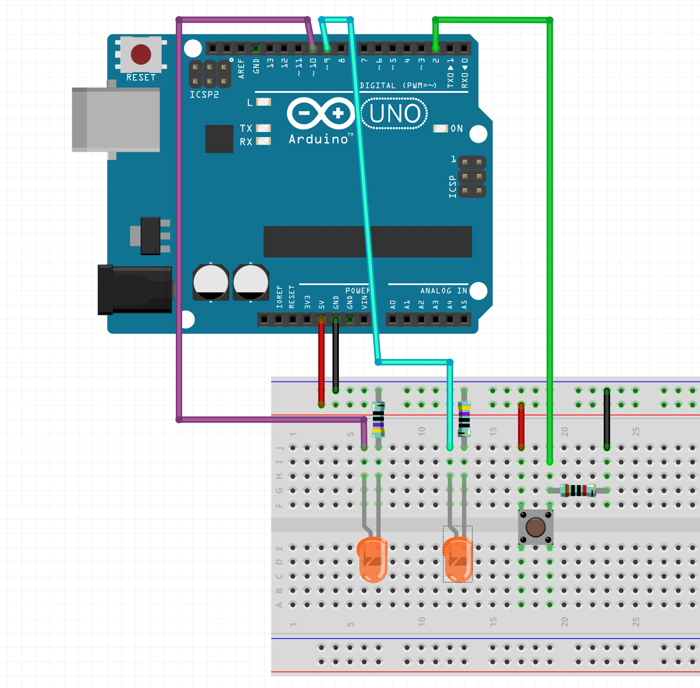

# Week 01

---

## Assignment 01: LED Counter

Create a circuit and Arduino code that does the following

### Circuit
- Connect two LEDs to your Arduino using a breadboard
- Connect one switch to your Arduino using a breadboard

### Code
1. Read a momentary switch being pressed
2. When the program starts, both LEDs are off
3. When the switch is pressed once, the first LED turns on
4. When the switch is pressed the second time, the second LED turns on (the first one should also still be on)
5. When the switch is pressed the third time, both LEDs turn off
6. Repeat this same cycle of LEDs turning on and off in sequence (off, one LED, two LEDs, off...)

**Document your work on the course website that you created. Deadline: Thursday, November 1, 13:00**

### Tips
[Check the tutorials on Digital Input from here](../../../tutorials/arduino-and-electronics/arduino/)

### Solutions



[](./img/assignment-01.png)

```c
int ledPin1 = 10;
int ledPin2 = 9;
int btnPin = 2;
int btnState = 0;
int prevBtnState = 0;
int counter = 0;
void setup() {
  // put your setup code here, to run once:
  pinMode(ledPin1, OUTPUT);
  pinMode(ledPin2, OUTPUT);
  pinMode(btnPin, INPUT);
  Serial.begin(9600);
}

void loop() {
  // check the button
  btnState = digitalRead(btnPin);

  // check if the state is different from the previous loop
  if (btnState != prevBtnState) {
    if (btnState == HIGH) {
      // add one to the counter
      counter++;
      // check if the counter is too large
      if(counter>2){
        counter = 0;
      }
      Serial.println(counter);
    }
  }
  // store the current button state for the next loop
  prevBtnState = btnState;

  switch (counter) {
    case 0:
      digitalWrite(ledPin1, LOW);
      digitalWrite(ledPin2, LOW);
      break;
    case 1:
      digitalWrite(ledPin1, HIGH);
      digitalWrite(ledPin2, LOW);
      break;
    case 2:
      digitalWrite(ledPin1, HIGH);
      digitalWrite(ledPin2, HIGH);
      break;
  }

  // delay helps to prevent noise from the input signal
  // even better way to do this would be to implement debouncing:
  // https://www.arduino.cc/en/Tutorial/BuiltInExamples/Debounce
  delay(10);
}
```




This solution uses 3 LEDs and is a little bit more complicated since it uses arrays and for loops but it is also more flexible in a situation where you have more LEDs than just a couple. I made the video for the class in 2020 (covid year) when we had lots of restrictions in using the spaces.

<iframe src="https://aalto.cloud.panopto.eu/Panopto/Pages/Embed.aspx?id=5d4498d6-73aa-48a8-8e17-ac6a012cef7c&autoplay=false&offerviewer=true&showtitle=true&showbrand=true&captions=true&interactivity=all" width="100%" height="500px" style="border: 1px solid #464646;" allowfullscreen allow="autoplay"></iframe>

