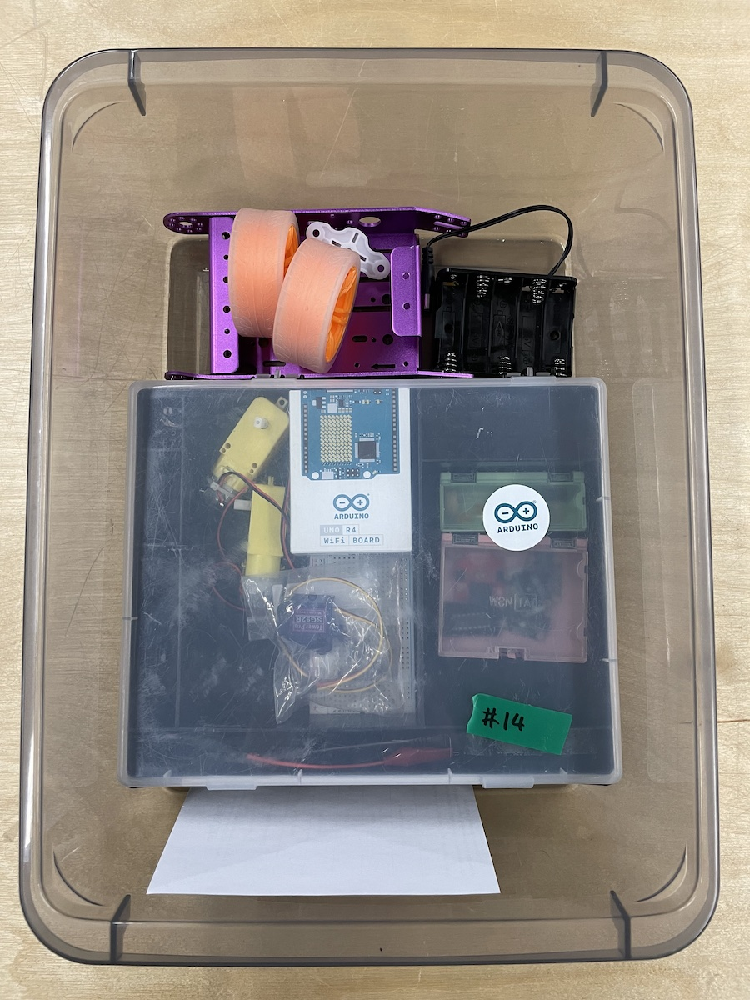
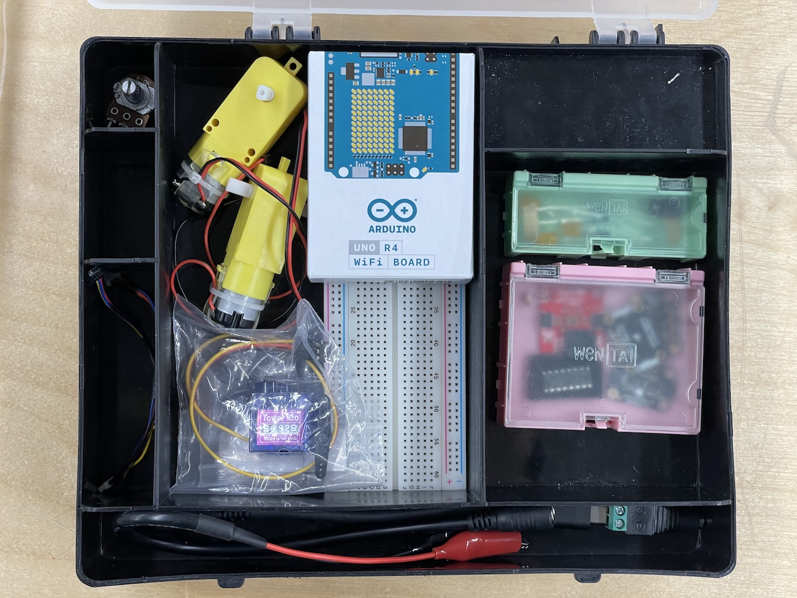
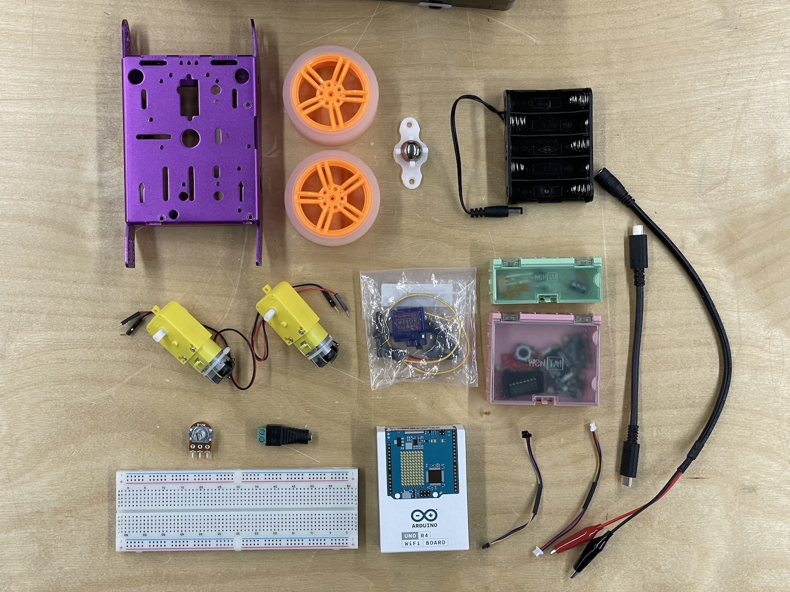
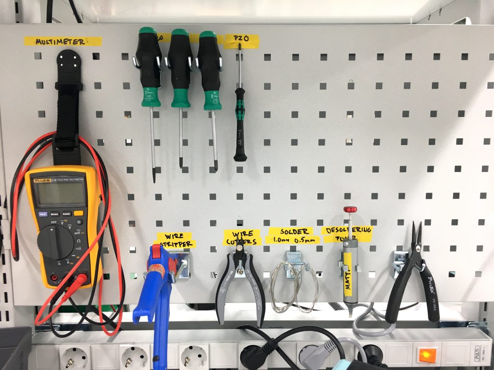

## Your Kit

I'm still missing a couple of parts, you will get these kits on Thursday (October 26). Come back to this page to see a detailed list of what your kit includes.


Take a picture of your kit today and make sure you return it to me just like this latest on January 12, 2024.


---

## Your Workstation

We have 16 workstations with a set of tools. Choose one of them and use that specific one whenever you work over at the workshop. For the duration of the course, this workstation is under your responsibility. Clean your station after you stop working each day:

- Make sure the tip of the soldering iron is clean and shiny
- Make sure all the tools are in the places where they belong
- Clean your desk from all wire clippings and other trash. Use the brush and shovel hanging on the tool wall.

Some of the workstations do not have all the tools as shown above. Take a picture of yours in the beginning of the course and make sure it looks the same on the last day. Each of them has at least:

- Soldering Iron
- Helping Hands
- Multimeter
- Wire Strippers
- Wire Cutters
- Needle Nose Pliers
- PZ0 Screwdriver
- Solder

A full set should also include the following (but we do not currently have enough tools for everyone):

- Bench Top Power Supply
- Desoldering Pump
- PH1 Screwdriver
- PZ1 Screwdriver
- Flat Head Screwdriver

**This is also how you should ALWAYS leave your workstation after you are done, not just during this course.**
