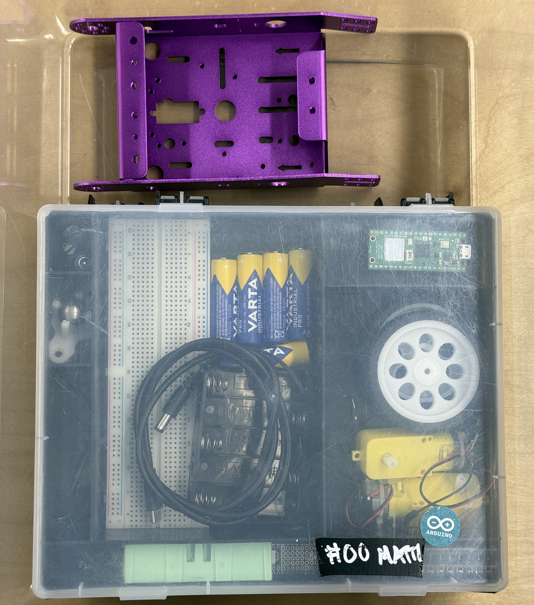
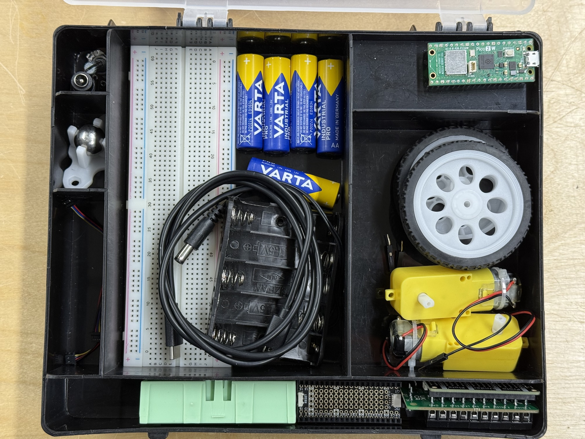
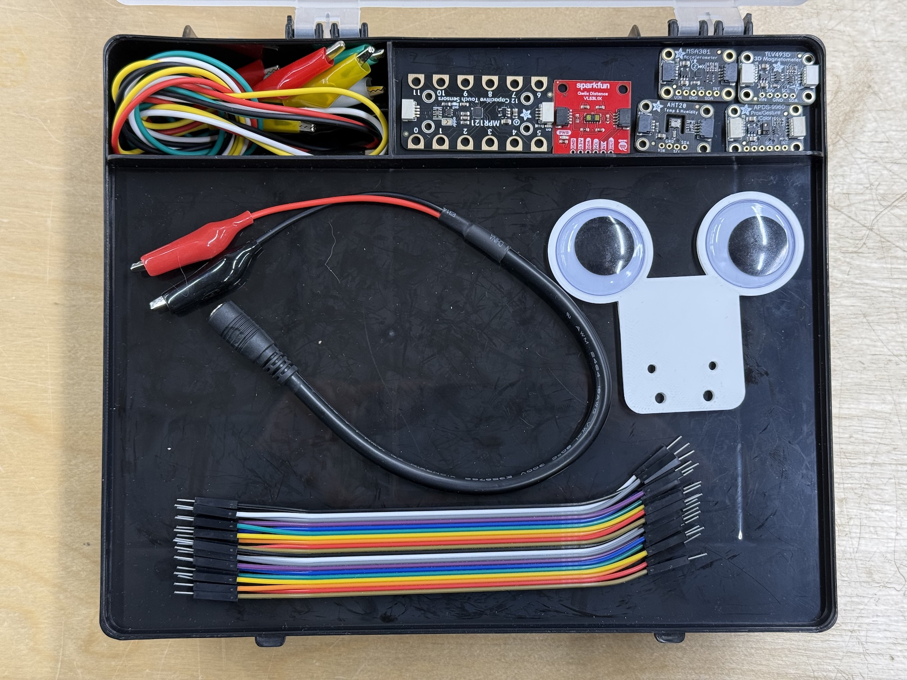
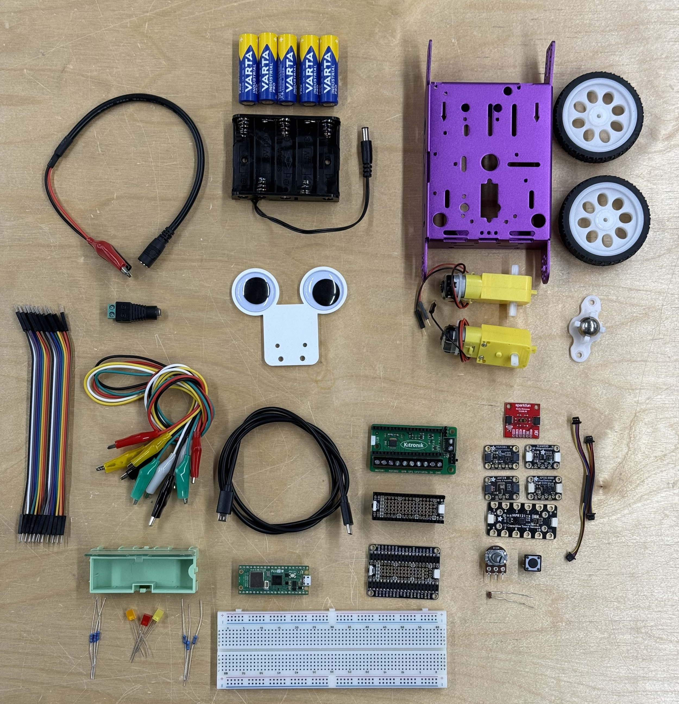

## Your Kit

<iframe width="100%" height="800" data-original-width="2500" data-original-height="2594" src="https://www.thinglink.com/view/scene/2039402467245949414" type="text/html" style="border: none;" webkitallowfullscreen mozallowfullscreen allowfullscreen scrolling="no"></iframe>

Your kit for this course includes the following parts:

Raspberry Pi Pico and Add-Ons

- [Raspberry Pi Pico 2 W](https://www.raspberrypi.com/documentation/microcontrollers/pico-series.html#pico2w-technical-specification)
- [Adafruit Proto Under Plate PiCowBell for Pico](https://www.adafruit.com/product/5905)
- [Adafruit PiCowbell Proto for Pico](https://www.adafruit.com/product/5200)
- [Kitronik Motor Driver Board for Raspberry Pi Pico](https://kitronik.co.uk/collections/robotics/products/5331-kitronik-compact-motor-driver-board-for-raspberry-pi-pico)
- USB Cable (USB-C to microUSB)

Prototyping Tools:

- Breadboard
- Jumper Wires
- 5 x Alligator Clips (black, red, white, green, yellow)
- [5 x AA Battery Holder with 2.1mm DC Jack](https://www.adafruit.com/product/3456)
- 5 x AA Batteries
- [Female DC Power adapter - 2.1mm jack to screw terminal block](https://www.adafruit.com/product/368)
- [2.1mm DC Barrel Jack to Alligator Clips](https://www.adafruit.com/product/1328)
- [Qwiic Cables (various lengths)](https://www.sparkfun.com/qwiic-cable-100mm.html)

Basic Electronic Components:

- [Small Modular Snap Box Green](https://www.adafruit.com/product/432)
- LEDs
- 10kΩ Resistors
- 100-300Ω resistors for using with the LEDs
- Momentary Push Button

Parts for Robotics:

- [Purple Aluminum Chassis for TT Motors](https://www.adafruit.com/product/3796)
- [2 x DC Gearbox Motor - "TT Motor" - 200RPM - 3 to 6VDC](https://www.adafruit.com/product/3777)
- [2 x Thin White Wheel for TT DC Gearbox Motors - 65mm Diameter](https://www.adafruit.com/product/3763)
- [20mm Height Metal Caster Bearing Wheel](https://www.adafruit.com/product/3948)
- Sensor/Googly Eyes Holder

Sensors:

- [Light Dependent Resistor (Photocell)](https://www.adafruit.com/product/161)
- 10kΩ Potentiometer
- [SparkFun Distance Sensor Breakout - 4 Meter, VL53L1X (Qwiic)](https://www.sparkfun.com/sparkfun-distance-sensor-breakout-4-meter-vl53l1x-qwiic.html)
- [Adafruit AHT20 - Temperature & Humidity Sensor Breakout Board](https://www.adafruit.com/product/4566)
- [Adafruit MSA311 or MSA301 Triple Axis Accelerometer](https://www.adafruit.com/product/5309) (note that some of you have the older MSA3401 and some of you have MSA311)
- [Adafruit APDS9960 Proximity, Light, RGB, and Gesture Sensor](https://www.adafruit.com/product/3595)
- [Adafruit TLV493D Triple-Axis Magnetometer](https://www.adafruit.com/product/4366)
- [Adafruit MPR121 12-Key Capacitive Touch Sensor Gator Breakout ](https://www.adafruit.com/product/4830)


Please return the kit as shown below in the pictures latest on January 9, 2026.


---

## Your Workstation

We have 16 workstations with a set of tools. Choose one of them and use that specific one whenever you work over at the workshop. For the duration of the course, this workstation is under your responsibility. Clean your station after you stop working each day:

- Make sure the tip of the soldering iron is clean and shiny
- Make sure all the tools are in the places where they belong
- Clean your desk from all wire clippings and other trash. Use the brush and shovel hanging on the tool wall.

Some of the workstations do not have all the tools as shown above. Take a picture of yours in the beginning of the course and make sure it looks the same on the last day. Each of them has at least:

- Soldering Iron
- Helping Hands
- Multimeter
- Wire Strippers
- Wire Cutters
- Needle Nose Pliers
- PZ0 Screwdriver
- Solder

A full set should also include the following (but we do not currently have enough tools for everyone):

- Bench Top Power Supply
- Desoldering Pump
- PH1 Screwdriver
- PZ1 Screwdriver
- Flat Head Screwdriver

**This is also how you should ALWAYS leave your workstation after you are done, not just during this course.**
