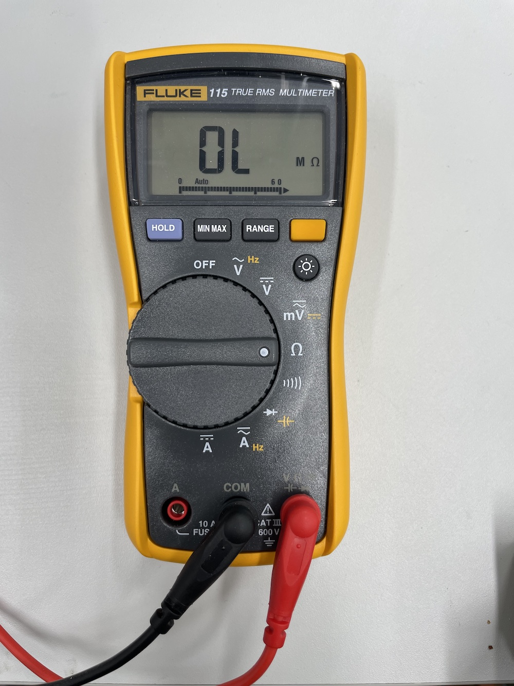
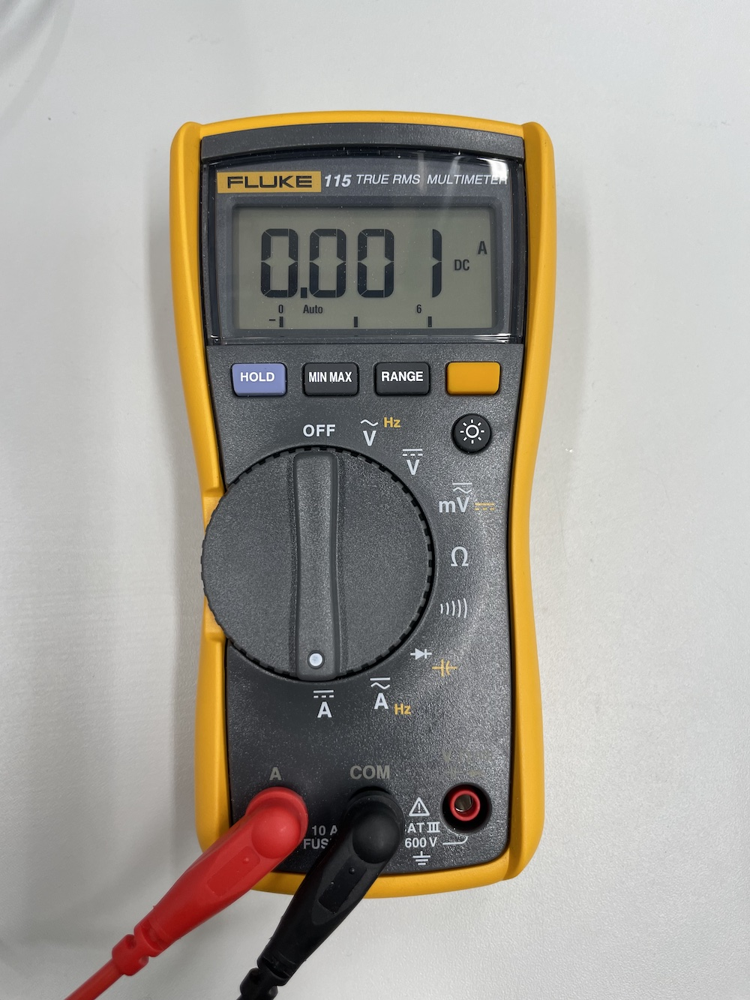

# Introduction to Electronics

---

## Inspiration





- [Niklas Roy](https://www.niklasroy.com/)

---

## Lecture Slides

[See the lecture slides here.](https://miro.com/app/board/uXjVPKsDjlM=/?share_link_id=301025126870)

---

## Your Kit

I'm still missing a couple of parts, you will get these kits on Thursday (October 27). Come back to this page to see what your kit includes. For today, I will just give you the components you need at the moment.

---

## Your Workstation

Each one of you has a designated workstation with a set of tools. For the duration of the course, this workstation is under your responsibility. Clean your station after you stop working each day:

- Make sure the tip of the soldering iron is clean and shiny
- Make sure all the tools are in the places where they belong
- Clean your desk from all wire clippings and other trash. Use the brush and shovel hanging on the tool wall.

Some of the workstations do not have all the tools as shown above. Take a picture of yours in the beginning of the course and make sure it looks the same on the last day. Each of them has at least:

- Soldering Iron
- Helping Hands
- Multimeter
- Wire Strippers
- Wire Cutters
- Needle Nose Pliers
- PZ0 Screwdriver
- Solder

A full set should also include the following (but we do not currently have enough tools for everyone):

- Bench Top Power Supply
- Desoldering Pump
- PH1 Screwdriver
- PZ1 Screwdriver
- Flat Head Screwdriver

**This is also how you should ALWAYS leave your workstation after you are done, not just during this course.**

---

## Resistance is Futile

---

## Tools: Multimeter

Multimeters are very handy tools for multiple purposes (hence the name MULTImeter). Usually, a multimeter will have different modes for measuring voltage, current, and resistance. Most multimeters also have a special continuity mode where the meter will make a little beep sound when the tested points are electrically connected.

### Multimeters at the Aalto Mechatronics Workshop

We are using the [Fluke 115 multimeters](https://www.fluke.com/en/product/electrical-testing/digital-multimeters/fluke-115). They have a handy auto-ranging feature, which means that they are quite easy to use.

Below I have explained the very basic features. For more information, [download the manual](https://newmedia.dog/wp-content/uploads/2018/10/115_manual.pdf).

### Measuring Voltage (DC)

- Make sure your probes are connected correctly: the red one to the port marked with **V, Ω etc.** and the black one should be connected to the port marked **COM**
- Set the meter to V with the lines on top of it (for DC voltage)
- Measure between two points in your circuit

### Measuring Resistance

- Make sure your probes are connected correctly: the red one to the port marked with **V, Ω etc.** and the black one should be connected to the port marked **COM**
- Set the meter to the **Ω** setting
- **Turn off the power from your circuit**
- Measure between two points in your circuit

### Measuring Continuity

There is a special mode on the multimeter that you can use to test if two points are connected or not. The multimeter will make a little beep noise when they are. Useful for finding short circuits or just to test what connects to where.

- Make sure your probes are connected correctly: the red one to the port marked with **V, Ω etc.** and the black one should be connected to the port marked **COM**
- **Turn off the power from your circuit**
- Set the meter to the **)))))** setting
- Measure between two point in your circuit and you will here a beep, if the points are connected (short circuit).

### Measuring Current

- Move the other probe to the port marked with **A**, the other probe should be connected to the **COM** port.
- If you are measuring DC current set the meter to the setting with the A and straight lines (one solid, one dashed) above it
- In order to measure current, you need to connect your meter in series to the circuit. You have to feed the current through the meter at the point where you want to measure

### More information

[There is another nice tutorial out there from Sparkfun.](https://learn.sparkfun.com/tutorials/how-to-use-a-multimeter)



---

## Related tutorials

