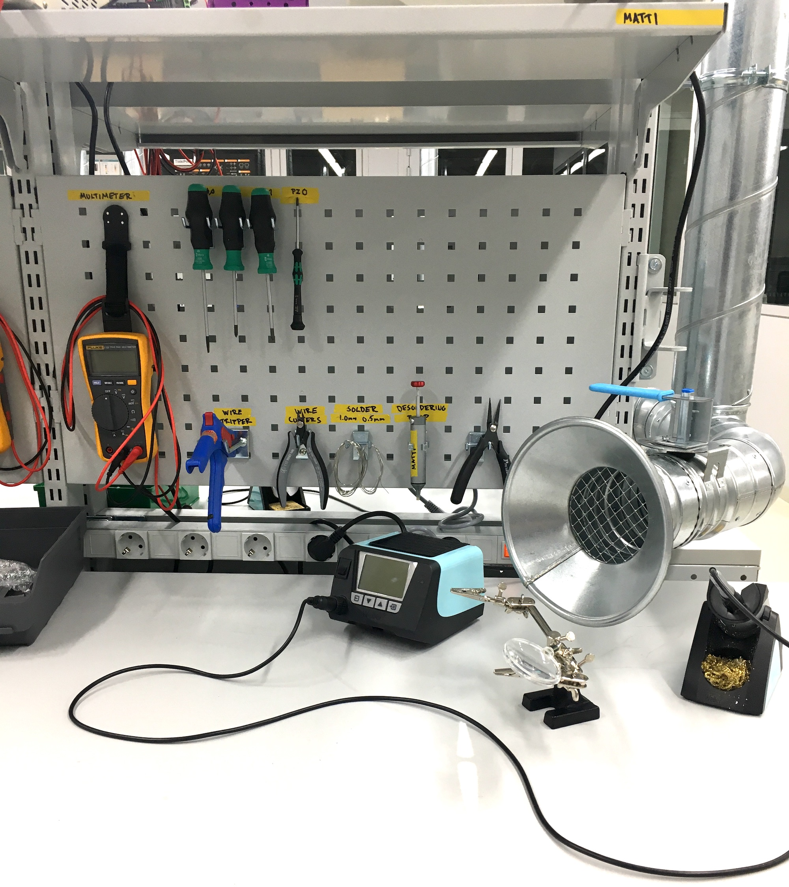

# Introduction to Electronics

---

## Inspiration





- [Niklas Roy](https://www.niklasroy.com/)

---

## Lecture Slides

[See the lecture slides here.](https://miro.com/app/board/uXjVPKsDjlM=/?share_link_id=301025126870)

---

## Your Kit

I'm still missing a couple of parts, you will get these kits on Thursday (October 27). Come back to this page to see what your kit includes. For today, I will just give you the components you need at the moment.

---

## Your Workstation

Each one of you has a designated workstation with a set of tools. For the duration of the course, this workstation is under your responsibility. Clean your station after you stop working each day:

- Make sure the tip of the soldering iron is clean and shiny
- Make sure all the tools are in the places where they belong
- Clean your desk from all wire clippings and other trash. Use the brush and shovel hanging on the tool wall.

Some of the workstations do not have all the tools as shown above. Take a picture of yours in the beginning of the course and make sure it looks the same on the last day. Each of them has at least:

- Soldering Iron
- Helping Hands
- Multimeter
- Wire Strippers
- Wire Cutters
- Needle Nose Pliers
- PZ0 Screwdriver
- Solder

A full set should also include the following (but we do not currently have enough tools for everyone):

- Bench Top Power Supply
- Desoldering Pump
- PH1 Screwdriver
- PZ1 Screwdriver
- Flat Head Screwdriver

**This is also how you should ALWAYS leave your workstation after you are done, not just during this course.**

---

## Tutorial – Electronics: Fundamentals

[See the Electronics: Fundamentals Tutorial](../../../../tutorials/arduino-and-electronics/electronics/electronics-fundamentals/)

---

## Tools: Multimeter

[See the multimeter tutorial](../../../../tutorials/arduino-and-electronics/electronics/tools-multimeter/)

## Tools: Breadboard

[See the multimeter tutorial](../../../../tutorials/arduino-and-electronics/electronics/tools-breadboard/)

---

## Prepare for Thursday

1. You will need to bring a laptop. If you don't have one, let Matti know and we can figure out something.
2. Download and nstall the [Arduino IDE 2.0.0 ](https://www.arduino.cc/en/software)