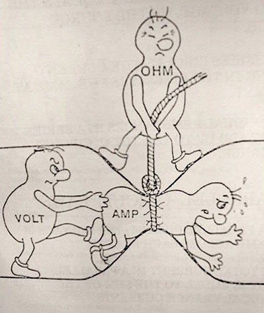
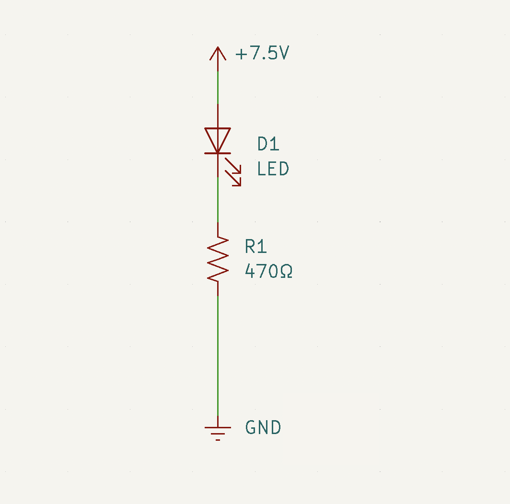
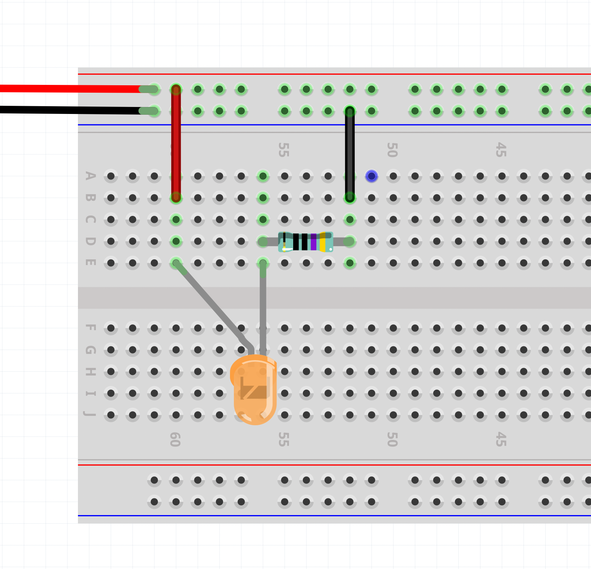
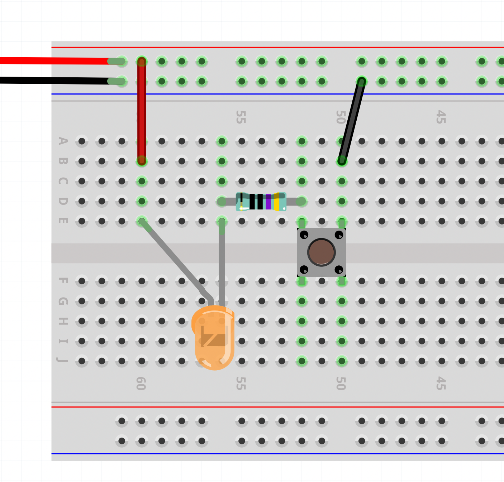
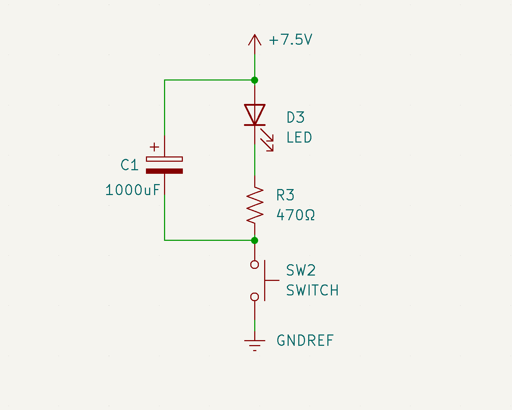

# Introduction to Electronics

---

## Inspiration





- [Niklas Roy](https://www.niklasroy.com/)

---

## Lecture Slides

[See the lecture slides here.](https://miro.com/app/board/uXjVPKsDjlM=/?share_link_id=301025126870)

---

## Tutorial – Electronics: Fundamentals

[See the Electronics: Fundamentals Tutorial](../../../../tutorials/arduino-and-electronics/electronics/electronics-fundamentals/)

---

## Tools: Multimeter

[See the multimeter tutorial](../../../../tutorials/arduino-and-electronics/electronics/tools-multimeter/)

## Tools: Breadboard

[See the breadboard tutorial](../../../../tutorials/arduino-and-electronics/electronics/tools-breadboard/)

---

## Examples

### LED with a current limiting resistor

### LED and Switch

### LED and Switch with a capacitor

---

## Prepare for Thursday

1. You will need to bring a laptop. If you don't have one, let Matti know and we can figure out something.
2. Download and nstall the [Arduino IDE 2.0.0 ](https://www.arduino.cc/en/software)