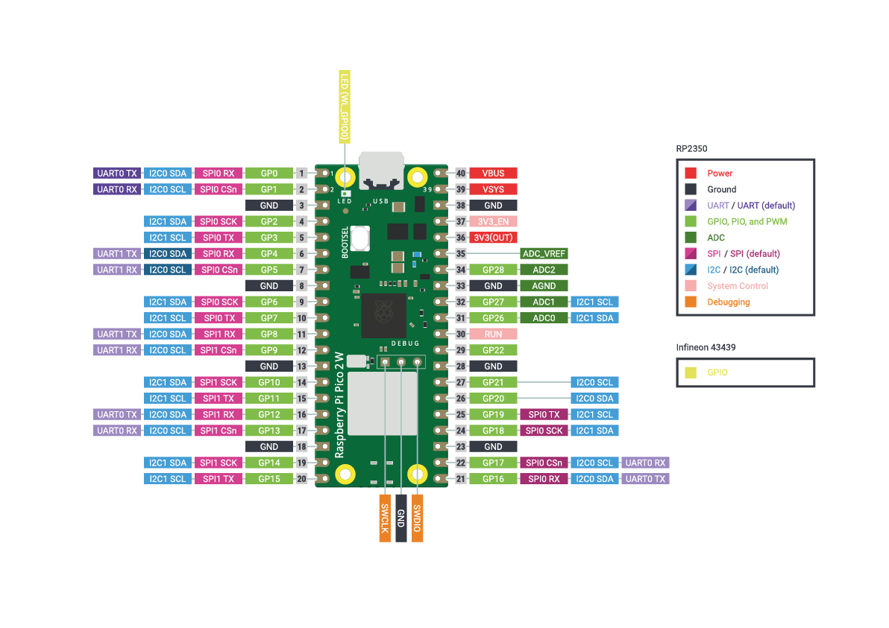
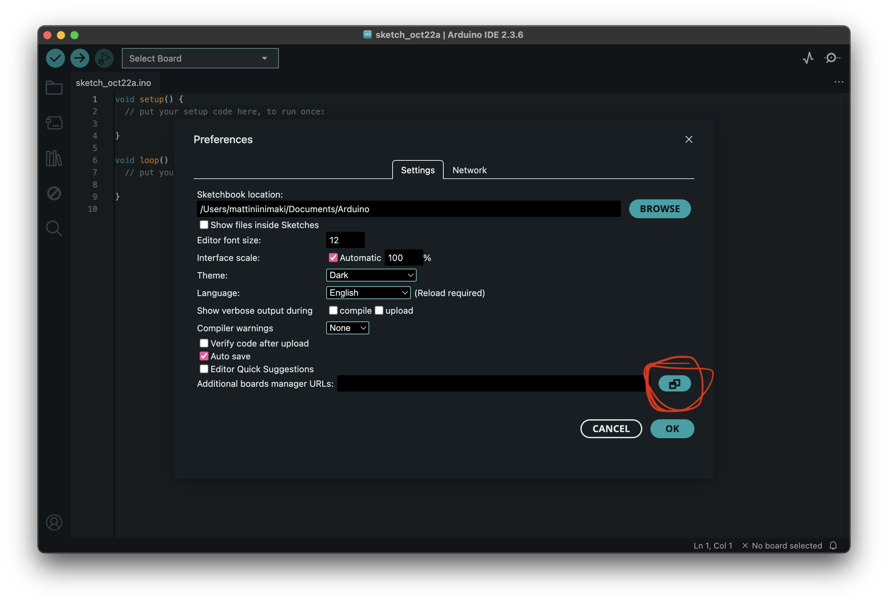
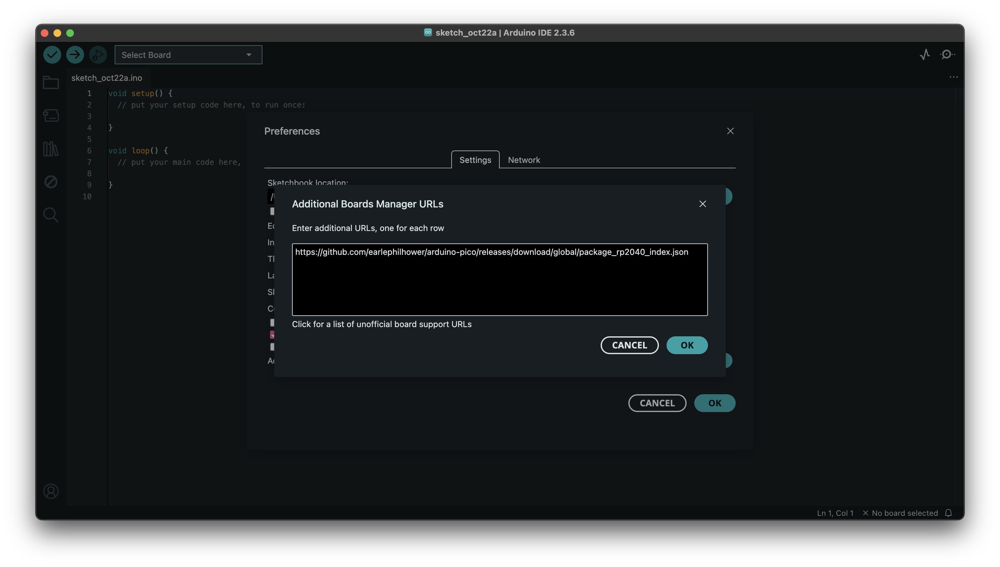
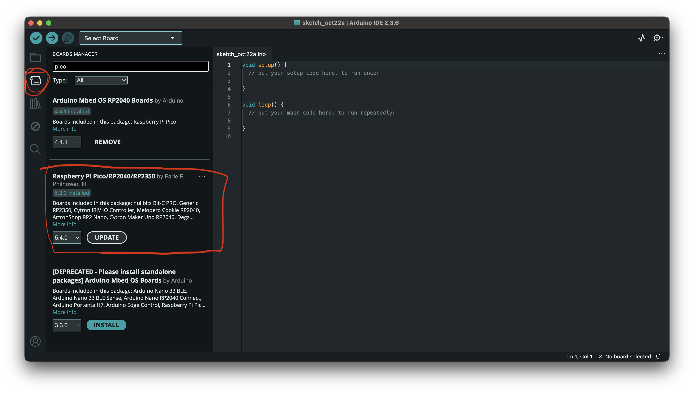
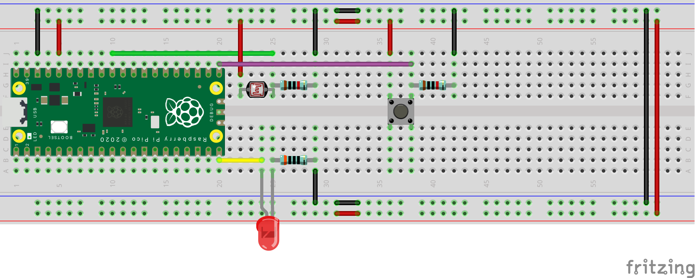
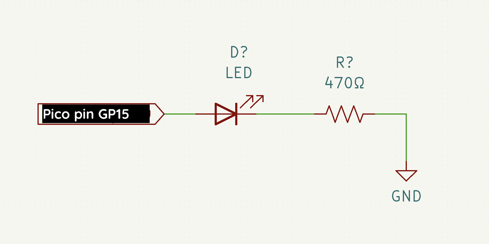
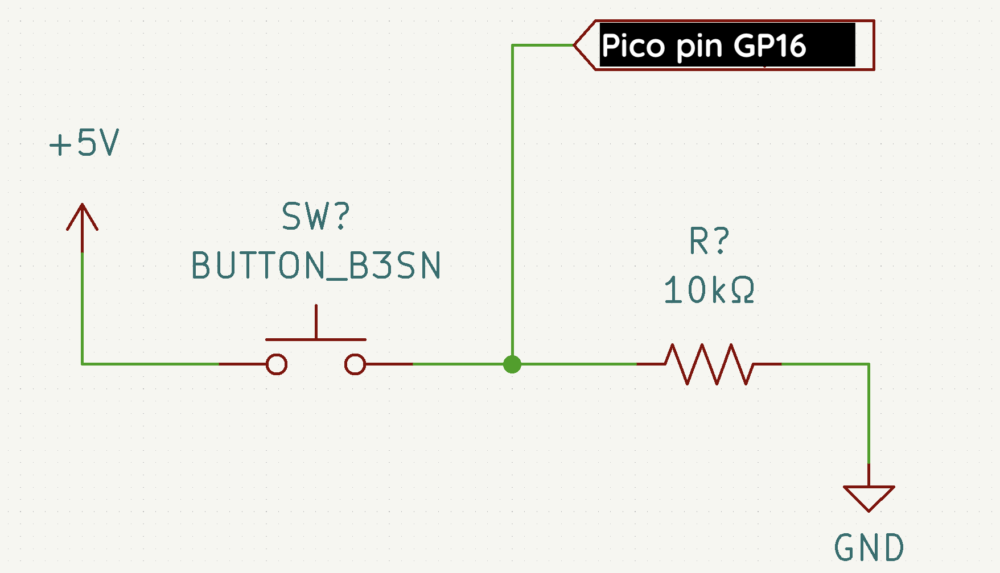

## Microcontrollers

Microcontrollers are all around you. They are inside many of the devices that you use in your everyday life. They come in many shapes and sizes, but generally look something like this:

[](./img/atmega328.jpg)

*ATMega328p microcontroller [Image by oomlout](https://www.flickr.com/photos/33504192@N00/3996006589) [CC BY-SA 2.0](https://creativecommons.org/licenses/by-sa/2.0/)*

Or nowadays most likely more like this:

[](./img/atmega328-smd.jpg)

*ATMega328p microcontroller [Image by oomlout](https://www.flickr.com/photos/snazzyguy/16421989932/) [CC BY-SA 2.0](https://creativecommons.org/licenses/by-sa/2.0/)*

...or like this

[](./img/rp2040.jpg)

*Raspberry Pi RP2040 microcontroller. [Image by Raspberry Pi Foundation](https://www.raspberrypi.com/documentation/microcontrollers/rp2040.html/) [CC BY-SA 4.0](https://creativecommons.org/licenses/by-sa/4.0/)*

Microcontrollers are essentially small computers built into one single chip. You can connect input and output devices to them. You can also program them to do specific things with those input and output devices. Microcontrollers are used when you need a small, low-power device to read data from sensors or to control some output devices.

### Microcontrollers Used in This Course

Over the years we have used differnet types of microcontrollers, generally some variation of the [Arduino](https://www.arduino.cc/) boards.


Note that microcontrollers and [microprocessors](https://en.wikipedia.org/wiki/Microprocessor) are two different things. Microprocessor is the CPU that you have inside your laptop or desktop computer.

[For example, Raspberry Pi computers use microprocessors not microcontrollers](https://www.raspberrypi.org/), **but** the Raspberry Pi company also makes a microcontroller called [RP2040](https://www.raspberrypi.com/products/rp2040/) and the [Raspberry Pi Pico microcontroller board.](https://www.raspberrypi.com/products/raspberry-pi-pico/)


{}
#### Raspberry Pi Pico 2 W
In the 2025 Physical Computing course, we use this microcontroller:

[](./img/pico2w-pinout.png)

- [Raspberry Pi Pico 2 W](https://www.raspberrypi.com/documentation/microcontrollers/pico-series.html#pico2w-technical-specification)

The Raspberry Pi Pico 2 W is a low-cost microcontroller from the makers of Rasberry Pi. It uses the RP2350 microcontroller that has a wide variety of features and an additonal chip for wireless communication (WiFI and Bluetooth).


{}
{}
#### Arduino Uno R4 WiFi

In the 2024 Physical Computing course, we use this microcontroller:

[](./img/arduino-uno-r4-wifi-pinout.png)

The board that you have in your kit is called [Arduino Uno R4 WiFi](https://docs.arduino.cc/hardware/uno-r4-wifi) and it's the one that we are mainly going to use for everything in this class. You might also want to use some other boards depending on the requirements of your final project.
- [Arduino Uno R4 WiFi](https://docs.arduino.cc/hardware/uno-r4-wifi) that uses the [Renesas RA4M1 (Arm® Cortex®-M4)](https://www.renesas.com/us/en/document/dst/ra4m1-group-datasheet) as the main microcontroller and the [ESP32-S3](https://www.espressif.com/en/products/socs/esp32-s3) as the WiFi and Bluetooth module.
{}
{}

#### Arduino Uno R3

[](./img/arduino-uno-pinout.png)

- [Arduino Uno R3 Documentation](https://docs.arduino.cc/hardware/uno-rev3)

Arduino Uno R3 is the basic model of the Arduino that is based on the ATMega328 8-bit microcontroller. The ATMega328 is quite old and not really recommended to be used on any new designs anymore. There are many newer and more powerful microcontrollers available, but it is still very good place to start with for the following reasons:

- It is quite robust and durable, it's not very easy to break one (compared to many of the newer models).
- If you manage to burn or otherwise break the microcontroller chip, it can be easily replaced without soldering.
- So many of the examples you find online will be based on the Uno so it is going to be easier to start learning with it.
- Most of the code that you will create during this class will not be anywhere near hitting the limits of the Uno R3/ATMega328.

---

#### Arduino RP2040 Connect

[](./img/arduino-rp2040-connect-pinout.png)

- [Arduino RP2040 Connect Documentation](https://docs.arduino.cc/hardware/nano-rp2040-connect)

The other microcontroller we have quite many of is the Arduino RP2040 Connect. It's a much more powerful microcontroller than the Uno. It also has two built-in sensors (IMU, microphone) as well as a wireless chip that supports WiFi and Bluetooth.


Please be very careful with these boards! There are two things that can fairly easily break on them.

[](./img/arduino-rp2040-image.jpg)

1. The USB connector. Always unplug your USB cable from the board when you pack it up into your kit. Also be careful not to drop the board with the USB cable connected to it.
2. The antenna. The antenna is very fragile and can also snap off quite easily if you drop the board or otherwise hit the antenna.


Features:
- Microcontroller Raspberry Pi® RP2040
- Digital I/O Pins: 20
- Analog Input Pins: 8
- PWM pins: 
- IMU sensor: LSM6DSOXTR (6-axis)
- Microphone: MP34DT05

- Can be programmed either with the Arduino code (C++) or Python
- [See this turorial for instructions on how to use the board with MicroPython if you prefer Python](https://docs.arduino.cc/learn/programming/arduino-and-python)

{}




## Time Before Arduino

Before the Arduino boards came along, there were many attempts at creating simple (and not so simple) development boards for microcontrollers that could be used in education and prototyping. Some examples:

- [BASIC Stamp](https://en.wikipedia.org/wiki/BASIC_Stamp)
- [PIC microcontrollers](https://en.wikipedia.org/wiki/PIC_microcontrollers)
- [I-CubeX](https://en.wikipedia.org/wiki/I-CubeX)
- [Phidgets](https://en.wikipedia.org/wiki/Phidget)
- and many more

Quite many of these were/are quite hard to start working with and none of them were able to become as ubiquitous in the educational/hobbyist/art/design world as the Arduino boards and all the thousands of variations and clones based on the Arduino have. Things started to change around 2003 because of a project called Wiring.

## Wiring, 2003

Arduino is based on a project called [Wiring](http://wiring.org.co/) originally created by [Hernando Barragán](http://barraganstudio.com) as his Master's Thesis project at [Interaction Design Institute Ivrea (IDII)](https://en.wikipedia.org/wiki/Interaction_Design_Institute_Ivrea) in Italy in 2003. You can read the thesis [here](http://people.interactionivrea.org/h.barragan/thesis/thesis_low_res.pdf). The thesis has a nice benchmarking section that looks into some of the options that were available at the time.

The way Wiring worked and how the software looked like was based on [Processing](https://processing.org). The attempt was to create an environment for working with microcontrollers, physical computing, electronics and programming that would be easily approached by beginners and non-engineers. Just like Processing was attempting to do for programming in 2001.

Hernando Barragán has never been properly (or enough) credited for his work in making the Arduino what it is now so I feel that it is important that I highlight his work here on this page. [See below for an interesting text on the history of Arduino.](./lesson-02/#the-drama)

## Arduino

Arduino Documentary, 2010.



Arduino was created in 2005 as a fork of the Wiring project based on a cheaper microcontroller. The original team behind the Arduino project was:

- Massimo Banzi (thesis advisor for the Wiring thesis by Hernando Barragán)
- David Cuartielles
- Tom Igoe
- David Mellis
- (Gianluca Martino) not officially mentioned anymore on the Arduino website, [see below to learn why not.](./lesson-02/#the-drama)

Arduino means multiple things:

- [Arduino](https://www.arduino.cc/en/about), the company that designs and manufactures the Arduino boards, maintains the software, and creates educational content
- [Arduino IDE](https://www.arduino.cc/en/software) (open source development tool for writing code and uploading it to your microcontroller)
- [Arduino Language](https://www.arduino.cc/reference/en/) (not really a programming language but rather a collection of functions and classes written in C++)
- [Arduino is also a collection of open source development boards built around different microcontrollers.](https://www.arduino.cc/en/hardware) These boards have unique names like Uno, Nano, MKR 1000 WiFI, RP2040 Connect etc.) Arduino has become in some ways a general term like **tupperware** to describe a microcontoller.
- ...and a couple of other things, but this is enough for now


You don't need to use the Arduino IDE or even the Arduino functions to program an Arduino board. You also don't need to have a board made by Arduino to use the Arduino IDE. 

You can use boards made by other manufacturers or you can even make your own boards! The IDE and the code works for many other boards and microcontrollers as well.

This all seems very confusing, but don't worry. Things will slowly start to make sense.


### The Drama

You wouldn't think that there could be a lot of interesting controversy in the world of open source electronics, but just like anything that turns into a multimillion business, there will be people fighting for the money and the fame. There was a very strange but interesting legal battle that happened between 2015–2017. Take a look at the following articles, if you have a couple of hours to spend on digging through the drama:

- [Arduino VS Arduino](https://hackaday.com/2015/02/25/arduino-v-arduino/)
- [Arduino V Arduino: Part II](https://hackaday.com/2015/03/12/arduino-v-arduino-part-ii/)
- [Federico Musto Of Arduino SRL Discusses Arduino Legal Situation](https://hackaday.com/2015/07/23/hackaday-interviews-federico-musto-of-arduino-srl/)
- [The Untold History of Arduino by Hernando Barragán, the creator of Wiring](https://arduinohistory.github.io/)
- [Two Arduinos become one](https://blog.arduino.cc/2016/10/01/two-arduinos-become-one-2/)
- [A new era for Arduino begins today](https://blog.arduino.cc/2017/07/28/a-new-era-for-arduino-begins-today/)
- (+ many other articles that followed)

[In 2025, Qualcomm bought Arduino](https://www.arduino.cc/qualcomm/), it is quite uncertain still what that will mean to the Arduino project and the open source side.

### Arduino IDE

The Arduino IDE is a code editor and a toolchain for uploading code to various microcontrollers.

[](./img/arduino-18.png)

[](./img/arduino-2.png)

The old and new version look slightly different but the code will be the same. You can also use the older version of the software if you want/need to.

---

## Raspberry Pi Pico


In the 2025 class, we use the Raspberry Pi Pico 2 W boards. 

### Programming the Pico

The Pico boards can be programmed in multiple ways:

- Python
  - MicroPython
  - CircuitPyhon. An alternative version of python for microcontrollers maintained by Adafruit. It includes many libraries for sensors and other components that we commonly use in this class. **If you wish to use python, I would recommend CircuitPython for our use case.**
- C++
  - You can use the standard C++ libraries from Raspberry Pi
  - Or you can use the Arduino libraries using Arduino-Pico. **This is what we will use in this course!**

#### Why C++ and not Python?

Mainly because of two reasons:
- Our introductory programming classes use either Processing (Java) or p5.js (JavaScript) which are very very similar to using the Arduino libraries in C++.
- C++ is faster (although we rarely run into the speed limits of either language)

### Arduino-Pico

Although we use the Pico boards, we are going to program them using the Arduino IDE instead of Python. This is done with the help of a great project by [Earle F. Philhower, III ](https://github.com/earlephilhower). It is called [Arduino-Pico](https://github.com/earlephilhower/arduino-pico) and it essentially provides the support for dozens of microcontroller boards based on the Raspberry Pi chips RP2040 and RP2350 chips.

### Installing Arduino-Pico

1. Download and install the Arduino IDE
2. Open the software
3. Open the Settings/Preferences. And click the icn at the end of the field `Additional boards manager URLs` [](./img/boards-manager.png)
4. Paste the following to the pop-up window: `https://github.com/earlephilhower/arduino-pico/releases/download/global/package_rp2040_index.json` [](./img/boards-manager-filled.png)
5. Hit ok to close and confirm
6. Go to the Boards Manager and search for `pico``
7. Find the option called `Raspberry Pi Pico/RP2040/RP2350 by Earle F. Philhower, III` from the search results and install it.
[](./img/install-boards.png)


---

## Example done in class

[](./img/001_example_pico.png)

[](./img/example-led_pico.png)

[](./img/example-button_pico.png)

[](./img/example-ldr_pico.png)

The code below includes the light sensor as well, we did not get so far with our example.

```c
int button;
int light;
int brightness;
void setup() {
  // put your setup code here, to run once:
  pinMode(15,OUTPUT);
  pinMode(16,INPUT);
  Serial.begin(9600);
}

void loop() {
  // put your main code here, to run repeatedly:
  // read the button
  button = digitalRead(16);

  // read the light level
  light = analogRead(A0);
  Serial.print("light level: ");
  Serial.println(light);

  // map the light level (0,1023) to a value suitable for the LED (0-255)
  brightness = map(light,0,1023,0,255);
  Serial.print("LED: ");
  Serial.println(brightness);

  // only turn on the light if the button is pressed
  if(button==HIGH){
    analogWrite(15,brightness);
  }else{
    digitalWrite(15,LOW);
  }
  // small delay to not send too much data over the serial port
  delay(10);
}
}
```

---

## Actual Class Example Code (Thursday)

This is how far we hot actually last time. This code does not have the light sensor.

```c
int button;
int light;
int brightness;
void setup() {
  // put your setup code here, to run once:
  pinMode(15,OUTPUT);
  pinMode(16,INPUT);
  Serial.begin(9600);
}

void loop() {
  // put your main code here, to run repeatedly:
  // read the button
  button = digitalRead(16);

  // only turn on the light if the button is pressed
  if(button==HIGH){
    analogWrite(15,255);
  }else{
    digitalWrite(15,LOW);
  }
  // small delay to not send too much data over the serial port
  delay(10);
}
```

---

## Related tutorials

[Arduino Basics](../../../../tutorials/arduino-and-electronics/arduino/arduino-basics/)


