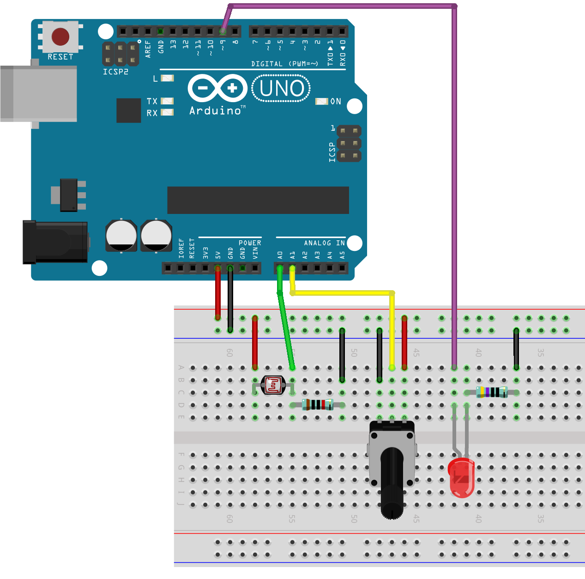

## Inspiration




- [Peter Vogel](http://vogelexhibition.weebly.com/)
  - [The Sound of Shadows](https://vimeo.com/59829961)
- [Yuri Suzuki](https://www.yurisuzuki.com/)
- [Mohit Bhoite](https://www.bhoite.com/sculptures/)
- [Tim Hunkin](https://www.timhunkin.com/)
  - [The Secret Life of Machines](https://www.secretlifeofmachines.com/)
  - [Watch the episodes](https://www.exploratorium.edu/ronh/SLOM/)

## Variable resistors

Many sensors are just variable resistors that change their resistance value based on some external input (light, temperature, force etc.). The Arduino is not able to read the change in resistance directly, but we can convert that resistance change into a change in voltage using a voltage divider.

### Voltage Divider | Converting resistance to voltage

If you connect two resistors in series as in the image below, the voltage read from Vout depends on the ratio of the two resistors. Using a variable resistor instead of a fixed-value one as one of the resistors will create a circuit where the voltage read between the resistors will vary depending on the conditions that change the resistance. For example, using an LDR (light dependent resistor) as R1 allows you to read the change of the light level.

Read the [Wikipedia article](https://en.wikipedia.org/wiki/Voltage_divider) or check [this tutorial from Sparkfun](https://learn.sparkfun.com/tutorials/voltage-dividers/all), if you want to learn how to calculate the values.

[](/images/tutorials/electronics/voltage-divider.jpg)

#### Light Dependent Resistor

[See the LDR tutorial to learn how to use the photoresistor (LDR) we have in the kit.](../../../../tutorials/arduino-and-electronics/sensors/light-ldr/)

#### Other variable resistors

- Potentiometer
- Thermistor
- Stretch Sensor
- Force Sensitive Resistor (FSR)
- ...

## Sensors with analog output

There are also many sensors that have an analog output. Analog in this case meaning that they are directly outputting a varying level of voltage. Some of the analog sensors we have in the Mechatronics workshops:

- Accelerometer ADXL335
- Sharp IR Distance Sensors

## Sensors with simple digital output

The most basic sensor with a digital output is just a switch. We covered those last week. Some other sensors that just send out a simple on/off signal:

- PIR Motion sensors

### pulseIn()

Some sensors send their data as a short pulse that has a specific duration. You can read those using the [pulseIn()](https://www.arduino.cc/reference/en/language/functions/advanced-io/pulsein/) function in Arduino. Sensors that work like this:

- [Ultrasonic Ranging Sensor HC-SR04](../../../../tutorials/arduino-and-electronics/sensors/distance-ultrasonic-hc-sr04/)

### Complex digital output

There are many other digital communication protocols that are often used with modern sensors. We will cover these in the next class.

---

## Working with analog signals

- [See the Analog Input tutorials.](../../../../tutorials/arduino-and-electronics/arduino/)
- [See the specific Sensor Tutorials](../../../../tutorials/arduino-and-electronics/sensors/)

---

## Examples done in class

### Circuit

[](./img/example-bb.png)

### Code

```c
int light;
int pot;
int b;

void setup() {
  Serial.begin(9600);
  pinMode(9,OUTPUT);
}

void loop() {
  // read both sensors
  light = analogRead(A0);
  pot = analogRead(A1);

  // print the min and max values so the Serial Plotter doesn't autoscale. Go to a new line.
  Serial.println("Min:0, Max:1023");

  // print the light sensor value
  Serial.print(light);
  // print space character so that the values each get a separate graph in the plotter
  Serial.print(' ');
  // print the potentiometer value and go to a new line
  Serial.println(pot);

  // map the values from the light sensor to a new range between 100-255
  // store the value to a variable called b (the brightness of the LED)
  // when the light sensor value reaches the value of pot, the brightness of the LED will be 100
  // the darker it gets the brighter the LED becomes
  // if the light sensor would read a value of 0, the brightness would be 255
  b = map(light,pot,0,100,255);

  // if light level goes below the threshold (pot), turn the LED on, set brightness to b
  // otherwise set the LED brightness to 0
  if(light < pot){ 
    analogWrite(9,b);
  }else{
    analogWrite(9,0);
  }

  // delay to slow down the loop a bit
  delay(10);
}
```

---

## References

There are various sites that list out sensors:

- [Aalto New Media: Sensors tutorials.](../../../../tutorials/arduino-and-electronics/sensors/) The tutorials on this site. Specifically focusing on components we have in our kits and otherwise available.
- [sensorwiki.org](https://sensorwiki.org/) by The Working Group on Interactive Systems and Instrument Design in Music (ISIDM)

I find it useful to browse some online shops that sell sensor boards to get an understanding what kind of things are possible. 

- [Adafruit sensors](https://www.adafruit.com/category/35)
- [Sparkfun sensors](https://www.sparkfun.com/categories/23)

