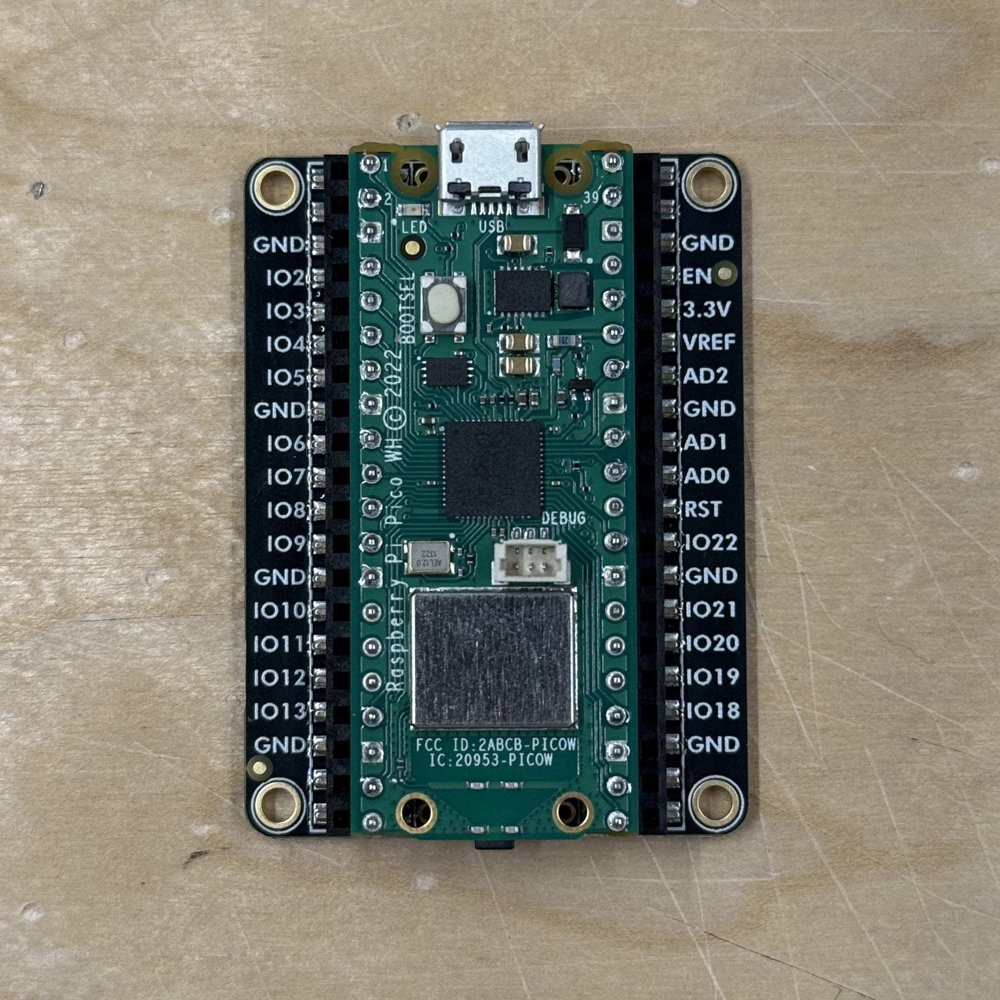
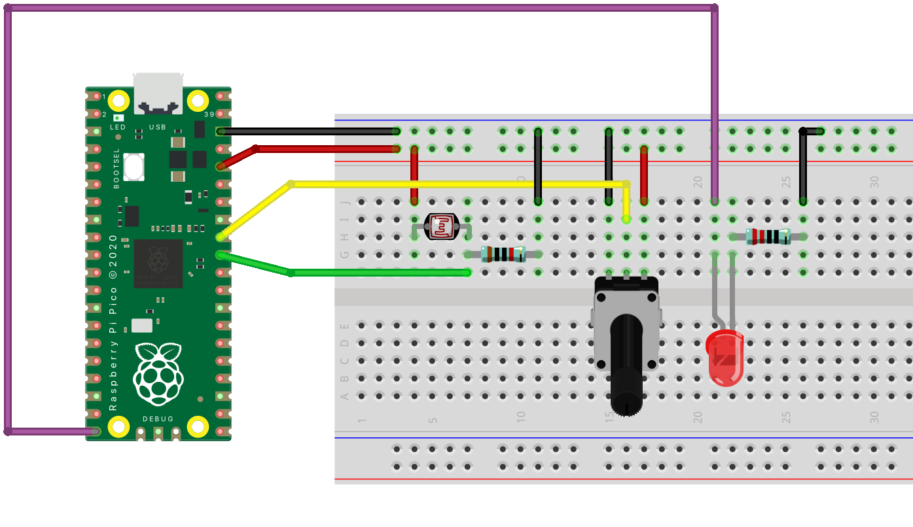

## Inspiration







- [Peter Vogel](http://vogelexhibition.weebly.com/)
  - [The Sound of Shadows](https://vimeo.com/59829961)
- [Ramyah Gowrishankar](https://narrativize.net/about/) and her [Aalto page](https://www.aalto.fi/en/people/ramyah-gowrishankar) and [Master's Thesis](https://www.researchgate.net/publication/301687480_Designing_Fabric_Interactions_A_study_of_knitted_fabrics_as_an_electronic_interface_medium)
- [Mohit Bhoite](https://www.bhoite.com/sculptures/)
- [Tim Hunkin](https://www.timhunkin.com/)
  - [The Secret Life of Machines](https://www.secretlifeofmachines.com/)

---

## Setup

Firstly, let's do some inventory. Check that your kit has all of the items shown [here](../../kit-and-workstation/).

<iframe width="100%" height="705" data-original-width="2500" data-original-height="2594" src="https://www.thinglink.com/view/scene/2039402467245949414" type="text/html" style="border: none;" webkitallowfullscreen mozallowfullscreen allowfullscreen scrolling="no"></iframe><script async src="//cdn.thinglink.me/jse/responsive.js"></script>

You should have one of these Pico Under Plates in your Kit.

[](./img/pico_underplate.jpg)

Plug your Pico on top of the Under Plate. **Make sure that you connect it in the correct orientation. USB connector side is marked in the bottomo of the board.** This board allows us an easier access to the pins and it has labels for most of them, so you don't have to go look at the diagram all the time. 

[](./img/pico_underplate_connected.jpg)

One side of the board has a reset button, you can press it to have the board reset and run the program from the beginning.

[](./img/pico_underplate_reset.jpg)

The other side has a connector that we will use a lot for easily connecting digital sensors (starting from tomorrow). This connector is used by Adafruit for their sensors and they call it [STEMMA QT](https://learn.adafruit.com/introducing-adafruit-stemma-qt/what-is-stemma-qt). Another company called Sparkfun calls it [Qwiic connector](https://www.sparkfun.com/qwiic). I will generally refer to it as the Qwiic connector in this course. More and more components have started to include these connectors, so this Under Plate we use is a very handy addition to our Pico boards.

[](./img/pico_underplate_qwiic.jpg)

---

## Variable resistors

Many sensors are just variable resistors that change their resistance value based on some external input (light, temperature, force etc.). The Arduino is not able to read the change in resistance directly, but we can convert that resistance change into a change in voltage using a voltage divider.

### Voltage Divider | Converting resistance to voltage

If you connect two resistors in series as in the image below, the voltage read from Vout depends on the ratio of the two resistors. Using a variable resistor instead of a fixed-value one as one of the resistors will create a circuit where the voltage read between the resistors will vary depending on the conditions that change the resistance. For example, using an LDR (light dependent resistor) as R1 allows you to read the change of the light level.

Read the [Wikipedia article](https://en.wikipedia.org/wiki/Voltage_divider) or check [this tutorial from Sparkfun](https://learn.sparkfun.com/tutorials/voltage-dividers/all), if you want to learn how to calculate the values.

[](/images/tutorials/electronics/voltage-divider.jpg)

#### Light Dependent Resistor

[See the LDR tutorial to learn how to use the photoresistor (LDR) we have in the kit.](../../../../tutorials/arduino-and-electronics/sensors/light-ldr/)

#### Other variable resistors

- [Potentiometers](  )
- Thermistor
- Stretch Sensor
- Force Sensitive Resistor (FSR)

#### DIY Textile Sensors

You can also make your own sensors using conductive textiles, yarns and other materials.

- [Kobakant | How To Get Waht You Want](https://howtogetwhatyouwant.at/) is an excellent resource for making your own sensors.
- [Sensors section from Kobakant](https://www.kobakant.at/DIY/?cat=26)
- Aalto offers two courses if you are interested in wearables and combining textiles with electronics
  - [Smart Wearables](https://sisu.aalto.fi/student/courseunit/aalto-CU-1150972289-20240801/brochure)
  - [Smart Wearables II](https://sisu.aalto.fi/student/courseunit/aalto-CU-1150972290-20240801/brochure)

## Sensors with analog output

There are also many sensors that have an analog output. Analog in this case meaning that they are directly outputting a varying level of voltage. Some of the analog sensors we have in the Mechatronics workshops:

- Accelerometer ADXL335
- Sharp IR Distance Sensors

## Sensors with simple digital output

The most basic sensor with a digital output is just a switch. We covered those last week. Some other sensors that just send out a simple on/off signal:

- PIR Motion sensors

### pulseIn()

Some sensors send their data as a short pulse that has a specific duration. You can read those using the [pulseIn()](https://www.arduino.cc/reference/en/language/functions/advanced-io/pulsein/) function in Arduino. Sensors that work like this:

- [Ultrasonic Ranging Sensor HC-SR04](../../../../tutorials/arduino-and-electronics/sensors/distance-ultrasonic-hc-sr04/)

### Complex digital output

There are many other digital communication protocols that are often used with modern sensors. We will cover these in the next class.

---

## Working with analog signals

- [See the Analog Input tutorials.](../../../../tutorials/arduino-and-electronics/arduino/)
- [See the specific Sensor Tutorials](../../../../tutorials/arduino-and-electronics/sensors/)

---

## Example done in class

The project we are going to build in class implements a simple threshold for deciding when an LED should turn on.


{}

### Circuit

This example uses two analog inputs:

- Light sensor connected to pin ADC0 (GP26)
- Potentiometer connected to pin ADC1 (GP27)

One digital output:

- LED connected to pin GP15

[](./img/example-schematic-pico.png)

[](./img/example-bb-pico.png)

### Code


The code does the following
- Read the light level using the light sensor and store the value to a variable called `lightValue`
- Read the potentiometer value and store the value to a variable called `pot`
- If `lightValue` is less than `pot`, turn on the LED with the brigthness value `b`
- Otherwise, turn the LED off
- Print all the values using the serial port for feedback. Variable called `trigger` is used to print out a value of `0` or `1023` depending on the state of the LED.


```c
int lightValue;
int pot;
// b is used to store the brightness of the LED
int b = 255;
// trigger variable is used to visualize the output on the plotter
int trigger = 0;

void setup() {
  Serial.begin(9600);
  // make the pin where LED is connected to an output
  pinMode(15, OUTPUT);
}

void loop() {
  lightValue = analogRead(26);
  pot = analogRead(27);
  if (lightValue < pot) {
    analogWrite(15, b);
    trigger = 1023;
  } else {
    analogWrite(15, 0);
    trigger = 0;
  }

  // 0 and 1023 are printed to make sure the plotter doesn't autoscale
  Serial.println("Min:0, Max:1023");

  Serial.print(lightValue);
  Serial.print(" ");
  Serial.print(pot);
  Serial.print(" ");
  Serial.println(trigger);
  delay(10);
}
```

{}
{}

### Circuit

This example uses two analog inputs:

- Light sensor connected to pin A0
- Potentiometer connected to pin A1

One digital output:

- LED connected to pin 9

[](./img/example-bb.png)

### Code


The code does the following
- Read the light level using the light sensor and store the value to a variable called `lightValue`
- Read the potentiometer value and store the value to a variable called `pot`
- If `lightValue` is less than `pot`, turn on the LED with the brigthness value `b`
- Otherwise, turn the LED off
- Print all the values using the serial port for feedback. Variable called `trigger` is used to print out a value of `0` or `1023` depending on the state of the LED.


This code is for the Arduino Uno boards.

```c
int lightValue;
int pot;
// b is used to store the brightness of the LED
int b = 255;
// trigger variable is used to visualize the output on the plotter
int trigger = 0;

void setup() {
  Serial.begin(9600);
  // make the pin where LED is connected to an output
  pinMode(9, OUTPUT);
}

void loop() {
  lightValue = analogRead(A0);
  pot = analogRead(A1);
  if (lightValue < pot) {
    analogWrite(9, b);
    trigger = 1023;
  } else {
    analogWrite(9, LOW);
    trigger = 0;
  }

  // 0 and 1023 are printed to make sure the plotter doesn't autoscale
  Serial.println("Min:0, Max:1023");

  Serial.print(lightValue);
  Serial.print(" ");
  Serial.print(pot);
  Serial.print(" ");
  Serial.println(trigger);
  delay(10);
}
```

{}


---

## References

There are various sites that list out sensors:

- [Aalto New Media: Sensors tutorials.](../../../../tutorials/arduino-and-electronics/sensors/) The tutorials on this site. Specifically focusing on components we have in our kits and otherwise available.
- [sensorwiki.org](https://sensorwiki.org/) by The Working Group on Interactive Systems and Instrument Design in Music (ISIDM)

I find it useful to browse some online shops that sell sensor boards to get an understanding what kind of things are possible. 

- [Adafruit sensors](https://www.adafruit.com/category/35)
- [Sparkfun sensors](https://www.sparkfun.com/categories/23)

