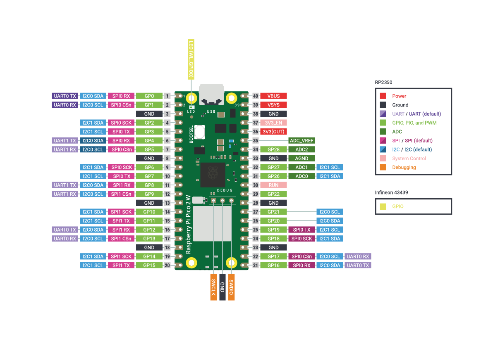
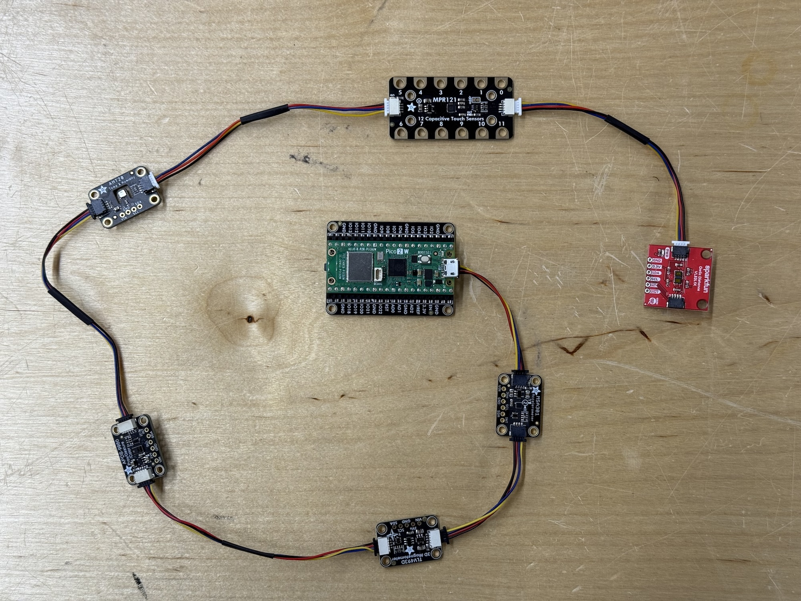

## Inspiration







[Myriam Bleau](http://www.myriambleau.com/)

## I2C

Many modern sensors are much more complex than being just a resistor. They are quite complex digital circuits with different protocols for communicating with them. One of the most popular protocols for sensors to communicate with microcontrollers is I2C (Inter-Integrated Circuit).

Read more:

- [Wikipedia Article](https://en.wikipedia.org/wiki/I2C)
- [Sparkfun Tutorial](https://learn.sparkfun.com/tutorials/i2c/all)

Benefits of I2C sensors:
- Only two wires needed for communication for the entire bus (SDA for data and SCL for clock)
- You can daisy chain multiple devices to each other
- Theoretically, you can connect up to 128 devices in one I2C bus.


I2C is not just for sensors. There are many other types of devices that use I2C as the communication protocol.


### Pico I2C Pins

The Pico boards have two I2C ports available that can be configured quite flexibly to different pins on the board. When writing code with the Arduino, the default pins for using I2C are GP4 (SDA) and GP5 (SCL)

### Qwiic/Stemma QT Connectors

The boards we use have a specific connector for easily working with I2C devices. The actual connector is a 4-pin JST SH connector but it is called Qwiic by Sparkfun and STEMMA QT by Adafruit.

Your kit includes six sensors that can be connected using this handy system:

- [Accelerometer | MSA301](../../../../tutorials/arduino-and-electronics/sensors/accelerometer-msa301/)
- [Distance Sensor | VL53L1X](../../../../tutorials/arduino-and-electronics/sensors/distance-vl53l1x/)
- [Temperature and Humidity Sensor | AHT20](../../../../tutorials/arduino-and-electronics/sensors/temperature-and-humidity-aht20/)
- [Magnetometer | TLV493D](../../../../tutorials/arduino-and-electronics/sensors/magnetometer-tlv493d/)
- [Proximity, Light, RGB, and Gesture Sensor | APDS9960 ](../../../../tutorials/arduino-and-electronics/sensors/proximity-gesture-light-rgb-apds9960/)
- [Capacitive Touch Sensor | MPR121](../../../../tutorials/arduino-and-electronics/sensors/touch-capacitive-mpr121/)

You could even connect all of them in a daisy chain and only need to use 4 pins from the Pico board.


You don't have to use the Qwiic connectors to work with these sensors. You could solder wires or header pins to them just as well. The connectors are very handy for quick prototyping without worrying about damaging the sensors.


---

## Deliverables for Week 2

[See the landing page for this week](./)