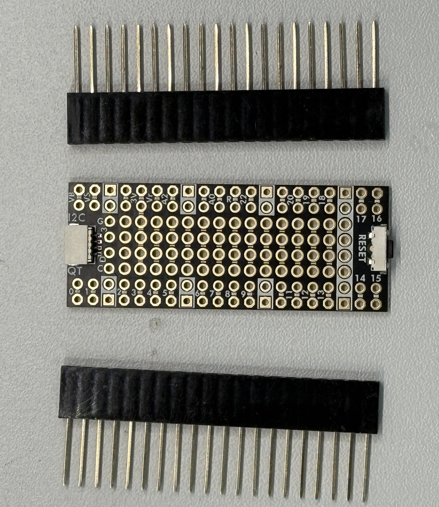
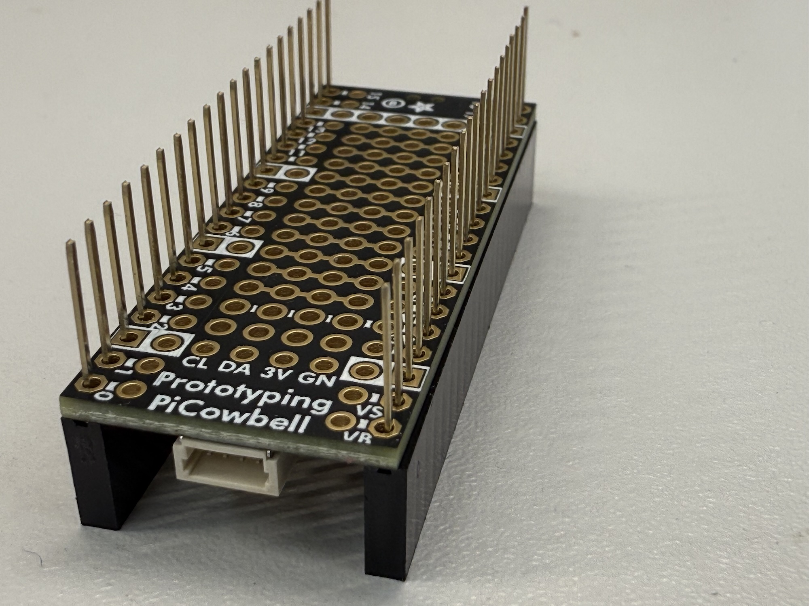
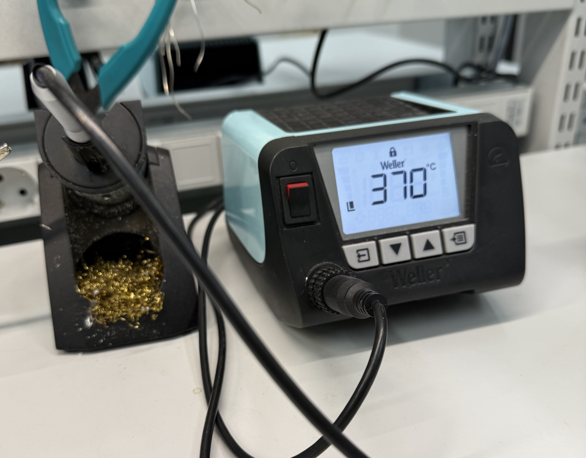
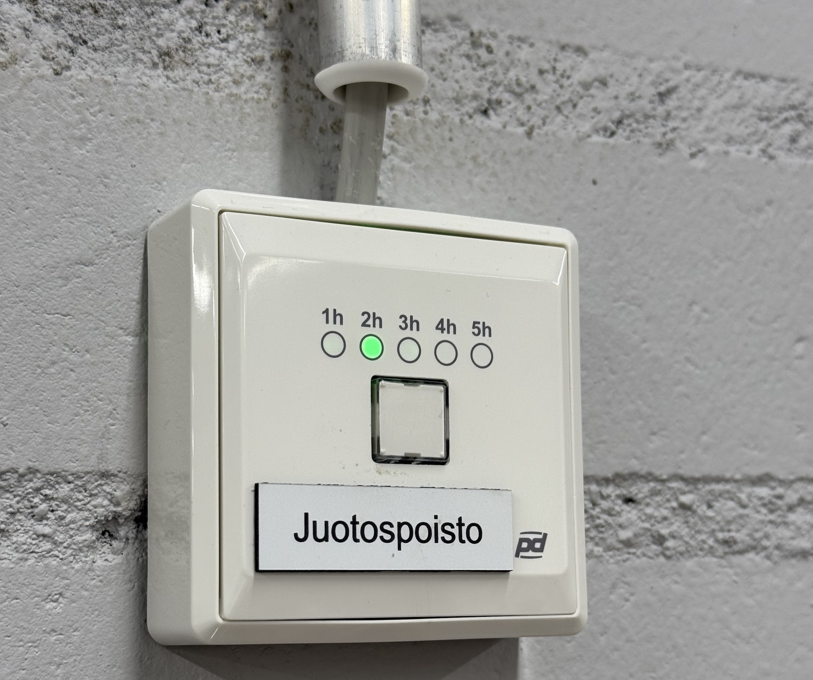
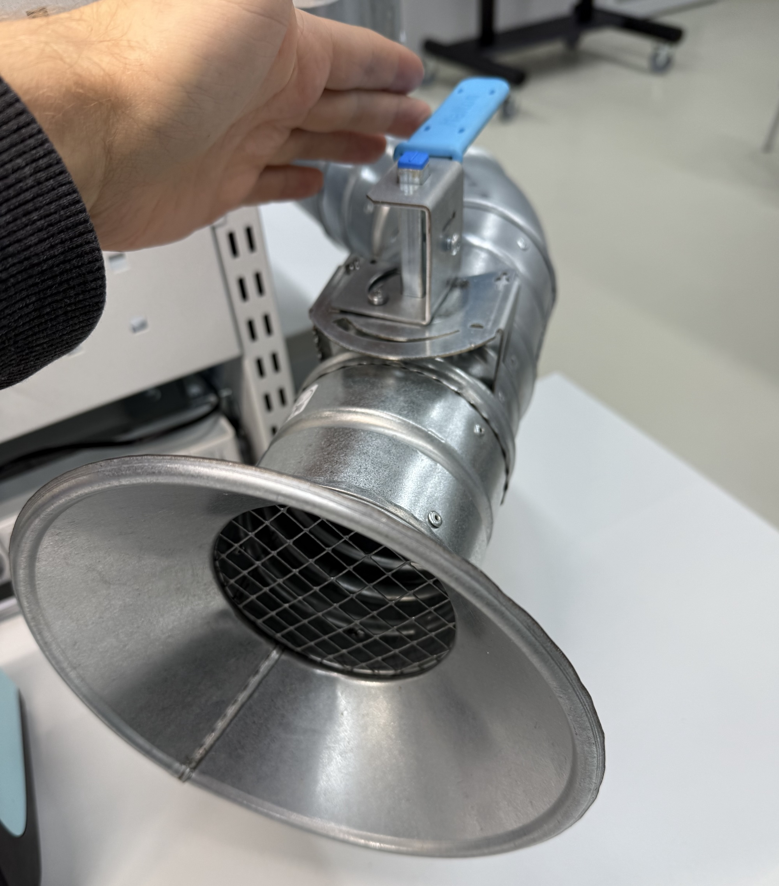


- Monday, November 3
- Mechatronics Workshop  
- 15:15–17:00


## Inspiration

Simple movements can make objects seem very alive.



- [Jennifer Greb: Electronic Creature](http://www.jennifergreb.com/demos#creature)



- [Jennifer Greb: Electronic Hand](http://www.jennifergreb.com/demos#box)



[@><#!!! Overtaxed Surface](http://www.overtaxedsurface.de/#video)













### Jinhee Kim





- [Jinhee Kim: A Fortune Tweeeting Bird](http://www.kimjinhee.com/A-Fortune-Telling-BIrd)
- [Jinhee Kim: A Lucky Charm Drawing Robot](http://www.kimjinhee.com/A-Lucky-Charm-Drawing-Robot)

### Daniel Rozin



## Artists working with robotics, mechanics and kinetic sculptures

- [Daniel Rozin](https://www.smoothware.com/danny/) – [Instagram](https://www.instagram.com/dannyrozin/)
- [Niklas Roy](http://niklasroy.com/) – Berlin-based artist working a lot with mechanical devices
- [Teija ja Pekka Isorättyä](http://www.isorattya.com/Videos.xhtml) – Finnish artist couple working with robotic installations
- [Markus Copper](https://kiasma.fi/en/exhibitions/markus-copper/)
- [Tommi Grönlund & Petteri Nisunen](https://vimeo.com/usergronlundnisunen) – Finnish artists working with kinetic sculptures
- [Tim Hunkin](http://www.timhunkin.com/) – A engineer/artist who builds weird and elaborate machines. Also worked on making the [Secret Life of Machines animation](http://www.exploratorium.edu/ronh/SLOM/)
- [Jeppe Hein](http://www.jeppehein.net/pages/works.php) – Very minimalistic installations using kinetic elements
- [ART+COM](http://www.artcom.de/en/projects/) – A German design studio that specializes in creating big kinetic sculptures
- [Ben Hopson](http://www.benhopson.com/?page_id=3) – An industrial designer who has a lot of very interesting Kinetic Sketches on his website. [Also this article about designing motion might be of interest to you.](http://www.core77.com/blog/featured_items/kinetic_design_and_the_animation_of_products_by_ben_hopson_12642.asp)
- [Theo Jansen](http://www.strandbeest.com/index.php) – Amazing wind-powered artificial creatures
- [Jie Qi](https://technolojie.com/) – Some interesting projects using muscle wire, paper electronics
- [Eunyoung Park](https://eunyoungpark.co/studio/) – From Aalto Media Lab, her thesis project was [LINKKI](http://eunyoungpark.co/linkki/)
- Tim Lewis – [Instagram](https://www.instagram.com/timlewis.info/)
- Behnaz Farahi - [Instagram](https://www.instagram.com/behnazfarahi/) and [Website](https://behnazfarahi.com/)

## Resources

- [Soft Robots](https://softroboticstoolkit.com/)
- [Muscle Wire + Paper Electronics](https://technolojie.com/origami-robotics/) by Jie Qi
- [Design with Movement](https://designwithmovement.aalto.fi/) by Eunyoung Park

---

## Soldering Excercise

There is one additional part that we need this week for our little robots. The [Adafruit PiCowbell Proto for Pico](https://www.adafruit.com/product/5200), which currently is not assembled yet.

1. Get the parts ready

2. Insert the header pins to the board as shown in the picture. The connector and the button should be on the side of the black plastic part of the headers.

3. Turn on the soldering station and set the temperature to 370°

4. Press the button on the wall to set the timer for the fume extraction. (Juotospoisto)

5. Open the valve on your desk to let the air flow to the fume extraction tubes.

6. Clean the tip of the soldering iron by melting a small amount of solder on all sides of the tip and then wipe it clean in the brass wool cleaner. The tip should be nice and shiny.
7. Solder all of the header pins to the board. Make sure that the solder joints look like sharp mountain peaks. If they are spherical blobs, reheat the joint and let it reflow. 
 

8. Once you are done, make sure to clean the tip again.

### Soldering Video

This video shows the process.

	<iframe src="https://aalto.cloud.panopto.eu/Panopto/Pages/Embed.aspx?id=035415ca-7a1c-4c06-9ab3-b386010bdce5&autoplay=false&offerviewer=true&showtitle=true&showbrand=false&captions=true&interactivity=all" style="border: 1px solid #464646; position: absolute; top: 0; left: 0; width: 100%; height: 100%; box-sizing: border-box;" allowfullscreen allow="autoplay" aria-label="Panopto Embedded Video Player" aria-description="soldering"></iframe>

---

## Soldering Resources

---

## Deliverables

- [See the final project guidelines.](../final-project/)
- [Your homework for this week](../week-03)