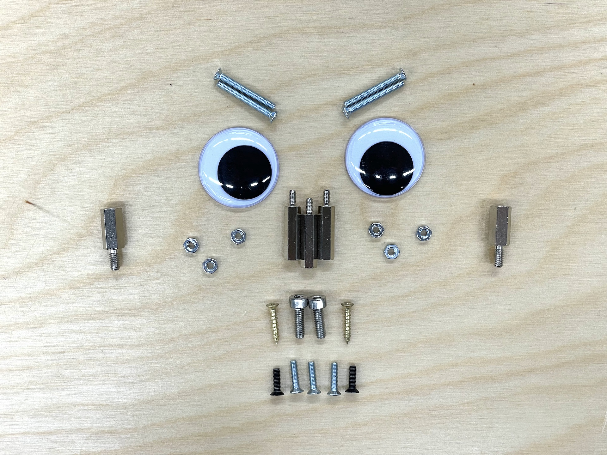
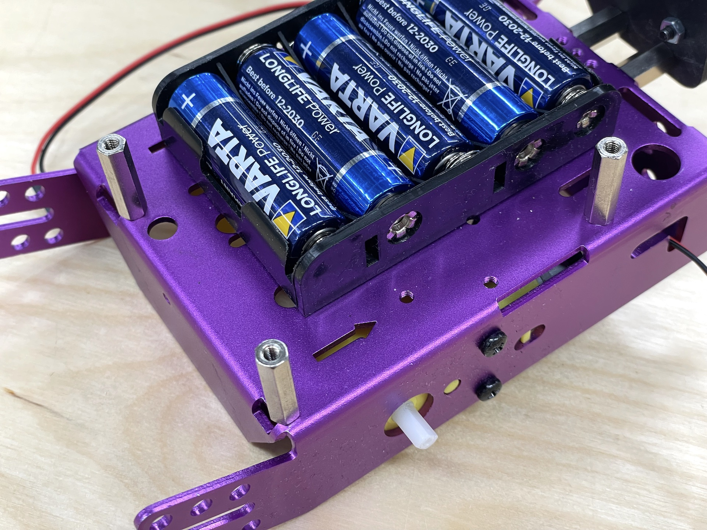
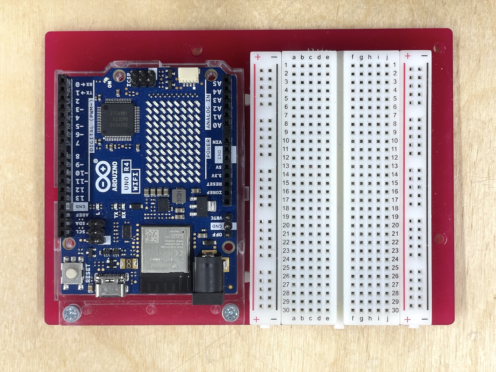
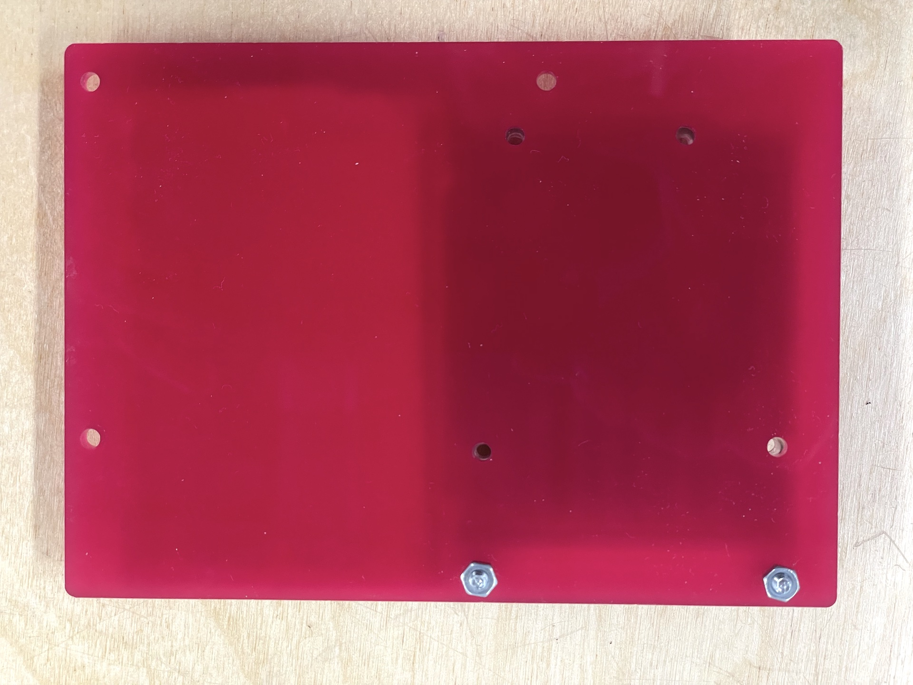
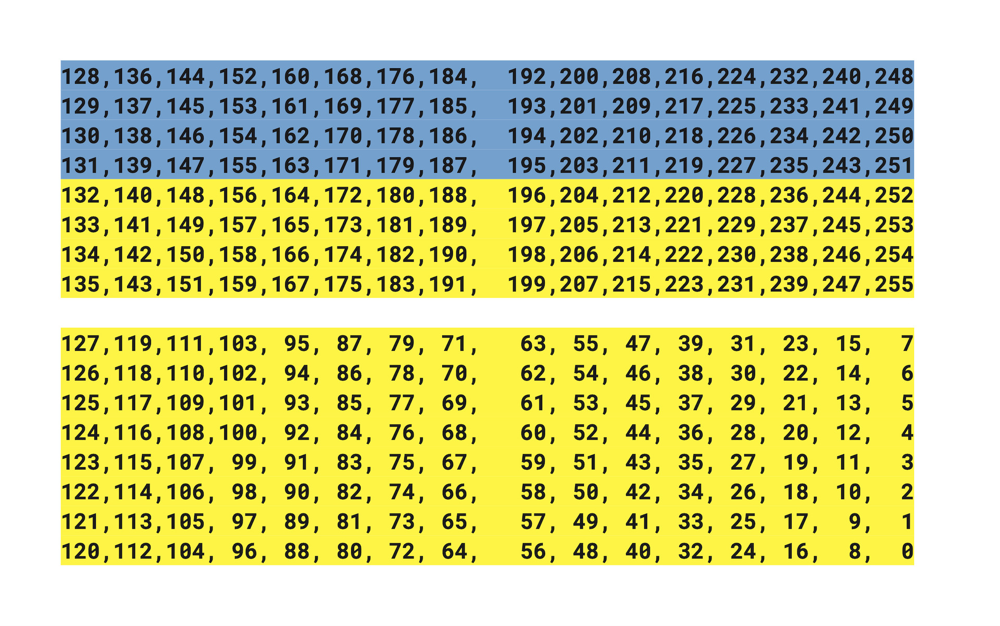

## Physical Computing Robot

Today, we are going to build the first Physical Computing Robot (looking for a better name, if you have any suggestions).

### Parts

You need the following parts:


- 1 x Chassis
- 2 x TT Motor
- 2 x Rear Wheels (can be orange or black)
- 1 x Caster Wheel
- 1 x Acrylic base plate (you make this with the laser cutter)
- 1 x 3D Printed Sensor Mount (you make this with the 3D printer)
- 1 x Battery Pack (5xAA)
- 1 x Bag of nuts, bolts, screws and other items
- 1 x Half-sized Breadboard
- 1 x Arduino Uno R4 WiFi 
- 1 x Distance Sensor
- 1 x Qwiic cable for the sensor (100 mm)
- 1 x L293D H-Bridge (Motor Driver)
- 1 x LDR (light dependent resistor, light sensor)
- 1 x 10kΩ Resistor
- Jumper wires


#### Robot Parts


#### Nuts, Bolts and Other Items

The bag of nuts, bolts and other items should have the following things:

[](./images/nuts-and-bolts.jpg)


- 2 x Googly Eyes
- 2 x M4x15 Standoff Screws
- 3 x M3x20 Standoff Screws
- 2 x M4x12 Machine Screws
- 4 x M3x25 Machine Screws
- 2 x M3x10 Machine Screws
- 2 x M3x8 Machine Screws
- 3 x M3x6 Machine Screws (I forgot these when I took the picture of the components)
- 6 x M3 Nuts
- 2 x 2x16 Brass Screws


The interactive image below shows what each part is.

<iframe width="100%" height="500" data-original-width="1920" data-original-height="1440" src="https://www.thinglink.com/view/scene/1778848233066332837" type="text/html" style="border: none;" webkitallowfullscreen mozallowfullscreen allowfullscreen scrolling="no"></iframe><script async src="//cdn.thinglink.me/jse/responsive.js"></script><br/><a href="https://www.thinglink.com/view/scene/1778848233066332837/accessibility" target="_blank" rel="noopener noreferrer">Click here to view the accessible version of this interactive content</a>


Please return all of these in the plastic bag inside the kit box at the end of the course.  
**Except the googly eyes, those you can keep.**


---

## Assembly

### 1. Distance Sensor


- 1 x 3D Printed Sensor Mount (you make this with the 3D printer)
- 2 x Googly Eyes
- 2 x M4x15 Standoff Screws
- 2 x M4x12 Machine Screws
- 2 x M3x8 Machine Screws
- 2 x M3 Nuts
- 1 x Distance Sensor
- 1 x Qwiic cable for the sensor (100 mm)


[](./images/distance-sensor-parts.jpg)

[](./images/distance-sensor-mounted.jpg)

[](./images/distance-sensor-mounted-back.jpg)

[](./images/distance-sensor-standoffs.jpg)

[](./images/distance-sensor-chassis.jpg)

[](./images/distance-sensor-ready.jpg)

### 2. Motors


- 4 x M3x25 Machine Screws
- 2 x M3 Nuts


[](./images/robot-motors.jpg)

[](./images/robot-motors-back.jpg)

Feed the wires through the L-shaped holes.

[](./images/robot-motors-wires.jpg)

### 3. Caster Wheel (Front Wheel)


- 1 x Caster Wheel
- 2 x M3x6 Machine Screws


[](./images/robot-caster.jpg)

[](./images/robot-caster-mounted.jpg)

### 3. Batteries

- 1 x Battery Pack (5xAA)
- 1 x M3x6 Machine Screws

Take one battery out of the battery holder and use one of the M3x6 screws to attach it to the chassis.

[](./images/batteries.jpg)

### 4. Base Plate + Arduino and Breadboard

- 3 x M3x20 Standoff Screws
- 1 x Acrylic base plate (you make this with the laser cutter)

[](./images/base-plate.jpg)

[](./images/base-plate-arduino.jpg)

[](./images/base-plate-back.jpg)


When you get this far, wait for a while. Let's test the electronics and change the batteries before we attach the acrylic plate.


### 5. Wheels


As a final touch, you can use the brass screws to make sure that the wheels will not fall off. I would recommend doing this only after you have tested your wiring and the code, so that you can easily take off the wheels while testing the motors.

[](./images/wheel-brass.jpg)



---

## Circuit

### Distance Sensor

The distance sensor is connected using the Qwiic cable. [See the VL53L1X sensor tutorial for a detailed overview of how the sensor works.](/tutorials/arduino-and-electronics/sensors/distance-vl53l1x)

### H-Bridge L293D

[](/images/tutorials/electronics/L293D-01.png)

[](/images/tutorials/electronics/L293D-02.png)

[](/images/tutorials/electronics/L293D-03.png)

### Light Sensor

[](./images/ldr_schematic.jpg)

[](./images/ldr.jpg)

---

## Code

### Motor Test



```c
#define MR_EN 5
#define MR_C1 6
#define MR_C2 7

#define ML_EN 9
#define ML_C1 10
#define ML_C2 11

void setup() {
  Serial.begin(9600);

  pinMode(MR_EN, OUTPUT);
  pinMode(MR_C1, OUTPUT);
  pinMode(MR_C2, OUTPUT);

  pinMode(ML_EN, OUTPUT);
  pinMode(ML_C1, OUTPUT);
  pinMode(ML_C2, OUTPUT);

  leftSpeed(255);
  rightSpeed(255);
  stopAll();
}

void loop(){
  // test the motor functions here:
  // leftSpeed(255);
  // rightSpeed(255);
  // goForward();
  // goBackward();
  // goLeft();
  // goRight();
  // stopAll();
  // leftMotorForward();
  // leftMotorBackward();
  // rightMotorForward();
  // rightMotorBackward();
}

void goForward() {
  leftMotorForward();
  rightMotorForward();
}

void goBackward() {
  leftMotorBackward();
  rightMotorBackward();
}

void goLeft() {
  rightMotorForward();
  leftMotorBackward();
}

void goRight() {
  leftMotorForward();
  rightMotorBackward();
}

void stopAll() {
  leftMotorStop();
  rightMotorStop();
}

void leftMotorForward() {
  digitalWrite(ML_C1, HIGH);
  digitalWrite(ML_C2, LOW);
}

void leftMotorBackward() {
  digitalWrite(ML_C1, LOW);
  digitalWrite(ML_C2, HIGH);
}

void leftMotorStop() {
  digitalWrite(ML_C1, LOW);
  digitalWrite(ML_C2, LOW);
}

void rightMotorStop() {
  digitalWrite(MR_C1, LOW);
  digitalWrite(MR_C2, LOW);
}

void rightMotorForward() {
  digitalWrite(MR_C1, HIGH);
  digitalWrite(MR_C2, LOW);
}

void rightMotorBackward() {
  digitalWrite(MR_C1, LOW);
  digitalWrite(MR_C2, HIGH);
}

void leftSpeed(int mSpeed) {
  analogWrite(ML_EN, mSpeed);
}

void rightSpeed(int mSpeed) {
  analogWrite(MR_EN, mSpeed);
}
```


### Final Code

The final code adds the following:

- Distance sensor configuration
  - ROI 16x4
  - Continuous reading every 33 ms
- Distance sensor reading
- Light Sensor

The region of interest is set in the following way to reduce the amount of issues with the sensor seeing the floor while still keeping as wide as possible view horizontally.

[](./images/robot-roi.jpg)


```c
#define MR_EN 5
#define MR_C1 6
#define MR_C2 7

#define ML_EN 9
#define ML_C1 10
#define ML_C2 11

#include <Wire.h>
#include <VL53L1X.h>

VL53L1X sensor;
int rawDistance;
int distance;
int sensorStatus;

int light;
int lightThreshold = 800;

void setup() {
  Serial.begin(9600);

  pinMode(MR_EN, OUTPUT);
  pinMode(MR_C1, OUTPUT);
  pinMode(MR_C2, OUTPUT);

  pinMode(ML_EN, OUTPUT);
  pinMode(ML_C1, OUTPUT);
  pinMode(ML_C2, OUTPUT);

  leftSpeed(255);
  rightSpeed(255);
  stopAll();

  // Setup the sensor
  Wire1.begin();
  Wire1.setClock(400000);  // use 400 kHz I2C
  sensor.setBus(&Wire1);
  sensor.setTimeout(500);
  if (!sensor.init()) {
    Serial.println("Failed to detect and initialize sensor!");
    while (1)
      ;
  }

  // Use long distance mode and allow up to 50000 us (50 ms) for a measurement.
  // You can change these settings to adjust the performance of the sensor, but
  // the minimum timing budget is 20 ms for short distance mode and 33 ms for
  // medium and long distance modes. See the VL53L1X datasheet for more
  // information on range and timing limits.
  sensor.setDistanceMode(VL53L1X::Long);
  sensor.setMeasurementTimingBudget(33000);  // time is in microseconds

  // ROI settings
  // 199 is the center of the array

  sensor.setROICenter(194);
  int center = sensor.getROICenter();
  Serial.print("ROI center: ");
  Serial.println(center);

  // the smallest size for the ROI is 4x4
  sensor.setROISize(16, 4);

  // Start continuous readings at a rate of one measurement every 33 ms (the
  // inter-measurement period). This period should be at least as long as the
  // timing budget.
  sensor.startContinuous(33);
}

void loop() {
  readLight();
  readDistance();
  if(light > 400){
    if (rawDistance > 300) {
      goForward();
    } else {
      goLeft();
    }
  }else{
    stopAll();
  }
}

void readLight() {
  light = analogRead(A3);
  Serial.print("light: ");
  Serial.println(light);
}

void readDistance() {
  sensor.read();
  rawDistance = sensor.ranging_data.range_mm;
  sensorStatus = sensor.ranging_data.range_status;

  // only save the reading to distance if the status is valid
  if (sensorStatus == 0 ||sensorStatus == 2 ) {
    distance = rawDistance;
  }

  Serial.print(rawDistance);
  Serial.print(" ");
  Serial.print(sensorStatus);
  Serial.print(" ");
  Serial.print(distance);
  Serial.println();
}

void goForward() {
  leftMotorForward();
  rightMotorForward();
}

void goBackward() {
  leftMotorBackward();
  rightMotorBackward();
}

void goLeft() {
  rightMotorForward();
  leftMotorBackward();
}

void goRight() {
  leftMotorForward();
  rightMotorBackward();
}

void stopAll() {
  leftMotorStop();
  rightMotorStop();
}

void leftMotorForward() {
  digitalWrite(ML_C1, HIGH);
  digitalWrite(ML_C2, LOW);
}

void leftMotorBackward() {
  digitalWrite(ML_C1, LOW);
  digitalWrite(ML_C2, HIGH);
}

void leftMotorStop() {
  digitalWrite(ML_C1, LOW);
  digitalWrite(ML_C2, LOW);
}

void rightMotorStop() {
  digitalWrite(MR_C1, LOW);
  digitalWrite(MR_C2, LOW);
}

void rightMotorForward() {
  digitalWrite(MR_C1, HIGH);
  digitalWrite(MR_C2, LOW);
}


void rightMotorBackward() {
  digitalWrite(MR_C1, LOW);
  digitalWrite(MR_C2, HIGH);
}

void leftSpeed(int mSpeed) {
  analogWrite(ML_EN, mSpeed);
}

void rightSpeed(int mSpeed) {
  analogWrite(MR_EN, mSpeed);
}


