## Physical Computing Robot

Today, we are going to build the first Physical Computing Robot (looking for a better name, if you have any suggestions).


For the 2025 class, we already built most of the robot during the last class. Please follow the instructions below to finish building the robot.

[](./images/robo_halfway.jpg)

You can jump to step 4.



### Parts

You need the following parts:


- 1 x Chassis
- 2 x TT Motor
- 2 x Rear Wheels
- 1 x Caster Wheel
- 1 x 3D Printed Sensor Mount
- 2 x Googly Eyes
- 1 x Battery Pack (5xAA)
- 1 x Raspberry Pico W
- 1 x Kitronik Motor Driver Board
- 1 x Adafruit PiCowbell Proto Board for Pico
- 1 x Distance Sensor
- 1 x Qwiic cable for the sensor (100 mm)
- 1 x DC Power adapter - 2.1mm jack to screw terminal block


#### Nuts, Bolts and Other Items


- 2 x M4x15 Standoff Screws
- 4 x M4x12 Machine Screws
- 4 x M3x25 Machine Screws
- 3 x M3x8 Machine Screws (Black)
- 6 x M3 Nuts
- 2 x 2x16 Brass Screws


[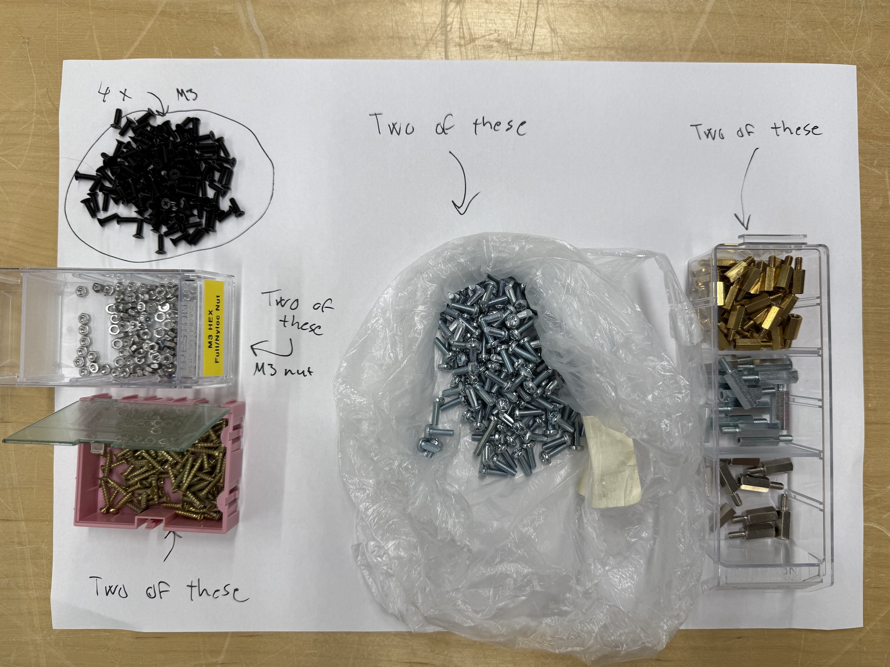](./images/robot-screws.jpg)

The interactive image below shows what each part is. **Note that this is the old one still. Will be updated later.

<iframe width="100%" height="500" data-original-width="1920" data-original-height="1440" src="https://www.thinglink.com/view/scene/1778848233066332837" type="text/html" style="border: none;" webkitallowfullscreen mozallowfullscreen allowfullscreen scrolling="no"></iframe><script async src="//cdn.thinglink.me/jse/responsive.js"></script><br/><a href="https://www.thinglink.com/view/scene/1778848233066332837/accessibility" target="_blank" rel="noopener noreferrer">Click here to view the accessible version of this interactive content</a>

---

## Assembly

### 1. Motors


- 4 x M3x25 Machine Screws
- 4 x M3 Nuts


[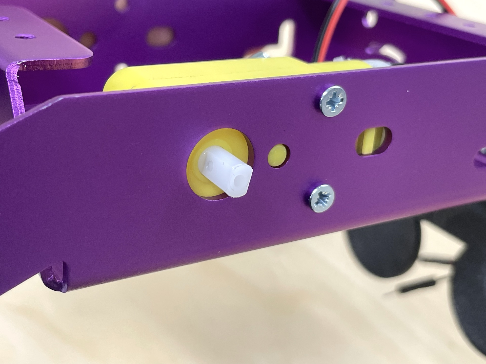](./images/robot-motors.jpg)

[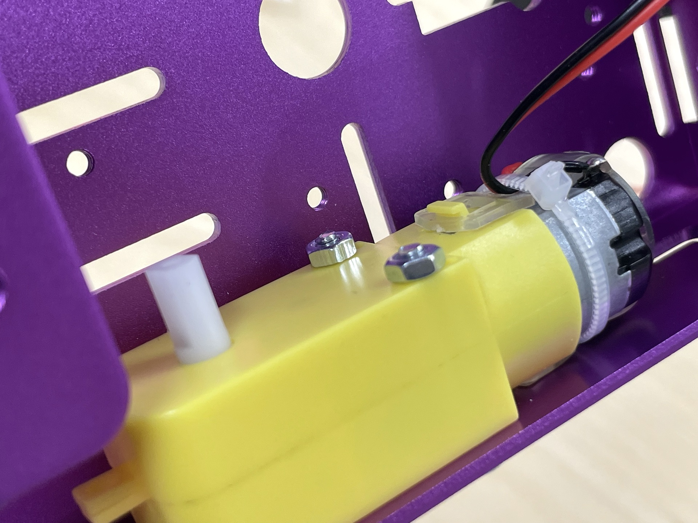](./images/robot-motors-back.jpg)

Feed the wires through the L-shaped holes.

[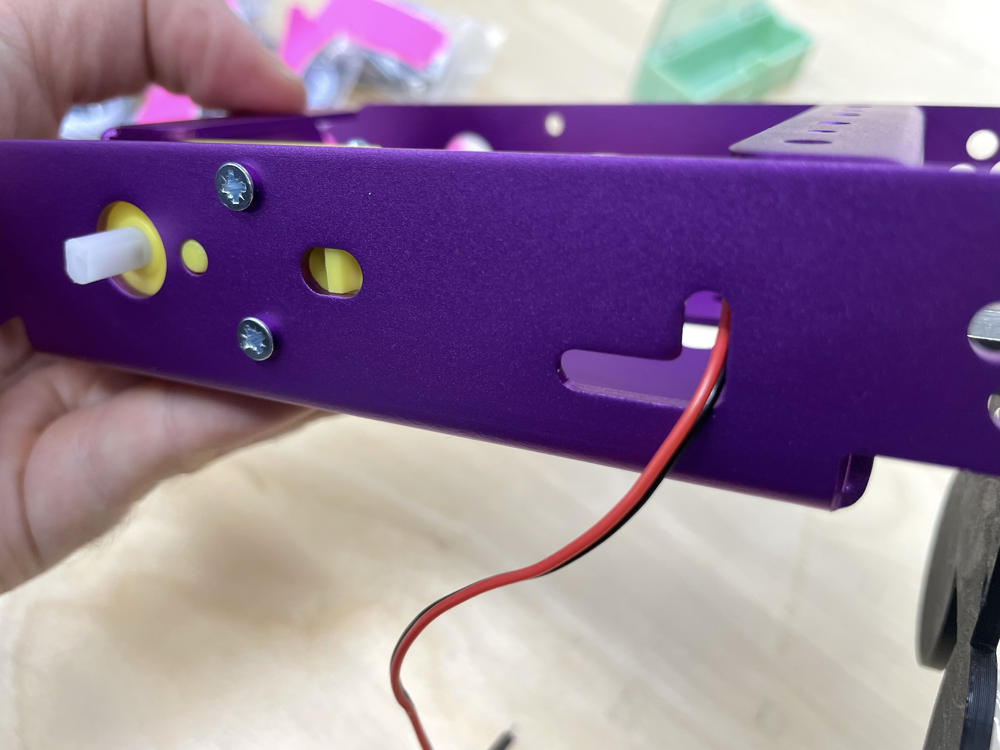](./images/robot-motors-wires.jpg)

### 2. Raspberry Pi Pico and the Motor Driver Board

### 3. Batteries


- 1 x Battery Pack (5xAA)
- 1 x M3x8 Machine Screws


### 4. Distance Sensor


- 1 x 3D Printed Sensor Mount (you make this with the 3D printer)
- 2 x Googly Eyes
- 2 x M4x15 Standoff Screws
- 2 x M4x12 Machine Screws
- 2 x M3x8 Machine Screws
- 2 x M3 Nuts
- 1 x Distance Sensor
- 1 x Qwiic cable for the sensor (100 mm)


[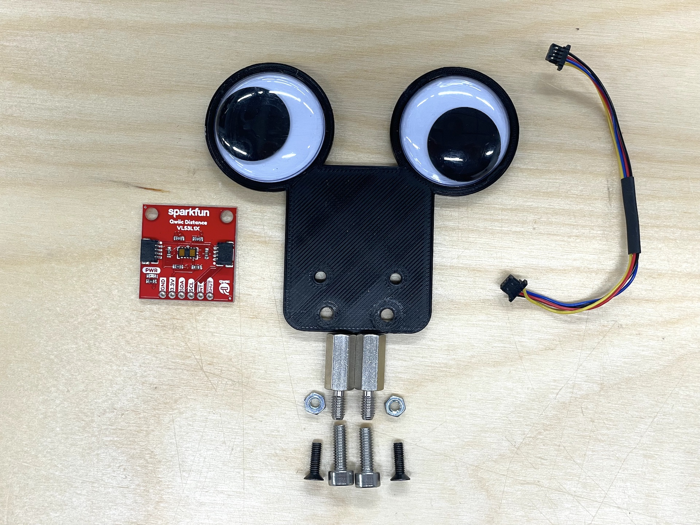](./images/distance-sensor-parts.jpg)

[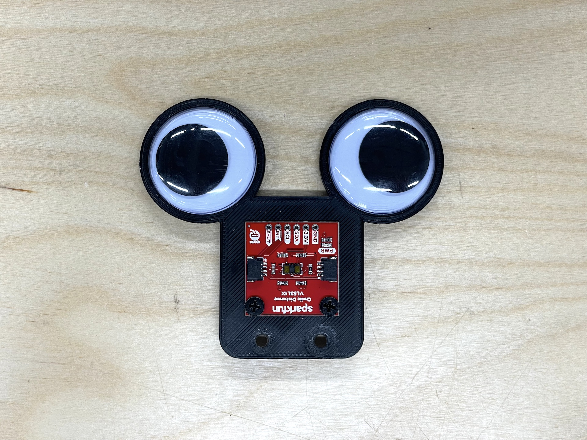](./images/distance-sensor-mounted.jpg)

[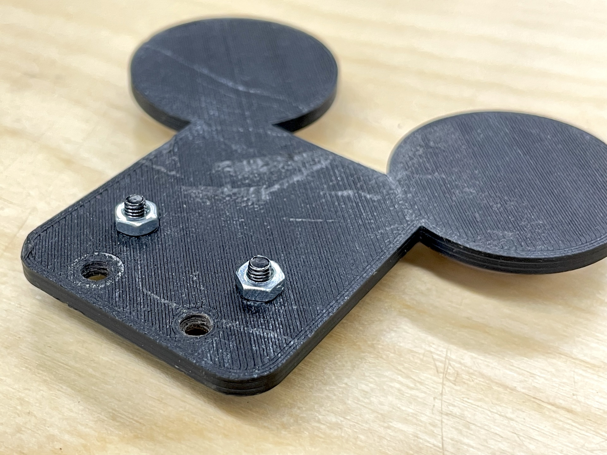](./images/distance-sensor-mounted-back.jpg)

[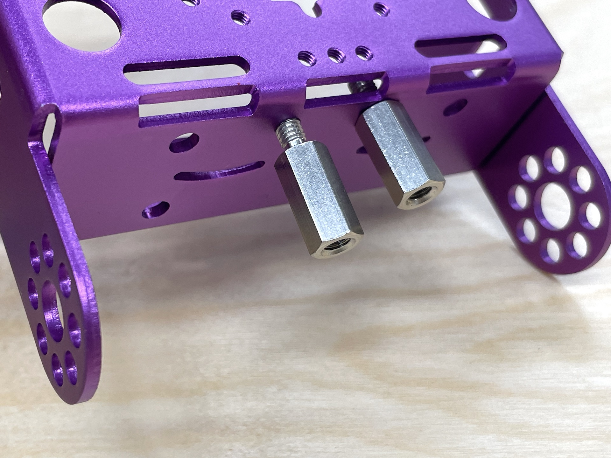](./images/distance-sensor-standoffs.jpg)

[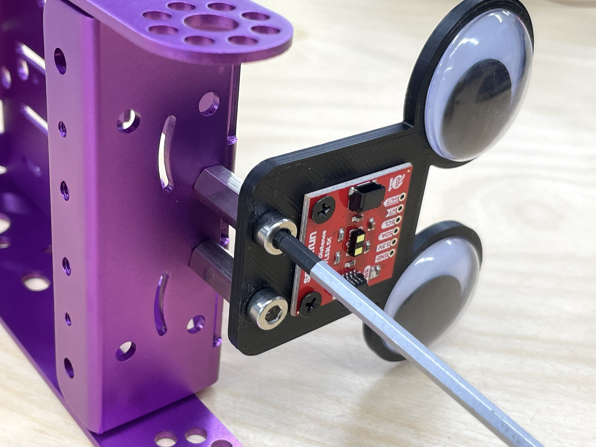](./images/distance-sensor-chassis.jpg)

[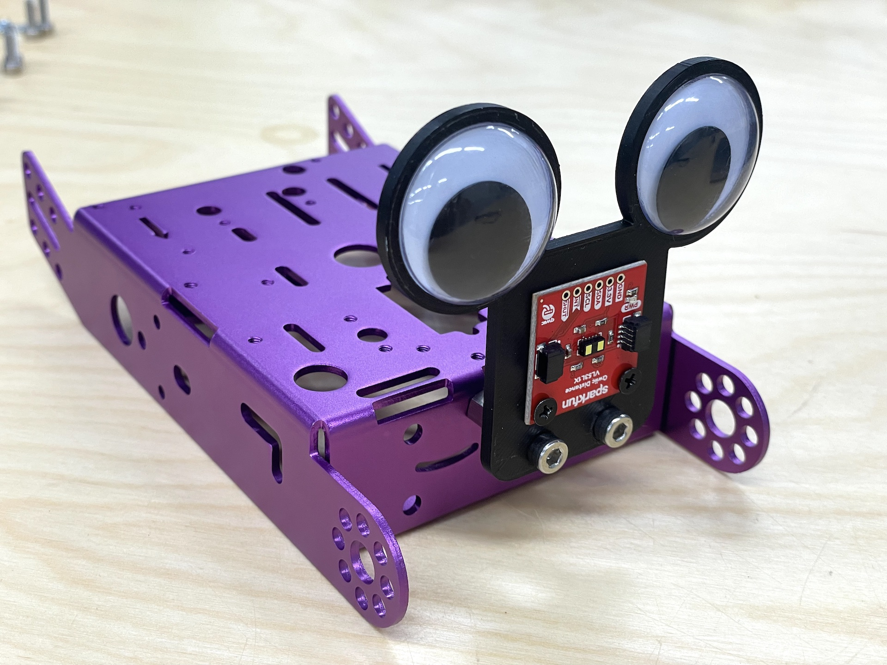](./images/distance-sensor-ready.jpg)

### 5. Caster Wheel (Front Wheel)


- 1 x Caster Wheel
- 2 x M3x8 Machine Screws


[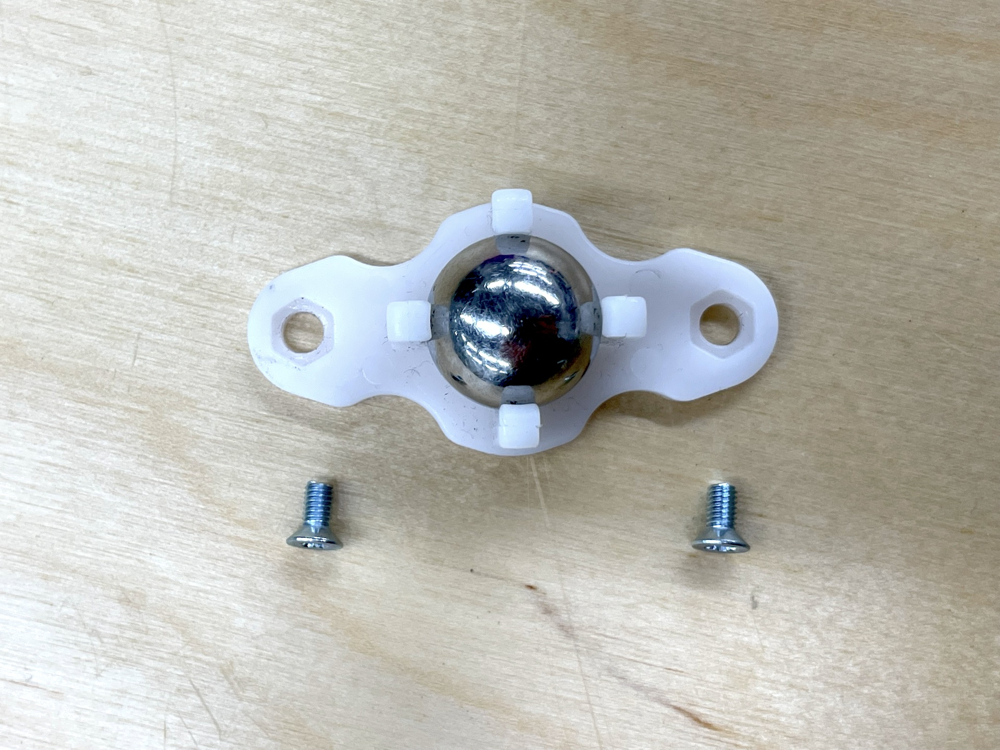](./images/robot-caster.jpg)

[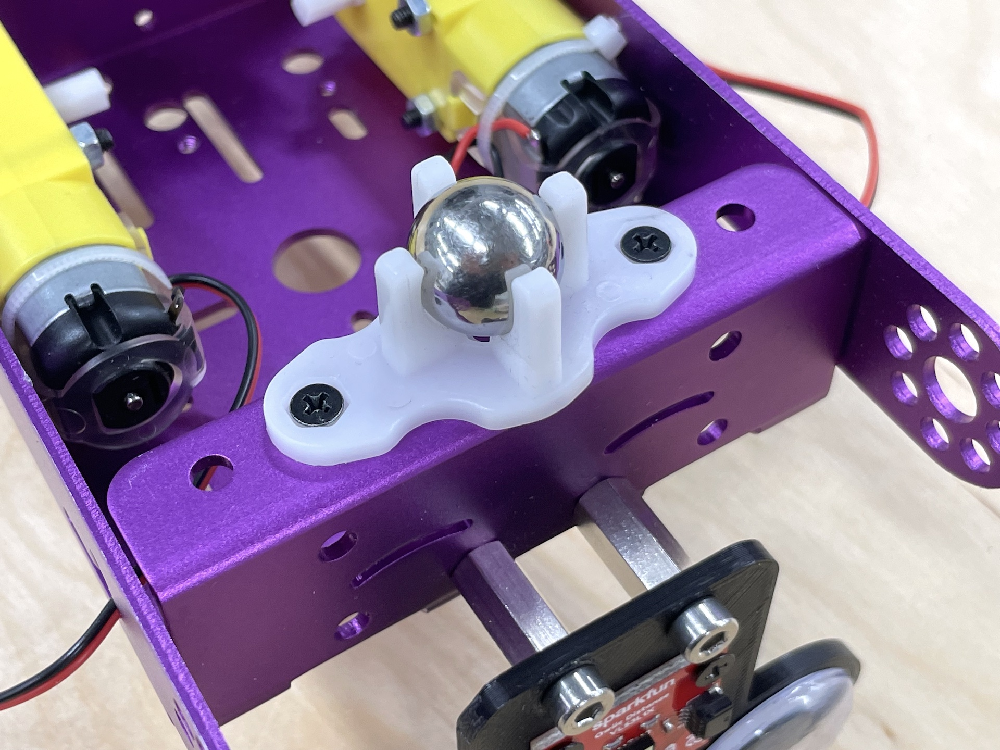](./images/robot-caster-mounted.jpg)

### 6. Wheels (Back Wheels)


As a final touch, you can use the brass screws to make sure that the wheels will not fall off. I would recommend doing this only after you have tested your wiring and the code, so that you can easily take off the wheels while testing the motors.

[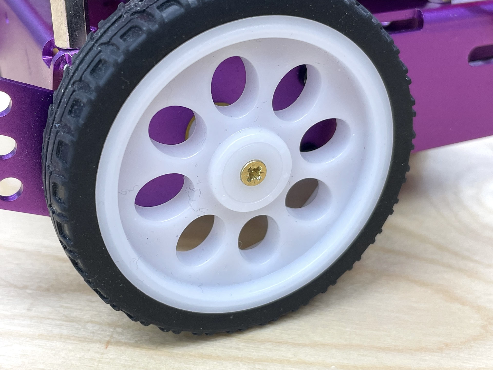](./images/wheel-brass.jpg)



---

## Circuit

### Distance Sensor

The distance sensor is connected using the Qwiic cable. [See the VL53L1X sensor tutorial for a detailed overview of how the sensor works.](/tutorials/arduino-and-electronics/sensors/distance-vl53l1x)

---

## Code


{}

### Motor Testing Example


This example code is for the Pico boards and the Kitronik Motor Drivers.

Uncomment the functions in the `loop()` one by one and see if the robot does what your code is telling. If not, you might need to check your wiring.

For example, If your code is saying `goForward()` and your robot moves backwards, the wires of the motors should be changed to be the opposite (swap the black and red wires on both motors.)

[Download the example code.](./files/week_three_robot_test.zip)



```c
// pins for MOTOR 1
int M1_C1 = 2;
int M1_C2 = 3;

// pins for MOTOR 2
int M2_C1 = 6;
int M2_C2 = 7;

// speed of the motors
int speed = 200;

void setup() {
  Serial.begin(115200);
  // change the pins to outputs
  pinMode(M1_C1, OUTPUT);
  pinMode(M1_C2, OUTPUT);
  pinMode(M2_C1, OUTPUT);
  pinMode(M2_C2, OUTPUT);

  // make sure that the motors are stopped in the beginning
  stopAll();
}

void loop() {
  // TRY UNCOMMENTING THESE LINES ONE BY ONE TO TEST THE MOVEMENTS
  // goForward();
  // goReverse();
  // goLeft();
  // goRight();
  // stopAll();
  // motorTwoForward();
  // motorTwoBackward();
  // motorOneReverse();
  // motorOneReverse();
}

void goForward() {
  motorTwoForward();
  motorOneForward();
}

void goReverse() {
  motorTwoReverse();
  motorOneReverse();
}

void goLeft() {
  motorOneForward();
  motorTwoReverse();
}

void goRight() {
  motorTwoForward();
  motorOneReverse();
}

void stopAll() {
  motorTwoStop();
  motorOneStop();
}

// MOTOR 1

void motorOneForward() {
  analogWrite(M1_C1, speed);
  analogWrite(M1_C2, 0);
}

void motorOneReverse() {
  analogWrite(M1_C1, 0);
  analogWrite(M1_C2, speed);
}

void motorOneStop() {
  analogWrite(M1_C1, 0);
  analogWrite(M1_C2, 0);
}

// MOTOR 2

void motorTwoForward() {
  analogWrite(M2_C1, speed);
  analogWrite(M2_C2, 0);
}

void motorTwoReverse() {
  analogWrite(M2_C1, 0);
  analogWrite(M2_C2, speed);
}

void motorTwoStop() {
  analogWrite(M2_C1, 0);
  analogWrite(M2_C2, 0);
}

```



### Final Robot Code


The code below adds the distance sensor and implements a basic obstacle avoidance logic for the robot.

[Download the example code.](./files/week_three_robot_final.zip)


{}
{}

### Motor Test


Use this code first to test out if the motors and the H-Bridge have been connected properly. Uncomment the functions in the `loop()` one by one and see if the robot does what your code is telling. If not, you might need to check your wiring.

For example, If your code is saying `goForward()` and your robot moves backwards, the wires of the motors should be changed to be the opposite (swap the black and red wires on both motors.)




```c
#define MR_EN 5
#define MR_C1 6
#define MR_C2 7

#define ML_EN 9
#define ML_C1 10
#define ML_C2 11

void setup() {
  Serial.begin(115200);

  pinMode(MR_EN, OUTPUT);
  pinMode(MR_C1, OUTPUT);
  pinMode(MR_C2, OUTPUT);

  pinMode(ML_EN, OUTPUT);
  pinMode(ML_C1, OUTPUT);
  pinMode(ML_C2, OUTPUT);

  leftSpeed(255);
  rightSpeed(255);
  stopAll();
}

void loop(){
  // test the motor functions here:
  // leftSpeed(255);
  // rightSpeed(255);
  // goForward();
  // goBackward();
  // goLeft();
  // goRight();
  // stopAll();
  // leftMotorForward();
  // leftMotorBackward();
  // rightMotorForward();
  // rightMotorBackward();
}

void goForward() {
  leftMotorForward();
  rightMotorForward();
}

void goBackward() {
  leftMotorBackward();
  rightMotorBackward();
}

void goLeft() {
  rightMotorForward();
  leftMotorBackward();
}

void goRight() {
  leftMotorForward();
  rightMotorBackward();
}

void stopAll() {
  leftMotorStop();
  rightMotorStop();
}

void leftMotorForward() {
  digitalWrite(ML_C1, HIGH);
  digitalWrite(ML_C2, LOW);
}

void leftMotorBackward() {
  digitalWrite(ML_C1, LOW);
  digitalWrite(ML_C2, HIGH);
}

void leftMotorStop() {
  digitalWrite(ML_C1, LOW);
  digitalWrite(ML_C2, LOW);
}

void rightMotorStop() {
  digitalWrite(MR_C1, LOW);
  digitalWrite(MR_C2, LOW);
}

void rightMotorForward() {
  digitalWrite(MR_C1, HIGH);
  digitalWrite(MR_C2, LOW);
}

void rightMotorBackward() {
  digitalWrite(MR_C1, LOW);
  digitalWrite(MR_C2, HIGH);
}

void leftSpeed(int mSpeed) {
  analogWrite(ML_EN, mSpeed);
}

void rightSpeed(int mSpeed) {
  analogWrite(MR_EN, mSpeed);
}
```


### Final Code

The final code adds the following:

- Distance sensor configuration
  - ROI 16x8
  - Continuous reading every 33 ms
- Distance sensor reading
- Light Sensor

The region of interest is set in the following way to reduce the amount of issues with the sensor seeing the floor while still keeping as wide as possible view horizontally.

[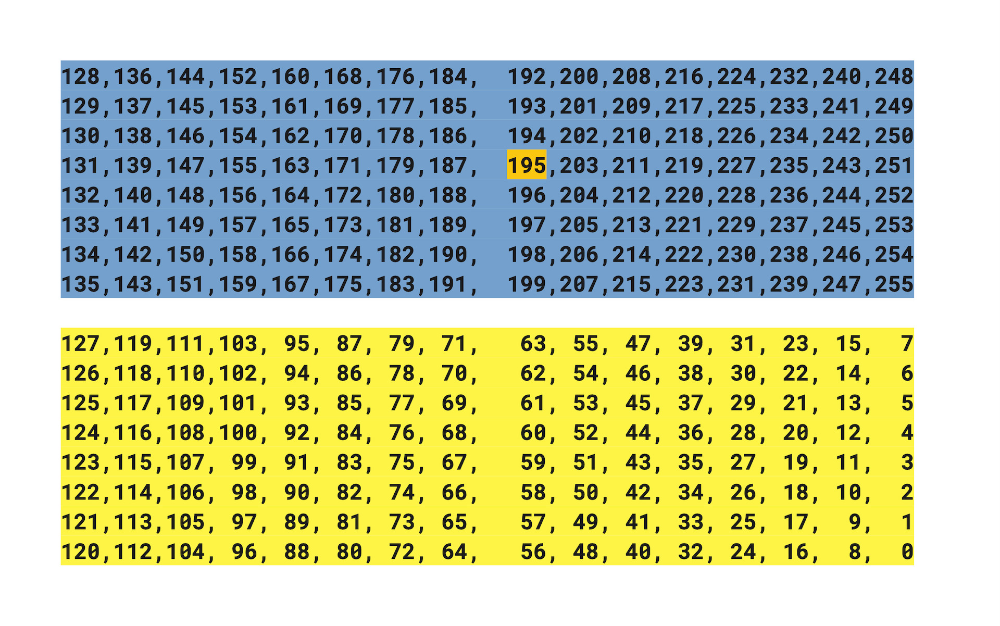](./images/robot-roi-16-8.jpg)




Note that I have separated the code into two tabs. The second tab `motors.ino` has all of the functions dealing with the motors.

[You can also download the code.](./files/RobotSensorControl.zip)


[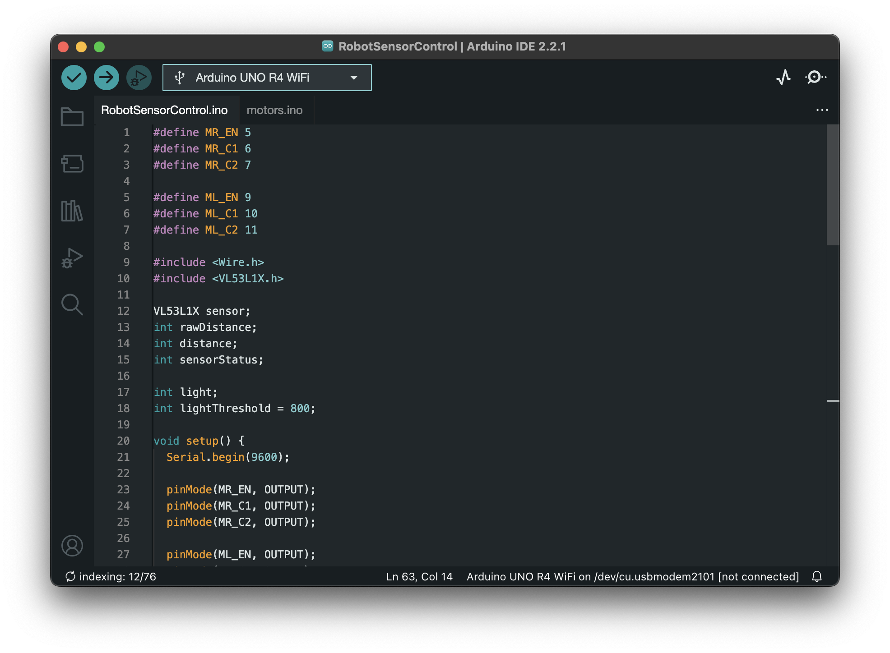](./images/robot-sensor-control-code.png)




```c
#define MR_EN 5
#define MR_C1 6
#define MR_C2 7

#define ML_EN 9
#define ML_C1 10
#define ML_C2 11

#include <Wire.h>
#include <VL53L1X.h>

VL53L1X sensor;
int rawDistance;
int distance;
int sensorStatus;

int light;
int lightThreshold = 800;

void setup() {
  Serial.begin(115200);

  pinMode(MR_EN, OUTPUT);
  pinMode(MR_C1, OUTPUT);
  pinMode(MR_C2, OUTPUT);

  pinMode(ML_EN, OUTPUT);
  pinMode(ML_C1, OUTPUT);
  pinMode(ML_C2, OUTPUT);

  leftSpeed(255);
  rightSpeed(255);
  stopAll();

  // Setup the sensor
  Wire1.begin();
  Wire1.setClock(400000);  // use 400 kHz I2C
  sensor.setBus(&Wire1);
  sensor.setTimeout(500);
  if (!sensor.init()) {
    Serial.println("Failed to detect and initialize sensor!");
    while (1)
      ;
  }

  // ROI settings
  // 195 is the center of the array
  sensor.setROICenter(195);
  int center = sensor.getROICenter();
  Serial.print("ROI center: ");
  Serial.println(center);
  // the smallest size for the ROI is 4x4
  sensor.setROISize(16, 8);

  // Start continuous readings at a rate of one measurement every 33 ms (the
  // inter-measurement period). This period should be at least as long as the
  // timing budget.
  sensor.setDistanceMode(VL53L1X::Long);
  sensor.setMeasurementTimingBudget(33000);  // time is in microseconds
  sensor.startContinuous(33); // time is in milliseconds
}

void loop() {
  readLight();
  readDistance();
  if(light > 400){
    if (rawDistance > 300) {
      goForward();
    } else {
      goLeft();
    }
  }else{
    stopAll();
  }
}

void readLight() {
  light = analogRead(A0);
  Serial.print("light: ");
  Serial.println(light);
}

void readDistance() {
  sensor.read();
  rawDistance = sensor.ranging_data.range_mm;
  sensorStatus = sensor.ranging_data.range_status;

  // only save the reading to distance if the status is valid
  if (sensorStatus == 0 ||sensorStatus == 2 ) {
    distance = rawDistance;
  }

  Serial.print(rawDistance);
  Serial.print(" ");
  Serial.print(sensorStatus);
  Serial.print(" ");
  Serial.print(distance);
  Serial.println();
}
```





```c
void goForward() {
  leftMotorForward();
  rightMotorForward();
}

void goBackward() {
  leftMotorBackward();
  rightMotorBackward();
}

void goLeft() {
  rightMotorForward();
  leftMotorBackward();
}

void goRight() {
  leftMotorForward();
  rightMotorBackward();
}

void stopAll() {
  leftMotorStop();
  rightMotorStop();
}

void leftMotorForward() {
  digitalWrite(ML_C1, HIGH);
  digitalWrite(ML_C2, LOW);
}

void leftMotorBackward() {
  digitalWrite(ML_C1, LOW);
  digitalWrite(ML_C2, HIGH);
}

void leftMotorStop() {
  digitalWrite(ML_C1, LOW);
  digitalWrite(ML_C2, LOW);
}

void rightMotorStop() {
  digitalWrite(MR_C1, LOW);
  digitalWrite(MR_C2, LOW);
}

void rightMotorForward() {
  digitalWrite(MR_C1, HIGH);
  digitalWrite(MR_C2, LOW);
}

void rightMotorBackward() {
  digitalWrite(MR_C1, LOW);
  digitalWrite(MR_C2, HIGH);
}

void leftSpeed(int mSpeed) {
  analogWrite(ML_EN, mSpeed);
}

void rightSpeed(int mSpeed) {
  analogWrite(MR_EN, mSpeed);
}
```




{}

