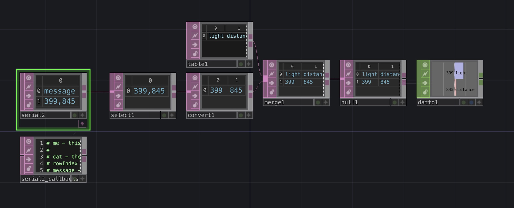

## Inspiration



[Myriam Bleau](http://www.myriambleau.com/)

## Serial

Arduino has two built-in tools for receiving and/or sending serial data.

- Serial Monitor
- Serial Plotter

We have already used them both, mainly for seeing data printed from the sensors we use.

You can also use serial communication with other software on your computer.


### Circuit

- Light sensor connected to pin A0
- The VL53L1X distance sensor connected to the I2C bus using the Qwiic connector


We have this done with our robot we built last week so just keep that connected.


### Arduino Code

Upload the following code to your Arduino. It reads the two sensors and prints out the data on one line with the values separated by a comma.

```c
#include <Wire.h>
#include <VL53L1X.h>
VL53L1X sensor;

int light;
int distance;
void setup() {
  // put your setup code here, to run once:
  Serial.begin(115200);
  // Setup the sensor
  Wire1.begin();
  Wire1.setClock(400000);  // use 400 kHz I2C
  sensor.setBus(&Wire1);
  sensor.setTimeout(500);
  if (!sensor.init()) {
    Serial.println("Failed to detect and initialize sensor!");
    while (1)
      ;
  }
  sensor.setDistanceMode(VL53L1X::Long);
  sensor.setROICenter(199);
  sensor.setROISize(4, 4);  // the smallest size for the ROI is 4x4
  sensor.setMeasurementTimingBudget(33000);  // time is in microseconds
  sensor.startContinuous(33);
}

void loop() {
  // put your main code here, to run repeatedly:
  light = analogRead(A0);
  sensor.read();
  distance = sensor.ranging_data.range_mm;
  Serial.print(light);
  Serial.print(',');
  Serial.println(distance);
  delay(10);
}
```

### Option #1: p5.js code

We can use the p5.webserial library to communicate with the Arduino board directly from the browser. [See the documentation](https://github.com/gohai/p5.webserial/) of the library.

You can create a p5.js sketch to read the data from the serial port. This works with [the online editor](https://editor.p5js.org/) as well.


Note that you have to use a browser that supports the Web Serial API, such as Chrome, for this to work.


First, open the `index.html` file and add the following inside the `head` tags to include the library:

```html
<script src="https://unpkg.com/@gohai/p5.webserial@^1/libraries/p5.webserial.js"></script>
```

[](./img/p5js-editor-serial.png)

Then use the code below. If everything went as expected, you should be able to connect to your Arduino and see the data coming in.

```js
let port;
let light, distance;
let c;
let s=10;
function setup() {
  createCanvas(400, 400);
  port = createSerial();
  c = color(255);
}

function draw() {
  background(130,70,90);
  
  if(port.available()>0){
    let str = port.readUntil("\n");
    let splitData = split(str, ',');
    light = splitData[0];
    distance = splitData[1];
    port.clear();
    c = map(light,0,1023,0,255);
    s = map(distance,0,3000,10,400);
  }
  
  fill(255);
  text("light: " + light,20,20);
  text("distance: " + distance,20,40);
  fill(c);
  circle(width/2, height/2, s);
}

function mousePressed(){
  if (!port.opened()) {
    port.open(115200);
  }
}
```

### Option #2: Processing code

You can also do the same thing using Processing. The Serial library comes built-in with Processing so you don't need to install anything extra. Just include the library in your code.

```java
import processing.serial.*;

Serial myPort;  // Create object from Serial class
String str;      // Data received from the serial port
float light;
float distance;
float c;
float s=10;
void setup(){
  size(500, 500);
  // Open whatever port is the one you're using.
  // Change the 0 in  Serial.list()[0] to the correct device
  printArray(Serial.list());
  String portName = Serial.list()[5];
  myPort = new Serial(this, portName, 115200);
}

void draw(){
  if ( myPort.available() > 0) {  // If data is available,
    str = myPort.readStringUntil('\n');         // read it and store it in str
    if(str != null){
      String[] splitData = split(str, ",");
      light = float(splitData[0]);
      distance = float(splitData[1]);
      c = map(light,0,1023,0,255);
      s = map(distance,0,3000,10,400);
    }
  }
  background(130,70,90);   
  fill(255);
  text("light: " + light,20,20);
  text("distance: " + distance,20,40);
  fill(c);
  circle(width/2, height/2, s);
}
```

### Option #3: TouchDesigner Example

[](./img/td-serial-dat.jpg)

There are two ways to use serial communication in TouchDesigner:

1. Using the Serial CHOP | This is useful when you are only receiving one value
2. Usingt the Serial DAT | Use this for more complex cases or when you need to receive multiple values

[Download a TouchDesigner example of reading the values from the Serial Port.](./files/ArduinoToTDSerial.toe)

---

## Keyboard

You can make the Arduino Uno R4 WiFi appear as a USB keyboard for your computer.


Be careful with this. It's quite easy to accidentally create something that is constantly typing something, which can make it really hard to reprogram your board.


### Sending individual keystrokes

```c
// Send an individual keystroke
Keyboard.press('a');
delay(1);
Keyboard.release('a');

// Use modifier keys
Keyboard.press(KEY_LEFT_SHIFT);
Keyboard.press('a');
delay(1);
Keyboard.releaseAll();
```

### Sending text

```c
// use println() to write text followed by a newline character
Keyboard.println("Hello world!");
```

### Special keys

You can find the [full list of supported special keys here](https://www.arduino.cc/reference/en/language/functions/usb/keyboard/keyboardmodifiers/).

### Example

```c
#include "Keyboard.h"

void setup(){
  // initialize control over the keyboard:
  Keyboard.begin();
}

void loop(){
  delay(5000);
  Keyboard.print('a');
  delay(5000);
  Keyboard.press(KEY_LEFT_SHIFT);
  Keyboard.print('a');
  delay(100);
  Keyboard.releaseAll();
  delay(5000);
  Keyboard.println("Hello World!");
}
```

---

## Mouse

You can also make the Arduino Uno R4 WiFi appear as a USB mouse to your computer.


Be careful with this. It's quite easy to accidentally create something that is constantly moving the mouse, which can make it really hard to reprogram your board.


```c
#include <Mouse.h>

void setup() {
  // put your setup code here, to run once:
  Mouse.begin();
  delay(1000);
}

void loop() {
  // put your main code here, to run repeatedly:
  Mouse.move(100,100);
  delay(1000);
  Mouse.move(-100,-100);
  delay(1000);
}
```

--- 

## Teensy Boards

The [Teensy boards](https://www.pjrc.com/teensy/) are also capable of becoming various USB devices. The libraries for the Teensy boards generally work better than the built-in USB HID library from Arduino.

- [USB Keyboard](https://www.pjrc.com/teensy/td_keyboard.html)
- [USB Mouse](https://www.pjrc.com/teensy/td_mouse.html)
- [USB Joystick](https://www.pjrc.com/teensy/td_joystick.html)
- [USB MIDI](https://www.pjrc.com/teensy/td_midi.html)
- [USB Flight Sim](https://www.pjrc.com/teensy/td_flightsim.html])

[The Teensy Audio library even allows you to use your Teensy as a USB Audio Interface.](https://www.pjrc.com/teensy/td_libs_Audio.html)