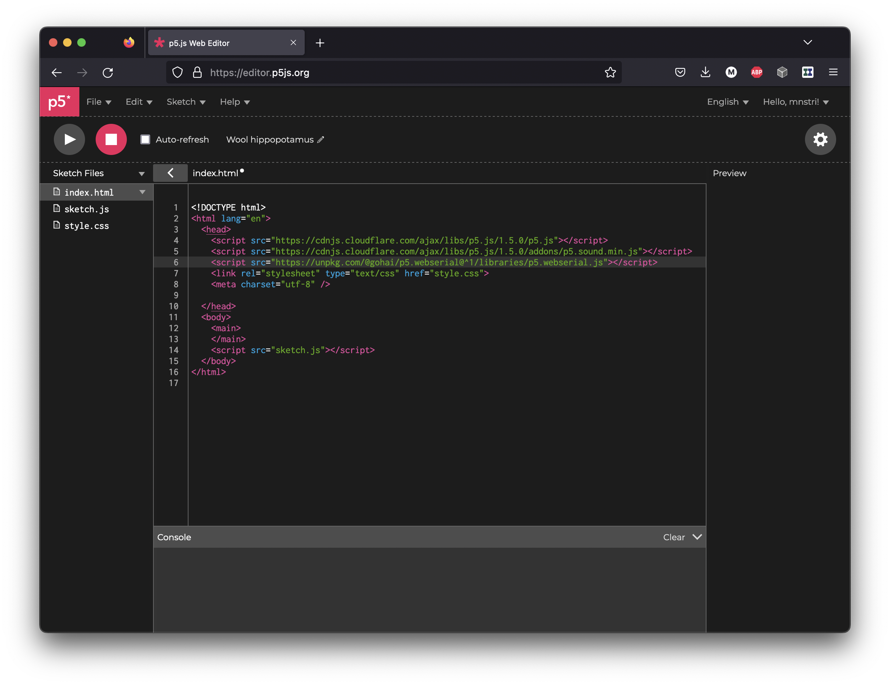

# Communication

---

## Inspiration



[Myriam Bleau](http://www.myriambleau.com/)

## Serial

Arduino has two built-in tools for receiving and/or sending serial data.

- Serial Monitor
- Serial Plotter

We have already used them both, mainly for seeing data printed from the sensors we use.

You can also use serial communication with other software on your computer.

### p5.webserial.js 

[See the documentation](https://github.com/gohai/p5.webserial/) of the library.

#### Circuit

- Light sensor connected to pin A3
- The VL53L1X distance sensor connected to the I2C bus using the Qwiic connector


We have this done with our robot we built last week so just keep that connected.


#### Arduino Code

Upload the following code to your Arduino. It reads the two sensors and prints out the data on one line with the values separated by a comma.

```c
#include <Wire.h>
#include <VL53L1X.h>
VL53L1X sensor;

int light;
int distance;
void setup() {
  // put your setup code here, to run once:
  Serial.begin(9600);
  // Setup the sensor
  Wire.begin();
  Wire.setClock(400000);  // use 400 kHz I2C

  sensor.setTimeout(500);
  if (!sensor.init()) {
    Serial.println("Failed to detect and initialize sensor!");
    while (1)
      ;
  }
  sensor.setDistanceMode(VL53L1X::Long);
  sensor.setMeasurementTimingBudget(25000);  // time is in microseconds
  sensor.setROICenter(199);
  // the smallest size for the ROI is 4x4
  sensor.setROISize(4, 4);
  sensor.startContinuous(25);
}

void loop() {
  // put your main code here, to run repeatedly:
  light = analogRead(A3);
  sensor.read();
  distance = sensor.ranging_data.range_mm;
  Serial.print(light);
  Serial.print(',');
  Serial.println(distance);
  delay(10);
}
```

#### Option #1: p5.js code

Then you can create a p5.js sketch to read the data from the serial port. This works with [the online editor](https://editor.p5js.org/) as well.


Note that you have to use a browser that supports the Web Serial API, such as Chrome, for this to work.


First, open the `index.html` file and add the following inside the `head` tags to include the library:

```html
<script src="https://unpkg.com/@gohai/p5.webserial@^1/libraries/p5.webserial.js"></script>
```

[](./img/p5js-editor-serial.png)

Then use the code below. If everything went as expected, you should be able to connect to your Arduino and see the data coming in.

```js
let port;
let light, distance;
let c;
let s=10;
function setup() {
  createCanvas(400, 400);
  port = createSerial();
  c = color(255);
}

function draw() {
  background(130,70,90);
  
  if(port.available()>0){
    let str = port.readUntil("\n");
    let splitData = split(str, ',');
    light = splitData[0];
    distance = splitData[1];
    port.clear();
    c = map(light,0,1023,0,255);
    s = map(distance,0,3000,10,400);
  }
  
  fill(255);
  text("light: " + light,20,20);
  text("distance: " + distance,20,40);
  fill(c);
  circle(width/2, height/2, s);
}

function mousePressed(){
  if (!port.opened()) {
    port.open(9600);
  }
}
```

#### Option #2: Processing code


If you have the new Mac computers with Apple Silicon (M1 or M2 chips), [see this page to fix the Serial library](https://notes.osteele.com/courses/interaction-lab/using-serial-with-processing-4-on-apple-silicon)


```java
import processing.serial.*;

Serial myPort;  // Create object from Serial class
String str;      // Data received from the serial port
float light;
float distance;
float c;
float s=10;
void setup()
{
  size(500, 500);
  // Open whatever port is the one you're using.
  // Change the 0 in  Serial.list()[0] to the correct device
  printArray(Serial.list());
  String portName = Serial.list()[5];
  myPort = new Serial(this, portName, 9600);
}

void draw()
{
  if ( myPort.available() > 0) {  // If data is available,
    str = myPort.readStringUntil('\n');         // read it and store it in str
    if(str != null){
      String[] splitData = split(str, ",");
      light = float(splitData[0]);
      distance = float(splitData[1]);
      c = map(light,0,1023,0,255);
      s = map(distance,0,3000,10,400);
    }
  }
  background(130,70,90);   
  fill(255);
  text("light: " + light,20,20);
  text("distance: " + distance,20,40);
  fill(c);
  circle(width/2, height/2, s);
}
```

---

## Keyboard

You can make the Arduino Nano RP2040 Connect to appear as a USB keyboard for your computer.


Be careful with this. It's quite easy to accidentally create something that is constantly typing something, which can make it really hard to reprogram your board.


### Sending individual keystrokes

```c
// Send an individual keystroke
Keyboard.key_code('a');

// Use modifier keys
Keyboard.key_code('a', KEY_SHIFT);
```

### Sending text

```c
// use printf() to
Keyboard.printf("Hello world!");
```

### Special keys

You can use the following names for special keys on the keyboard

- KEY_CTRL
- KEY_SHIFT
- KEY_ALT
- KEY_LOGO
- KEY_RCTRL
- KEY_RSHIFT
- KEY_RALT
- KEY_RLOGO
- KEY_NEXT_TRACK
- KEY_PREVIOUS_TRACK
- KEY_STOP
- KEY_PLAY_PAUSE
- KEY_MUTE
- KEY_VOLUME_UP
- KEY_VOLUME_DOWN
- KEY_F1
- KEY_F2
- KEY_F3
- KEY_F4
- KEY_F5
- KEY_F6
- KEY_F7
- KEY_F8
- KEY_F9
- KEY_F10
- KEY_F11
- KEY_F12
- KEY_PRINT_SCREEN
- KEY_SCROLL_LOCK
- KEY_CAPS_LOCK
- KEY_NUM_LOCK
- KEY_INSERT
- KEY_HOME
- KEY_PAGE_UP
- KEY_PAGE_DOWN
- RIGHT_ARROW
- LEFT_ARROW
- DOWN_ARROW
- UP_ARROW

### Example

```c
#include "PluggableUSBHID.h"
#include "USBKeyboard.h"

USBKeyboard Keyboard;

void setup(){
  
}

void loop(){
  delay(5000);
  Keyboard.key_code('a');
  delay(5000);
  Keyboard.key_code('a', KEY_SHIFT);
  delay(5000);
  Keyboard.printf("Hello World!");
}
```

---

## Mouse

You can also make the Arduino Nano RP2040 Connect appear as a USB mouse to your computer.

```c
#include "PluggableUSBHID.h"
#include "USBMouse.h"

USBMouse Mouse;

void setup() {
  // put your setup code here, to run once:
}

void loop() {
  // put your main code here, to run repeatedly:
  delay(1000);
  Mouse.move(100,100);
  delay(1000);
  Mouse.move(-100,-100);
}
```

--- 

## Teensy Boards

The [Teensy boards](https://www.pjrc.com/teensy/) are also capable of becoming various USB devices. The libraries for the Teensy boards generally work better than the built-in USB HID library from Arduino.

- [USB Keyboard](https://www.pjrc.com/teensy/td_keyboard.html)
- [USB Mouse](https://www.pjrc.com/teensy/td_mouse.html)
- [USB Joystick](https://www.pjrc.com/teensy/td_joystick.html)
- [USB MIDI](https://www.pjrc.com/teensy/td_midi.html)
- [USB Flight Sim](https://www.pjrc.com/teensy/td_flightsim.html])

[The Teensy Audio library even allows you to use your Teensy as a USB Audio Interface.](https://www.pjrc.com/teensy/td_libs_Audio.html)

--- 

## Assignment (Deadline: Tuesday, November 22 at 13:00)

Create a small project that does the following:

- Read at least two sensor values using Arduino. You can use any sensor you want to but they should be some other sensors than the ones we used in class. They can also be two channels from the same sensor such as the X and Y of the accelerometer.
- Print out the values using the Serial port in a way that you can separate the different values.
- Create a small sketch using Processing or p5.js (or some other programming environment) to read the sensor values from the serial port. You can use the examples on this page as a starting point.
- Map the sensor values to some parameters in your sketch. You can simply visualize the data in some way or create something more interesting and meaningful that is more connected to the interaction. Do something else than the example we created today.

Document your project on your course website. **Deadline: Tuesday, November 22 at 13:00.**