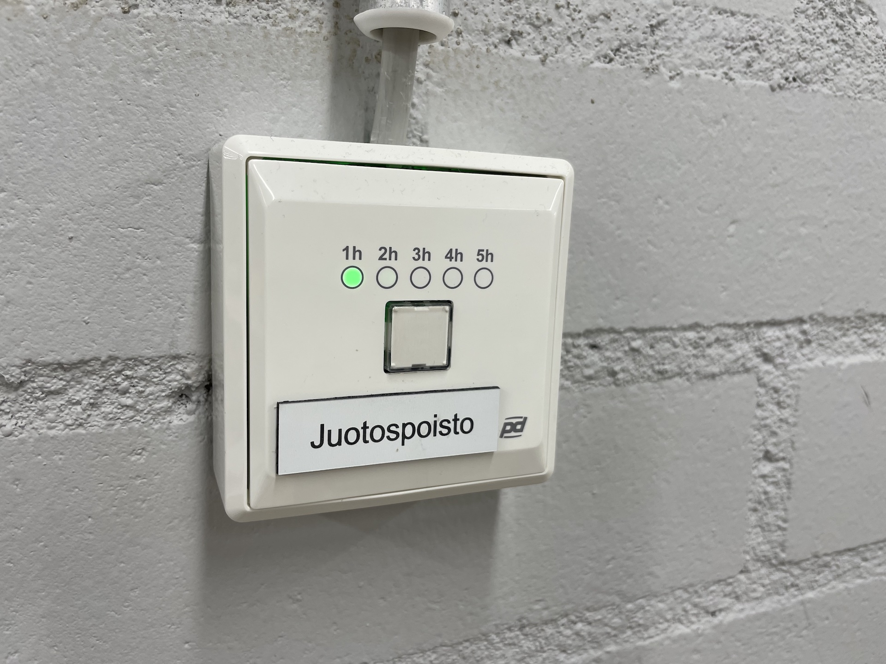
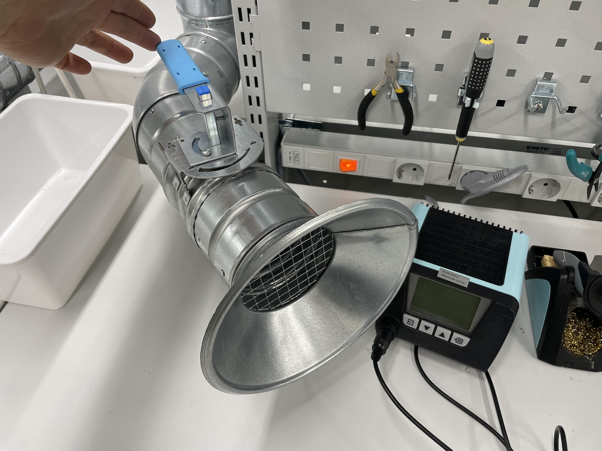
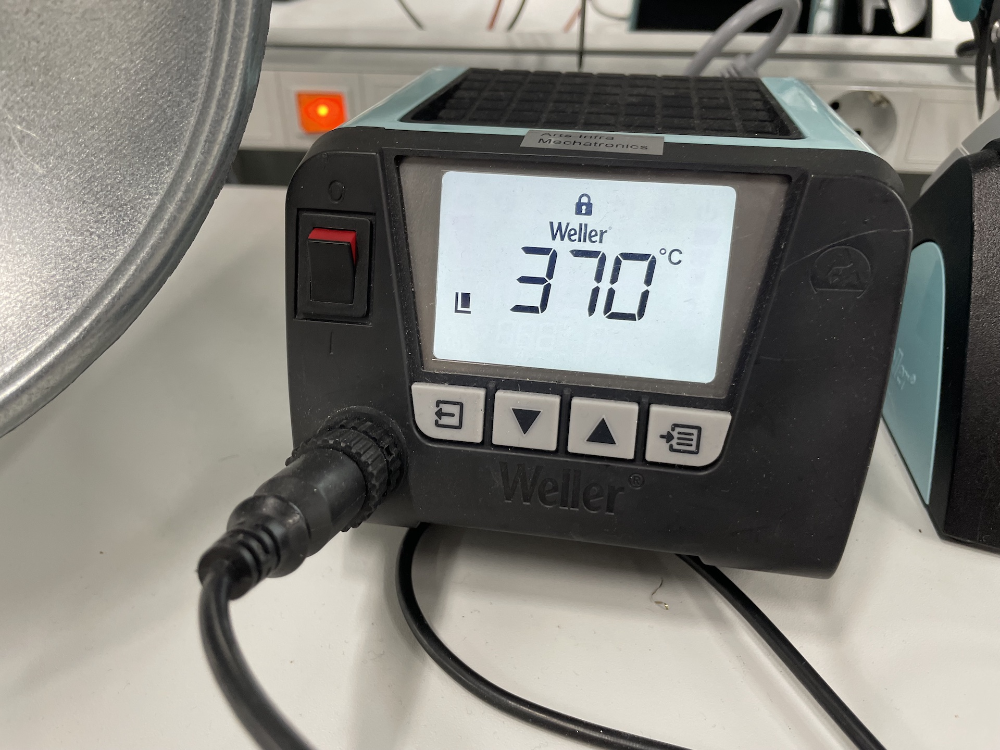
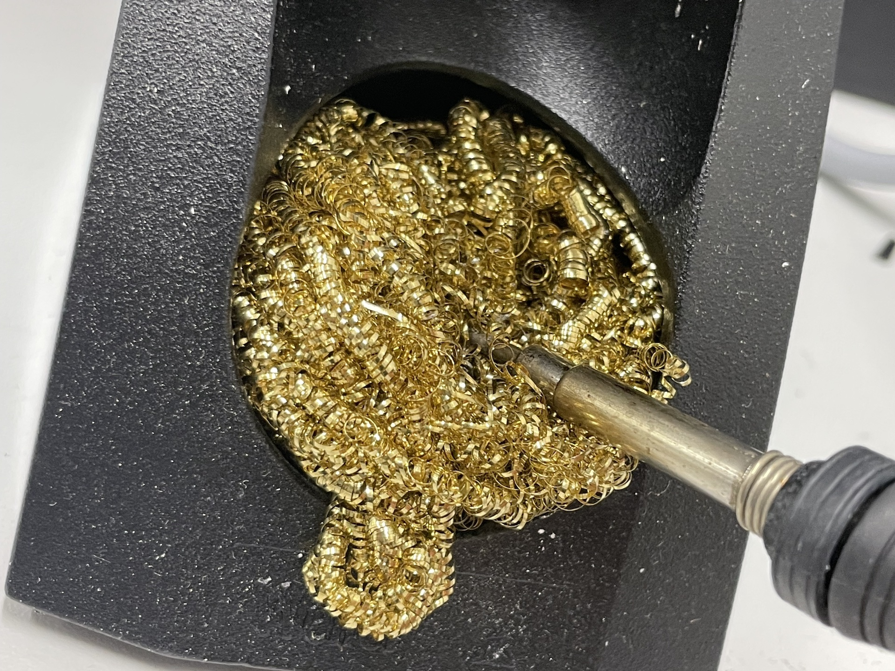
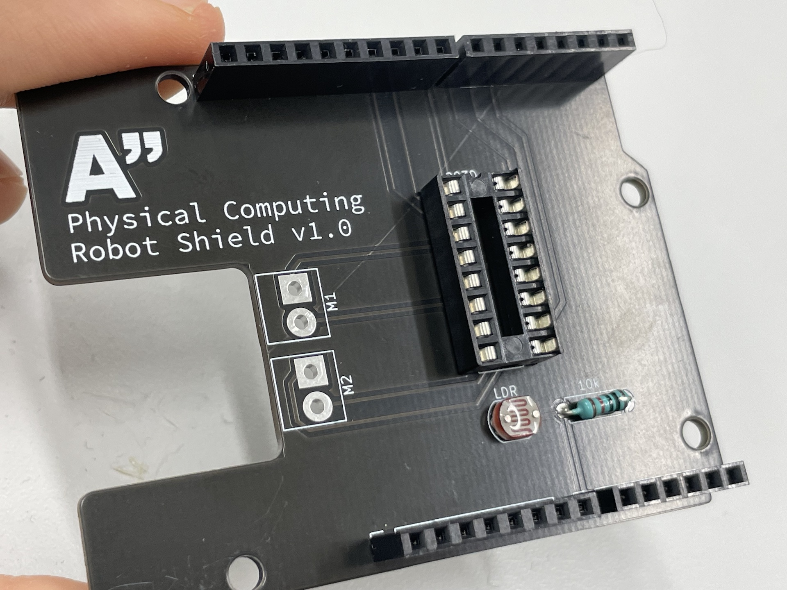
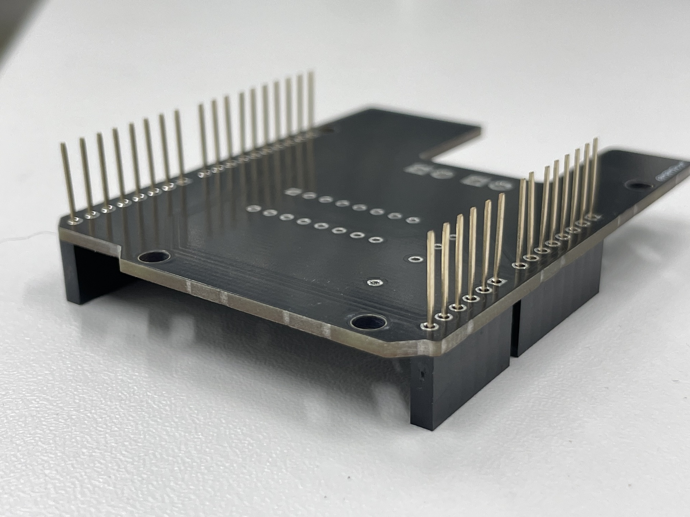
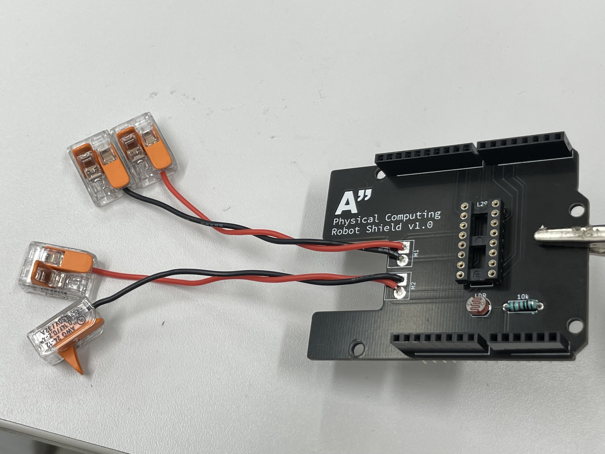
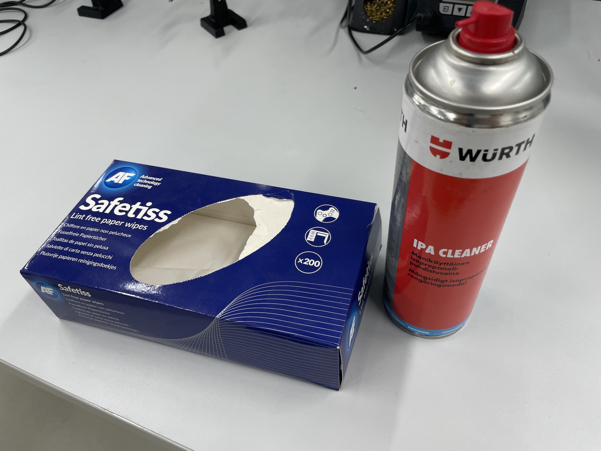
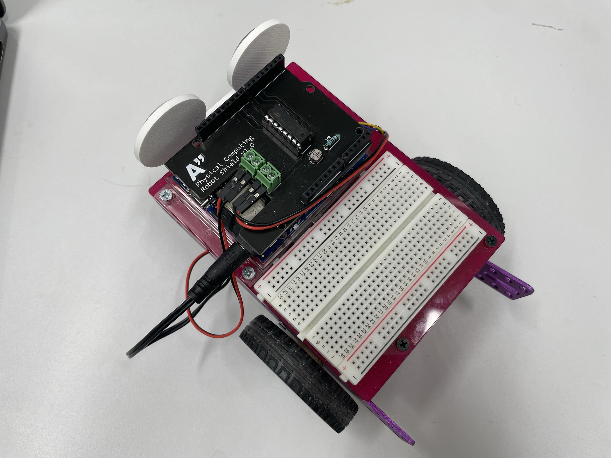

## Schedule

| TIME | MON | TUE | WED | THU | FRI |
| --- | --- | --- | --- | --- | --- |
| 09:15–12:00 |  |  |  |  |  |
| 12:00–13:00| 🥗🍜🍱🍝🍕 | 🥗🍜🍱🍝🍕 | 🥗🍜🍱🍝🍕 | 🥗🍜🍱🍝🍕 | 🥗🍜🍱🍝🍕 |
| 13:15–15:00 |  | Project Work |  | Project Work |  |
| 15:15–17:00 | Levels of Prototyping | Project Work|  | Project Work |  |

## Monday | Prototyping


We will divide into two groups. Half will start with the 3D printing workshop and the other half will start with the soldering. Then we switch around 16:15.


### 3D Printing Introduction

We get a proper introduction from Hector on all the possibilities at the 3D print workshop at Väre.

### Soldering exercise

We will also do a small soldering exercise and build a motor control shield for the robots.

#### General guidelines for soldering

- [Adafruit Guide To Excellent Soldering](https://learn.adafruit.com/adafruit-guide-excellent-soldering/tools) or [download the pdf file](https://cdn-learn.adafruit.com/downloads/pdf/adafruit-guide-excellent-soldering.pdf)

#### Väre Mechatronics specific guidelines for soldering

##### 1. Always turn on the fume extraction

Press the button on the wall, each press adds one hour to the time that the fume extraction is on.

Make sure the valve at your workstation is open. Try to solder near the fume hood (I know it's a little underpowered and not very conveniently placed)

##### 2. 370-380°C should be hot enough

Use 370-380°C as the temperature. Sometimes you might need to go higher if your board has a large heat sink or it's otherwise tricky. **Usually, the problem is that tip of the iron is not clean and not the temperature.**

##### 3. We use the brass sponges instead of wet sponges

The brass sponges do not cool down the tip of your iron and clean it better. Do not wipe the tip of the iron too aggressively on the sponge since it does do some mechanical damage to it over time.

#### Physical Computing Robot Shield

You have a small soldering assignment to complete today. Solder all of the parts onto the Physical Computing Robot Shield that you got last week. This one has the same functionality as the circuit we built on the breadboard during the previous weeks for the robot.

1. Start with the smallest parts (or the ones with the lowest profile). This allows you to use the weight of the board to hold the parts down during each step. For this project the smallest parts are the **LDR** and the **10kΩ resistor**. Cut the excess length of the legs when you are done soldering the parts. 
You can also use some tape to hold the components in place while soldering.

2. Next one is the IC socket for the H-Bridge. This allows us to still use the IC on a breadboard as well. Align the notch on one side of the socket to the print on the board. 
We do not have enough of these sockets this year, so some of you will have to solder the IC directly on the shield. Note that we have two different styles of IC sockets in use, use whatever you got. 

3. Then solder the header pins for the shield. 
Make sure they are straight, use the desk to align them properly. 

4. Normally, the motor connectors M1 and M2 should be populated with 2-pin screw-on terminals, but we unfortunately do not have those parts available today. Solder short pieces (<10cm) of wires to where the connectors should go to. 
**Use multistrand wire**. Also solder the colors as shown in this picture. This way the motor directions should be correct and you don't need to make any changes. 

5. Use the wago connectors to connect the motors to the wires you soldered to M1 and M2.
6. Carefully place the L293D H-Bridge on the IC socket (the legs bend very easily).
7. Use some isopropyl alcohol to clean the board when you are done. 
7. Test your shield to make sure that it works. If you still have the code from last week, it should just work and you can use the OSC control Processing sketch from last week. 

---

## Project Work

The rest of the course is reserved for project work. See these useful links:

- [Final Project Guidelines](../final-project/)
- [Resources](../resources/)
- [Tutorials](../../../tutorials/arduino-and-electronics/)