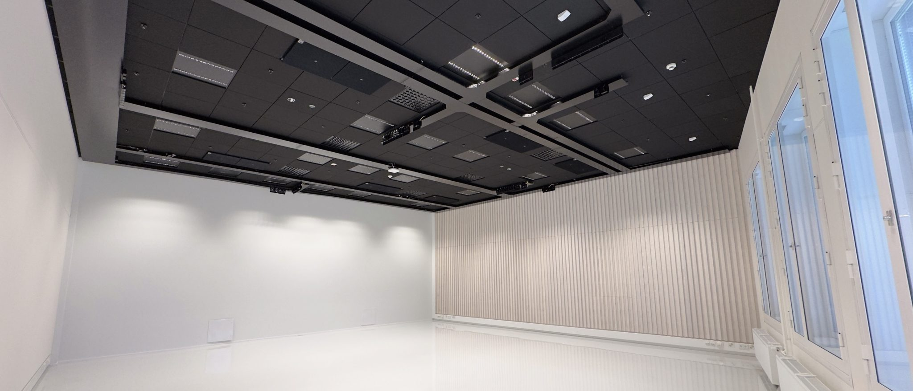


- [Official page from Aalto Studios](https://studios.aalto.fi/experimental-studios/)


Room 3430 aka ***Experimental Studio 1*** is a 100m2 space that is specifically meant for the purposes of New Media. Do you want to work with large-scale interactive installations, projection mapping, AI tools, and other computational media? This room is the place for that.

Features:
- Projector: Barco F90-W13 with EN68 short-throw lens (0.28:1 ratio)
- Projector: Panasonic RZ660 with ET-DLE060 zoom lens (0.6–0.8:1 ratio) | This one is pointing to the floor for floor projections.
- Computer: Dell Windows PC
  - CPU: i9-10980XE 3.00GHz, 18 cores
  - GPU: NVIDIA GeForce RTX 3090 24GB GDDR6X
  - RAM: 64GB
- Computer: HP Windows PC
  - CPU: i9-12900K 3.20G, 16 cores
  - GPU: NVIDIA RTX A5000 24 GB
  - RAM: 64GB