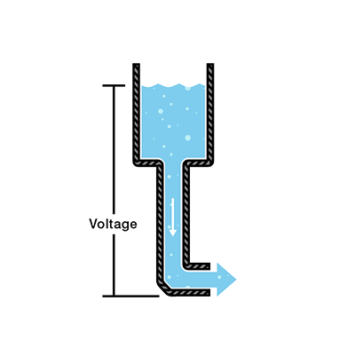
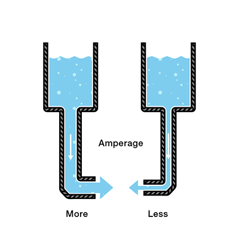
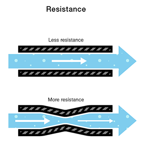
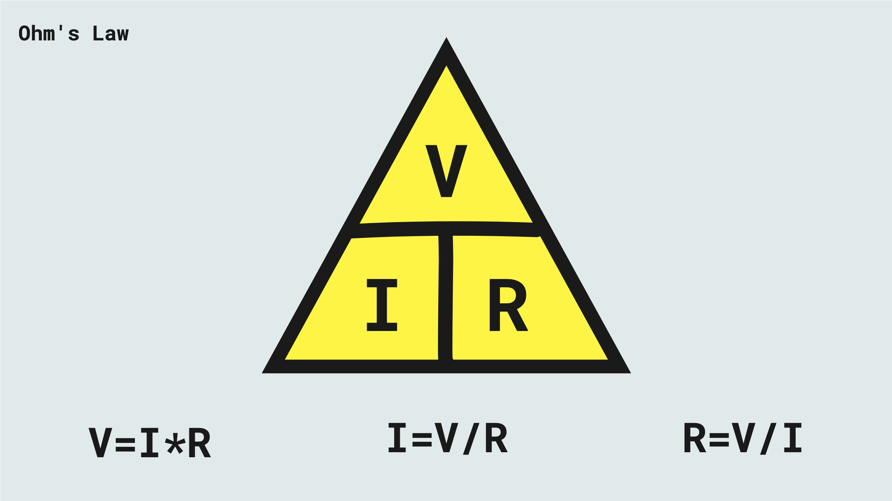

# Electronics: Fundamentals

---

## Voltage

- Symbol: V (U in some parts of Europe, E is sometimes used in the USA)
- Unit: Volt (V)

Voltage is the difference in electric potential energy between two points.

In our water analogy, voltage is like the amout of pressure that has the potential to push the water through a water pipe.

---

## Current 

- Symbol: I
- Unit: Ampere/Amp (A)

Current is the flow of electric charge.

In our water analogy, current would be the water current or water flow. The amount of water that flows in a water pipe.

---

## Resistance

- Symbol: R
- Unit: Ohm (Ω)

Resistance is the measure of a material’s ability to oppose the flow of electricity.

In our water analogy, resistance is like a narrowing or clog in the pipe that makes it harder for the water to flow through.

---

## Ohm's Law

- V = I * R
- I = V / R
- R = V / I

---

## Conventional Flow and Electron Flow

Due to the fact that electricity was discovered before we understood how atoms work, it was first believed that electrical current is something that flows from the positive side to the negative side in a circuit. In reality, electricity is the movement of electrons from one atom to another and it actually happens the other way: from negative to positive.

This has led to two different ways to talk about which way electricity flows. [The conventional flow and the electron flow](http://www.allaboutcircuits.com/textbook/direct-current/chpt-1/conventional-versus-electron-flow/). Most symbols on schematics make more sense, if we talk about electricity according to the conventional flow, also, electrical engineers and text books still mainly use that system.

We are also going to use the conventional flow, since it is a little bit more intuitive to think of it that way based on the water analogy: the current flows from the positive to the negative. The math still works the same no matter which you use. Additionally, we are not going to be working with anything where it would actually be important to understand the actual physics of electrons flowing.