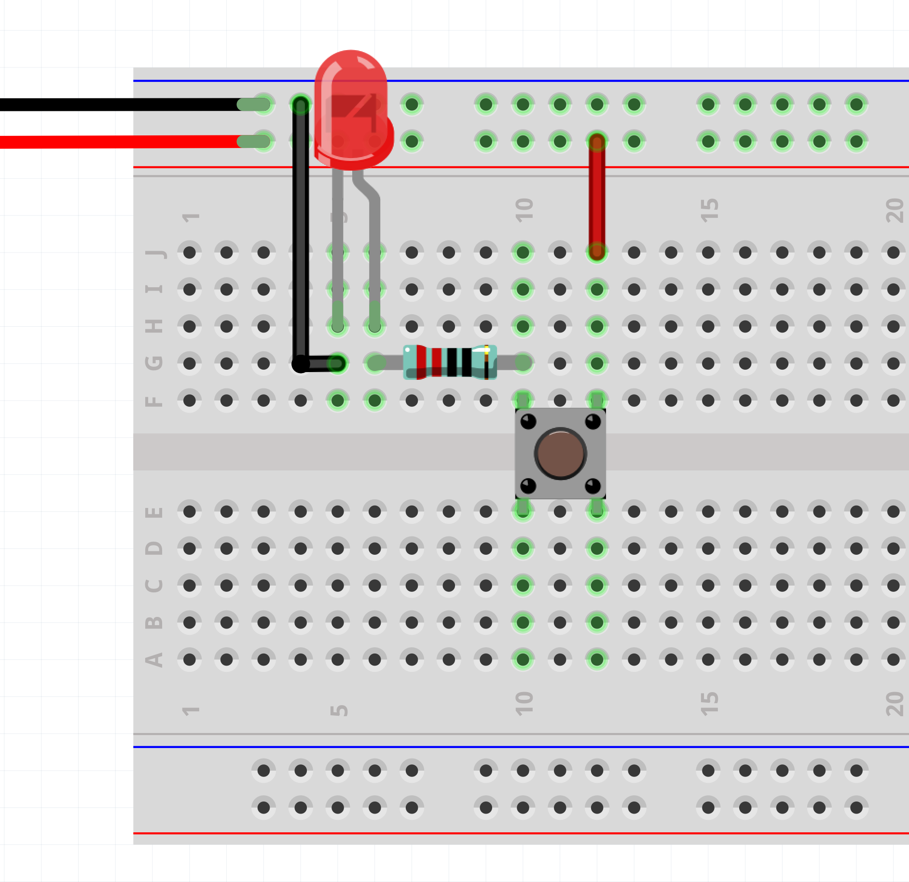

# Electronics: Breadboard

---

Breadboards are used to prototype and test your circuits before having to solder anything permanently. I like to think of the breadboard as a sketchbook for electronics. All my projects always start on a breadboard, but you should always aim to get rid of the breadboard when your project is ready.


Breadboards are great for prototyping, but they are also very prone to noise and it’s very easy for things to accidentally disconnect.


Inside a breadboard you will find metal strips that connect sets of holes together. The holes are spaced in a way that many commonly used parts will fit snugly into place.

The long strips on the edges are usually used as power buses, where you hook up your positive and negative power terminals (often 5V and ground in our circuits). In some breadboards the power rails are marked with colors and symbols.

