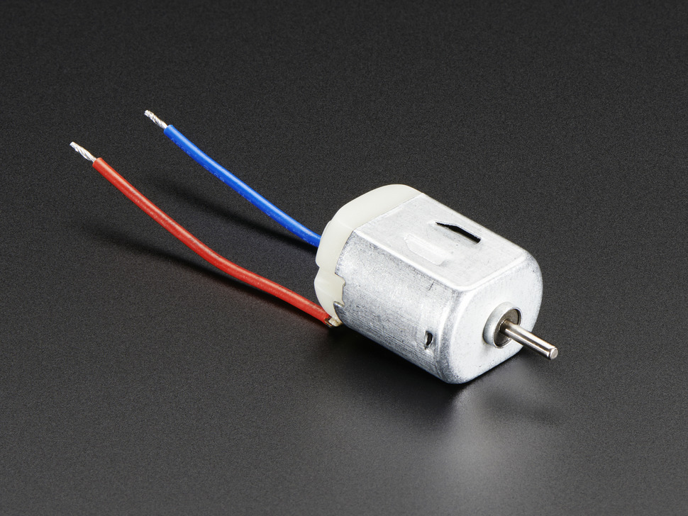
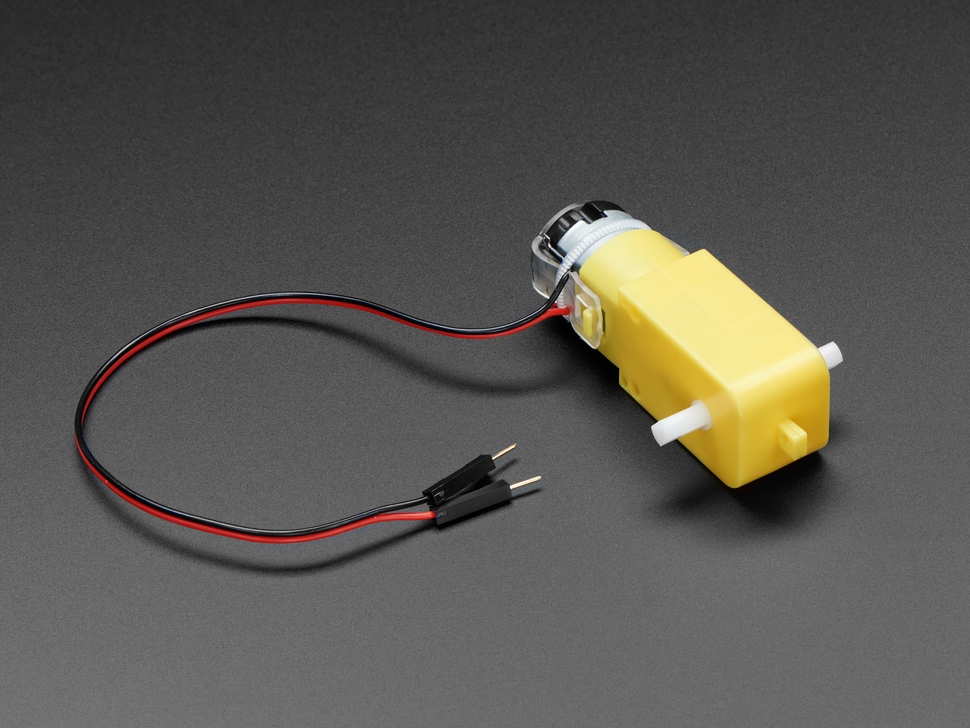

## DC Motors at Aalto Mechatronics

### Standard DC Motors

- Usually just 2 wires
- You can control the speed and direction. The direction depends on which terminal of the motor you connect to + and – of your power supply
- Use a transistor or an H-Bridge circuit to control
- On the Arduino you can just use digitalWrite() and analogWrite()
- A standard brushed DC motor usually has a very high rpm, but very low torque. Some sort of gear system is usually required for real-life applications.

### TT Motor

- 3–6V DC
- About 250 rpm
- Cheap
- Plastic gears
- You have these in your Physical Computing kit

### 12V DC Motors

- Stronger
- Different gear ratios (slower rpm means higher torque)
- We have at least 50 rpm and 1 rpm motors

## How to control DC Motors?

### Powering directly | Switch | Relay (ON/OFF)

### Transistors (ON/OFF and Speed)

If you want to take one step further in the level of control you can move on to transistors. Transistors can be controlled with a PWM signal to control the speed of a motor. See the Transistor page for more specific details on transistors.

#### TIP120

Here is an example with the

#### N-Channel Mosfet

Mosfets are more efficient than standard BJT or Darlington transistors which means that they don't get as hot and don't waste as much energy. They need to be connected in a slightly different way than the TIP120 transistor.

### H-Bridge (ON/OFF, Speed, Direction)

---

## Examples