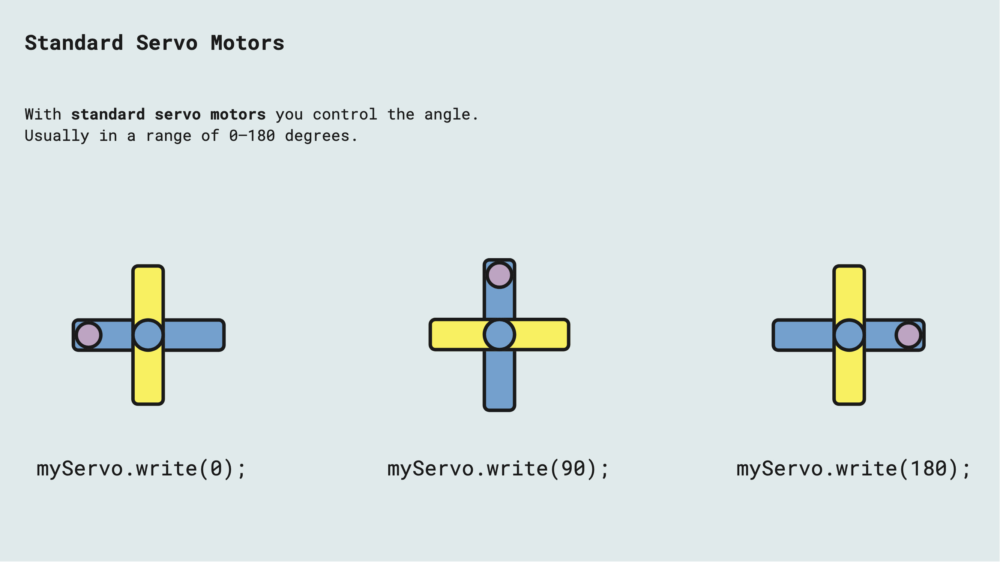

# Servo Motors

---

- Servo motors usually have 3 wires (VCC,GND,DATA)
- No need for special controlling circuits if you have an Arduino
-  Needs a PWM signal for controlling it
- In Arduino you can use the Servo library
- Small servo motors will be ok to power from the Arduino 5V (max 500 mA), but it is recommended to always use an external power supply
- Standard servo motors are usually limited to a range between 0-180 degrees, but continuous and multi-turn servos also exist

