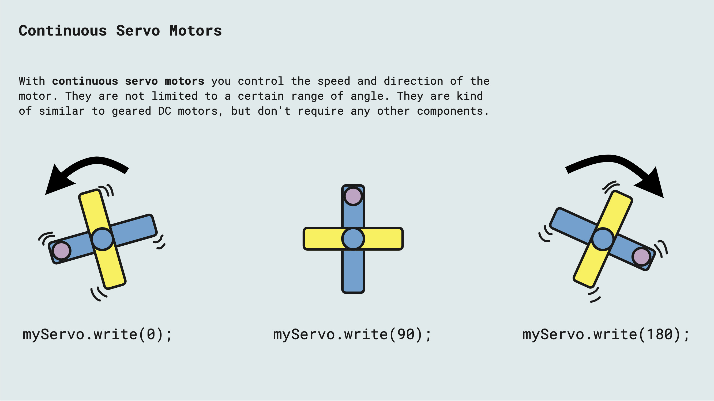

[

- Servo motors usually have 3 wires (VCC,GND,DATA)
- No need for special controlling circuits if you have an Arduino
-  Needs a PWM signal for controlling it
- In Arduino you can use the Servo library
- Small servo motors will be ok to power from the Arduino 5V (max 500 mA), but it is recommended to always use an external power supply
- Standard servo motors are usually limited to a range between 0-180 degrees, but continuous and multi-turn servos also exist

---

## TowerPro SG92R

The servo motor in the Physical Computing kit is the TowerPro SG92R

- Weight: 9g
- Dimension: 23×12.2x27mm
- Stall torque: 2.5kg /cm(4.8v)
- Gear type: POM with carbon fiber
- Operating speed: 0.1sec /60degree (4.8v)
- Operating voltage: 4.8v
- Temperature range: 0°C to 55°C
- Dead band width:1us
- servo wire length: 25 cm
- Servo Plug: JR (Fits JR and Futaba)
- servo arms &screws included and fit with Futaba servo arm
- It’s universal “S” type connector that fits most receivers, including Futaba, JR, Hitec ,GWS, Cirrus, Blue Bird, Blue Arrow, Corona, Berg, Spektrum.
- CE &RoHS approved

---

- [Arduino Servo Library](https://www.arduino.cc/reference/en/libraries/servo/)
- [Arduino Servo Examples](https://docs.arduino.cc/learn/electronics/servo-motors#hardware-required)