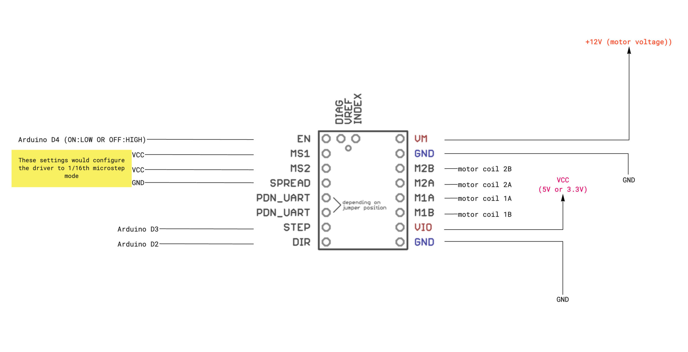

# Stepper Motors

---


## How to control stepper motors?

### SilentStepStick TMC 2209

#### Links and Resources

- [See the Watterott tutorial](https://learn.watterott.com/silentstepstick/)
- [Product Page from the manufacturer](https://www.trinamic.com/products/integrated-circuits/details/tmc2209-la/)
- [Download the datasheeet](https://newmedia.dog/wp-content/uploads/2019/11/SilentStepStick-TMC2209_v20.pdf)


#### Step Configuration

| CFG2/MS2 | CFG1/MS1 | SPREAD/MS3 | Steps | Interpolation | Mode |
| --- | --- | --- | --- | --- | --- |
| GND | GND | GND | 1/8 | 1/256 | stealthChop |
| GND | VIO | GND | 1/32 | 1/256 | stealthChop |
| VIO | GND | GND | 1/64 | 1/256 | stealthChop |
| VIO | VIO | GND | 1/16 | 1/256 | stealthChop |
| GND | GND | VIO | 1/8 | 1/256 | spreadCycle |
| GND | VIO | VIO | 1/32 | 1/256 | spreadCycle |
| VIO | GND | VIO | 1/64 | 1/256 | spreadCycle |
| VIO | VIO | VIO | 1/16 | 1/256 | spreadCycle |

#### Circuit

[](./img/stepsticksimple-scaled.jpg)

#### Code

This is a simple test code for the stepper motor controller

```c
int enPin = 4;
int dirPin = 2;
int stepPin = 3;
int stepAmount = 400;
int microSteps = 16; // 16 means 1/16, 32 means 1/32 etc.

void setup() {
  // put your setup code here, to run once:
  pinMode(dirPin, OUTPUT);
  pinMode(stepPin, OUTPUT);
  pinMode(enPin, OUTPUT);
  digitalWrite(dirPin, HIGH);
  digitalWrite(enPin, LOW);
}

void loop() {
  oneFullRotation();
  delay(1000);
}

void oneStep() {
  digitalWrite(stepPin, HIGH);
  delayMicroseconds(100);
  digitalWrite(stepPin, LOW);
  delayMicroseconds(100);
}

void oneFullRotation() {
  for (int i = 0; i < stepAmount * microSteps; i++) {
    oneStep();
  }
}
```

---

You can also use the vibration of the stepper motors as a feature. [Koka Nikoladze is the master of this.](https://www.koka.one/)





Other types of motors can also be tuned to play music:



