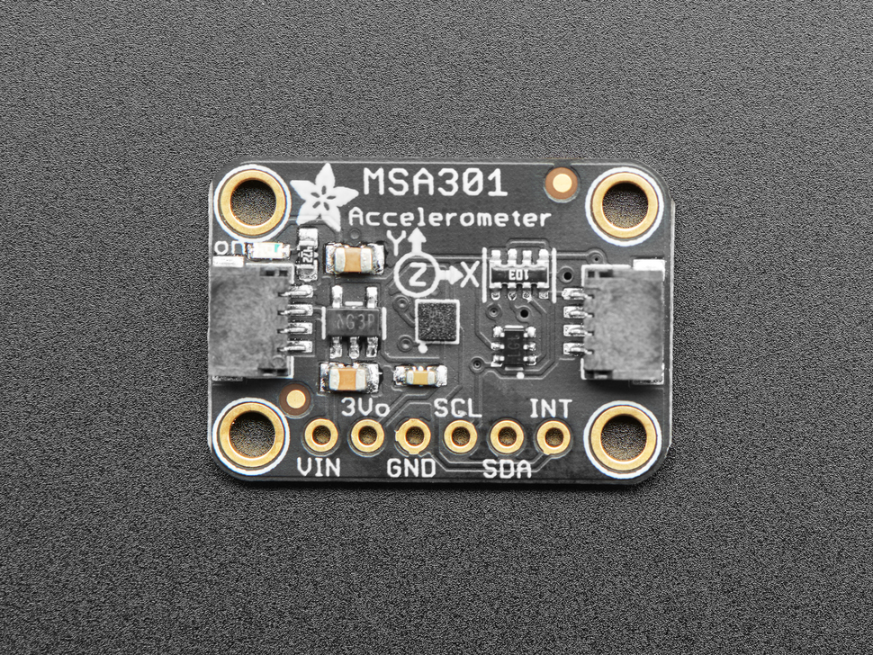
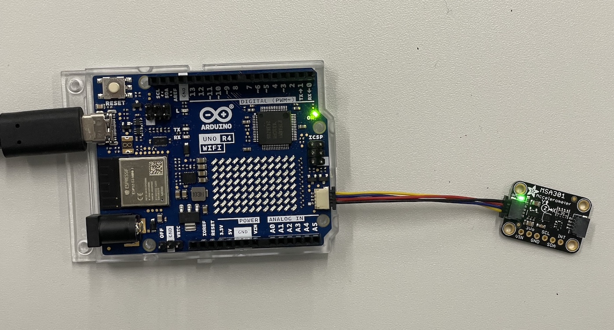

[](./images/msa301.jpg)

The MSA301 is a super small and low cost triple-axis accelerometer. It's inexpensive, but has just about every 'extra' you'd want in an accelerometer:

- Three axis sensing, 14-bit resolution
- ±2g/±4g/±8g/±16g selectable scaling
- I2C interface on fixed I2C address 0x26
- Interrupt output
- Multiple data rate options from 1 Hz to 500 Hz
- As low as 2uA current draw in low power mode (just the chip itself, not including any supporting circuitry)
- Tap, Double-tap, orientation & freefall detection

## Links and Resources

- Datasheet of the sensor
- [Adafruit tutorial for the breakout board](https://learn.adafruit.com/msa301-triple-axis-accelerometer)
- [Adafruit product page](https://www.adafruit.com/product/4344)

## Connecting the Sensor

These sensors come with a very handy connector that allows us to use it without any soldering or having to use the breadboard.

### Using the Qwiic/STEMMA QT connector

Just use a Qwiic/STEMMA QT cable to connect the sensor to your board. It does not matter which of the connectors you use, they are all connected together.

[](./images/msa301-qwiic.jpg)

### Connecting directly to the pins

Sometimes you might not have the connector on your microcontroller so you need to wire it up manually. This is also quite simple:

- **VIN** - this is the power pin.  To power the board, give it the same power as the logic level of your microcontroller - e.g. for a 5V micro like Arduino, use 5V
- **3Vo** - this is the 3.3V output from the voltage regulator, you can grab up to 100mA from this if you like
- **GND** – common ground for power and logic, connect to GND on your board
- **SCL** - I2C clock pin, connect to your microcontrollers I2C clock line. The logic level is the same as VIN and it has a 10K pullup already on it.
- **SDA** - I2C data pin, connect to your microcontrollers I2C data line. The logic level is the same as VIN. and it has a 10K pullup already on it.
- **INT** - This is the interrupt pin. You can setup the MSA301 to pull this low when certain conditions are met such as taps being detected.

## Recommended Library

Use the Adafruit MSA301 Library.

## I2C Bus on the Uno R4 boards


**Please note! The default examples do not work directly with the Qwiic connectors on the Arduino Uno R4 WiFi boards.** This due to the fact that the R4 boards have a different I2C port connected to the Qwiic connectors. We need to somehow configure the library for each sensor to use `Wire1` I2C bus instead of the default one (`Wire`). Each library does this slightly differently, I try to provide the details for all the sensors that you have in your Physical Computing kit, but for many other devices, you need to figure this out on your own.

[See this page for details](https://docs.arduino.cc/tutorials/uno-r4-wifi/qwiic)

This is quite often done in the `begin()` method in the libraries.

```c
Wire1.begin();
libraryName.begin(&Wire1);
```

**Sometimes** there is a specific method to switch the I2C bus.

```c
Wire1.begin();
libraryName.begin();
libraryName.setBus(&Wire1);
```



### Selecting Wire1 I2C Bus with the Adafruit MSA301 Library


For the **Adafruit AHT20** sensor breakout boards, you do it like this:

```c
msa.begin(MSA301_I2CADDR_DEFAULT, &Wire1)
```

The `&` means that we are passing a reference to the address of the variable. This is a pretty confusing and complicated topic, but you can read up on it:

- [Pointers (Wikipedia)](https://en.wikipedia.org/wiki/Pointer_%28computer_programming%29)
- [Pointer Access Operator &](https://www.arduino.cc/reference/en/language/structure/pointer-access-operators/reference/)



## Full example code
```c
// Basic demo for plotting accelerometer readings from Adafruit MSA301

#include <Wire.h>
#include <Adafruit_MSA301.h>
#include <Adafruit_Sensor.h>

Adafruit_MSA301 msa;

void setup(void) {
  Serial.begin(115200);
  while (!Serial) delay(10);     // will pause Zero, Leonardo, etc until serial console opens

  Serial.println("Adafruit MSA301 test!");
  
  // Try to initialize!
  if (! msa.begin(MSA301_I2CADDR_DEFAULT, &Wire1)) {
    Serial.println("Failed to find MSA301 chip");
    while (1) { delay(10); }
  }
  Serial.println("MSA301 Found!");
}

void loop() {

  /* Get a new sensor event, normalized */ 
  sensors_event_t event; 
  msa.getEvent(&event);
  
  /* Display the results (acceleration is measured in m/s^2), with commas in between */
  Serial.print(event.acceleration.x);
  Serial.print(", "); Serial.print(event.acceleration.y); 
  Serial.print(", "); Serial.print(event.acceleration.z); 
  Serial.println();
 
  delay(10); 
}
```
