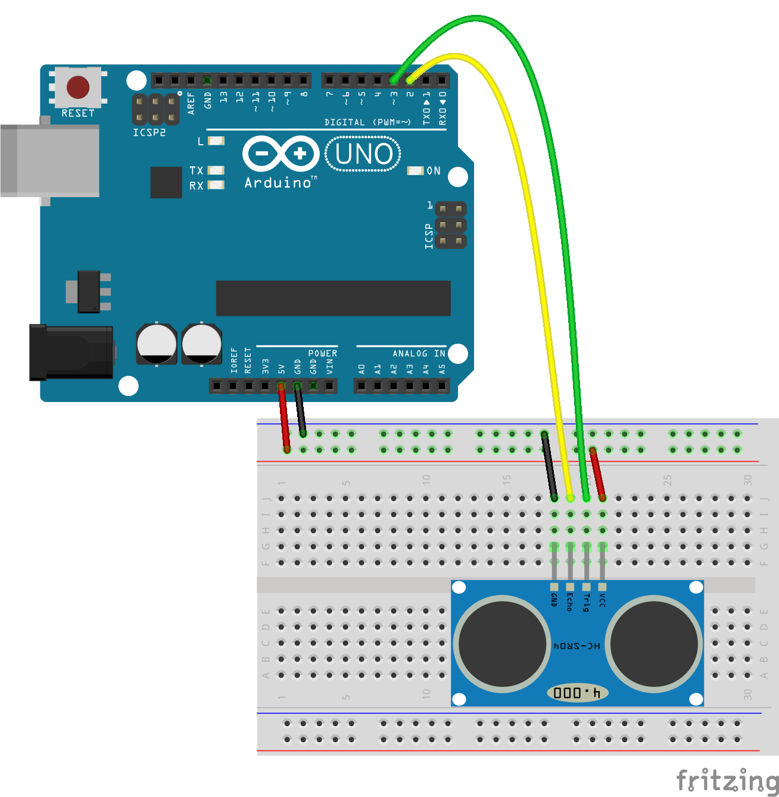

The HC-SR04 is a low-cost ultrasonic ranging sensor for measuring distances between 2–400cm. It is not the most accurate sensor and it can give a bit erratic readings sometimes, especially when the detected object is soft and uneven. It still does a fairly good job in most cases when you need to know how far a person or an object is from your sensor.

## Features

- Operating Voltage: 5V DC
- Operating Current: 15mA
- Measure Angle: 15°
- Ranging Distance: 2cm – 4m

## How does it work?

There are two ultrasonic transducers on the sensor board. One of them (connected to the trigger pin) is used to transmit a pulse, and the other one (connected to the echo pin) reads the reflected sound wave.

Since we know the speed of sound (about 343 m/s), it is possible to calculate the distance of the object based on the time that it took for the wave to get reflected back to the sensor.

## How to Use It With the Arduino?

You need to connect 4 pins:

- VCC to 5V
- GND to GND
- Trig to one of the digital pins of the Arduino (pin 3)
- Echo to one of the digital pins of the Arduino (pin 2)

[](./images/hc-sr04_bb.png)

```c
#define TRIG_PIN 3
#define ECHO_PIN 2

long duration;
int distance;

void setup() {
  Serial.begin(9600);
  // Ultrasonic sensor pinModes
  pinMode(TRIG_PIN, OUTPUT);
  pinMode(ECHO_PIN, INPUT);
}

void loop() {
  // read the HC-SR04 ultrasonic sensor
  // the boolean parameter just sets if you want to print the value or not
  // the number sets the maximum distance that you want to use. Use 400 or lower.
  distance = readUltrasonic(true, 400);
// the manufacturer recommends over 60ms reading cycle
  delay(60);
}


int readUltrasonic(bool shouldPrint, int maxDistance) {
  // Clear the TRIG_PIN
  digitalWrite(TRIG_PIN, LOW);
  delayMicroseconds(2);

  // Set the TRIG_PIN HIGH for 10 microseconds
  digitalWrite(TRIG_PIN, HIGH);
  delayMicroseconds(10);
  digitalWrite(TRIG_PIN, LOW);

  // Read the ECHO_PIN, returns the sound wave travel time in microseconds
  duration = pulseIn(ECHO_PIN, HIGH);

  // Calculate the distance
  // The calculation we use below is an approximation of the real formula:
  // duration * 0.034 / 2.0
  // (0.017 equals roughly to 1/58)
  // We do it this way to avoid having to use floating point numbers.
  int tempDistance = duration / 58;

  // sometimes the sensor gives strange values. This just ignores all values larger than the maxDistance.
  if (tempDistance < maxDistance) {
    return tempDistance;
  }else{
    return distance;
  }
}
```