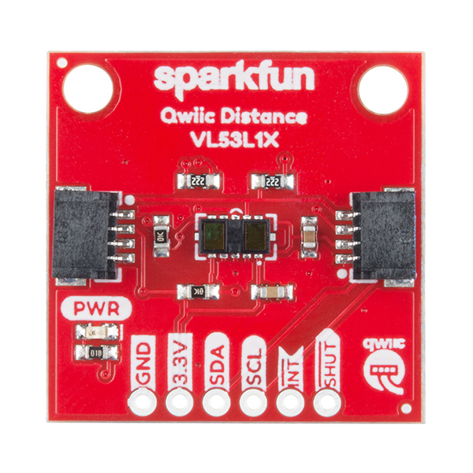
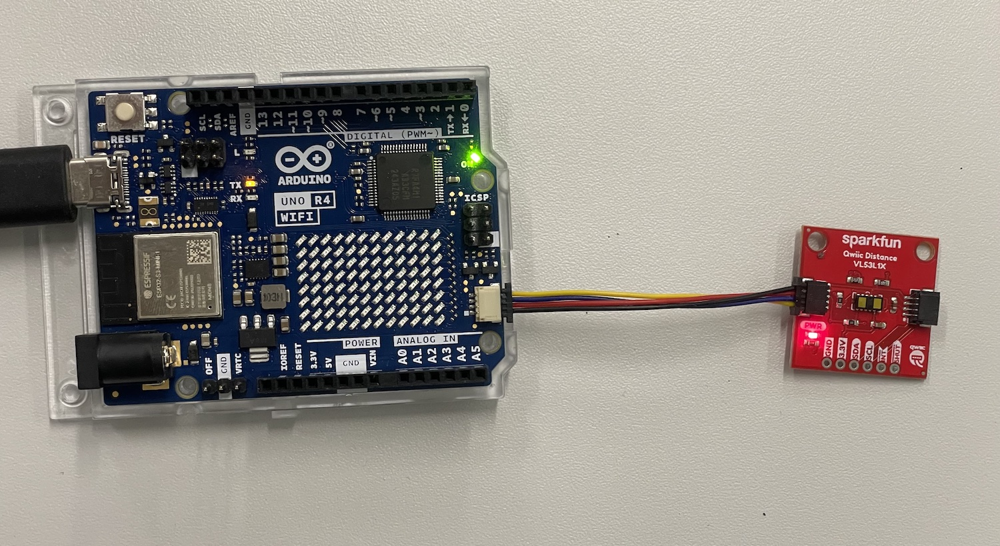
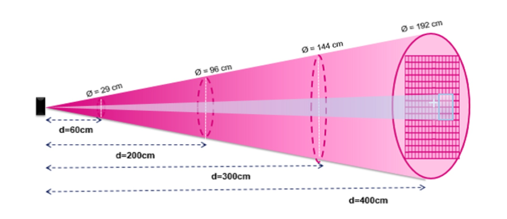
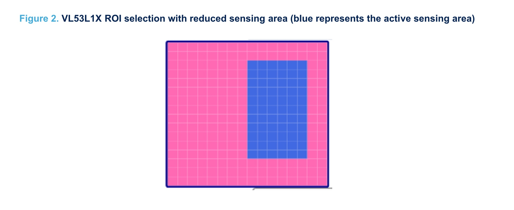
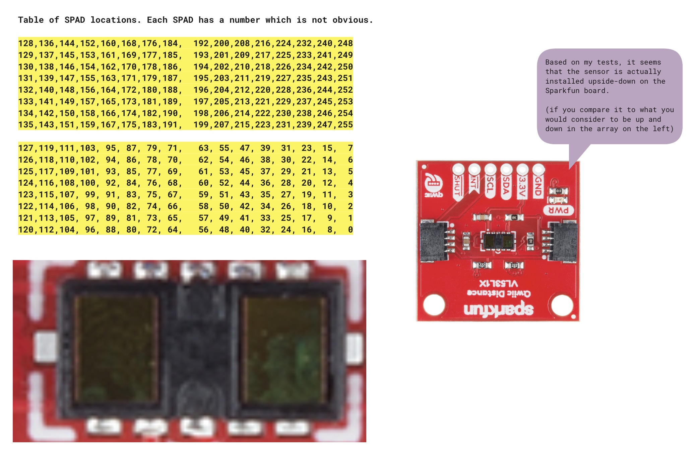
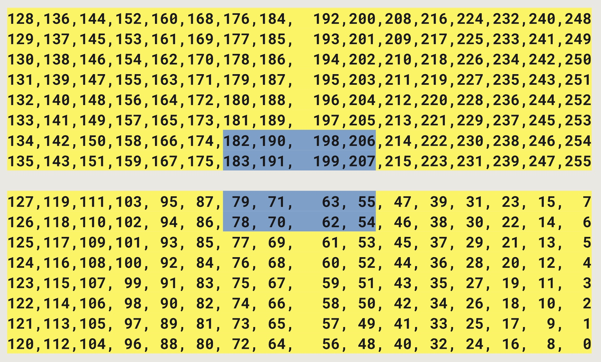
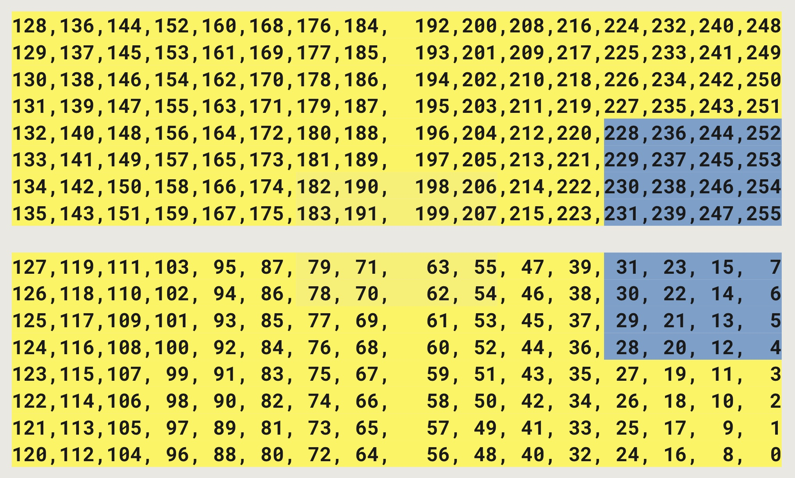

[](./images/VL53L1X.jpg)

## Features

The VL53L1X is a Time of Flight (ToF) module that is able to measure the distance to an object

- Operating Voltage: 2.6V-3.5V
- Power Consumption: 20 mW @10Hz
- Measurement Range: ~40mm to 4,000mm
- Resolution: +/-1mm
- Light Source: Class 1 940nm VCSEL
- 7-bit unshifted I2C Address: 0x29
- Field of View: 15° - 27°
- Max Read Rate: 50Hz

## Links and Resources

- [Datasheet for the sensor](./files/VL53L1X_Datasheet.pdf)
- [API Guide for the sensor](./files/VL53L1X_API.pdf)
- [Sparkfun hookup guide](https://learn.sparkfun.com/tutorials/qwiic-distance-sensor-vl53l1x-vl53l4cd-hookup-guide)
- [Sparkfun product page](https://www.sparkfun.com/products/14722)
- Other manufacturers:
  - [Pololu](https://www.pololu.com/product/3415)

---

## Connecting the Sensor

These sensors come with a very handy connector that allows us to use it without any soldering or having to use the breadboard.

### Using the Qwiic/STEMMA QT connector

Just use a Qwiic/STEMMA QT cable to connect the sensor to your board. It does not matter which of the connectors you use, they are all connected together.

[](./images/VL53L1X-qwiic.jpg)

### Connecting directly to the pins

Sometimes you might not have the connector on your microcontroller so you need to wire it up manually. This is also quite simple:

- **VIN** - this is the power pin.  To power the board, give it the same power as the logic level of your microcontroller - e.g. for a 5V micro like Arduino, use 5V
- **3.3V** - this is the 3.3V output from the voltage regulator, you can grab up to 100mA from this if you like
- **GND** – common ground for power and logic, connect to GND on your board
- **SCL** - I2C clock pin, connect to your microcontrollers I2C clock line. The logic level is the same as VIN and it has a 10K pullup already on it.
- **SDA** - I2C data pin, connect to your microcontrollers I2C data line. The logic level is the same as VIN. and it has a 10K pullup already on it.
- **INT** - Interrupt, goes low when data is ready.
- **SHUT** - Shutdown, can be pulled low to put the IC in shutdown mode.

---

## Recommended Library

There are many libraries for this sensor. All of them should work.

- **Recommended: Pololu VL53L1X**
- Sparkfun VL53L1X

### Using the Pololu library

The Pololu library for VL53L1X is the best one that I have tested. It has been the most reliable ad most of the sensors features are available for configuring through the library.

#### Install

1. Go to the Libraries
2. Search for VL53L1X
3. It should be named just with the part number and it should say that it's made by Pololu

## I2C Bus on the Uno R4 boards


**Please note! The default examples do not work directly with the Qwiic connectors on the Arduino Uno R4 WiFi boards.** This due to the fact that the R4 boards have a different I2C port connected to the Qwiic connectors. We need to somehow configure the library for each sensor to use `Wire1` I2C bus instead of the default one (`Wire`). Each library does this slightly differently, I try to provide the details for all the sensors that you have in your Physical Computing kit, but for many other devices, you need to figure this out on your own.

[See this page for details](https://docs.arduino.cc/tutorials/uno-r4-wifi/qwiic)

This is quite often done in the `begin()` method in the libraries.

```c
Wire1.begin();
libraryName.begin(&Wire1);
```

**Sometimes** there is a specific method to switch the I2C bus.

```c
Wire1.begin();
libraryName.begin();
libraryName.setBus(&Wire1);
```



### Selecting Wire1 I2C Bus with the Pololu VL53L1X Library


For the **Sparkfun VL53L1X** sensor breakout boards, you do it like this:

```c
Wire1.begin();
Wire1.setClock(400000); // use 400 kHz I2C
sensor.setBus(&Wire1);
sensor.init();
```


## Full example code
```c
/*
This example shows how to take simple range measurements with the VL53L1X. The
range readings are in units of mm.
*/

#include <Wire.h>
#include <VL53L1X.h>

VL53L1X sensor;

void setup()
{
  while (!Serial) {}
  Serial.begin(115200);
  Wire1.begin();
  Wire1.setClock(400000); // use 400 kHz I2C
  sensor.setBus(&Wire1);
  sensor.setTimeout(500);

  if (!sensor.init())
  {
    Serial.println("Failed to detect and initialize sensor!");
    while (1);
  }
  
  // Use long distance mode and allow up to 50000 us (50 ms) for a measurement.
  // You can change these settings to adjust the performance of the sensor, but
  // the minimum timing budget is 20 ms for short distance mode and 33 ms for
  // medium and long distance modes. See the VL53L1X datasheet for more
  // information on range and timing limits.
  sensor.setDistanceMode(VL53L1X::Long);
  sensor.setMeasurementTimingBudget(50000);

  // Start continuous readings at a rate of one measurement every 50 ms (the
  // inter-measurement period). This period should be at least as long as the
  // timing budget.
  sensor.startContinuous(50);
}

void loop()
{
  Serial.print(sensor.read());
  if (sensor.timeoutOccurred()) { Serial.print(" TIMEOUT"); }

  Serial.println();
}

```

---

## Details

### Field of View (FoV) of the sensor

The sensor sees the world basically as a cone shape. 4 meters away the cone has a diameter of 192cm!

[](./images/cone.jpg)

### Region of Interest (ROI)

We can limit this cone to a smaller area by using the ROI setting of the sensor.

[](./images/roi.jpg)

Using the ROI seems to be a little complicated at first but it is actually quite simple. There are two steps to define the ROI using the Pololu library:

1. Set the center of the Region of Interest (ROI)
2. Set the width and height of the ROI
  - Minimum 4x4
  - Maximum 16x16
  - Note that you have to take into account where the center is, you cannot go beyond the edges of the grid.

The photon detector is made up of a 16 x 16 array of SPADs (single photon avalanche diode). Each SPAD is identified by a number as shown in the table below.

[](./images/spad.jpg)

#### 4x4 ROI

Let's say you want to set the ROI to be only the blue area. You would set the code like below (using the Pololu library).

[](./images/roi-4-4.jpg)

```c
sensor.setROICenter(199);
sensor.setROISize(4, 4);
```

Why 199? We have an even value as width and height (4). Since the actual center value of an even number would be in-between the SPADs, we cannot directly say that.

We must choose the closest value that is to the right and up of the actual center. In this case it's 199.

#### 4x8 ROI

Let's say you want to set the ROI to be only the blue area. You would set the code like below (using the Pololu library)

[](./images/roi-4-8.jpg)

```c
sensor.setROICenter(247);
sensor.setROISize(4, 8);
```

Why 247? We have even values as width (4) and height (8). Since the actual center value of an even number would be in-between the SPADs, we cannot directly say that.

We must choose the closest value that is to the right and up of the actual center. In this case it's 247.