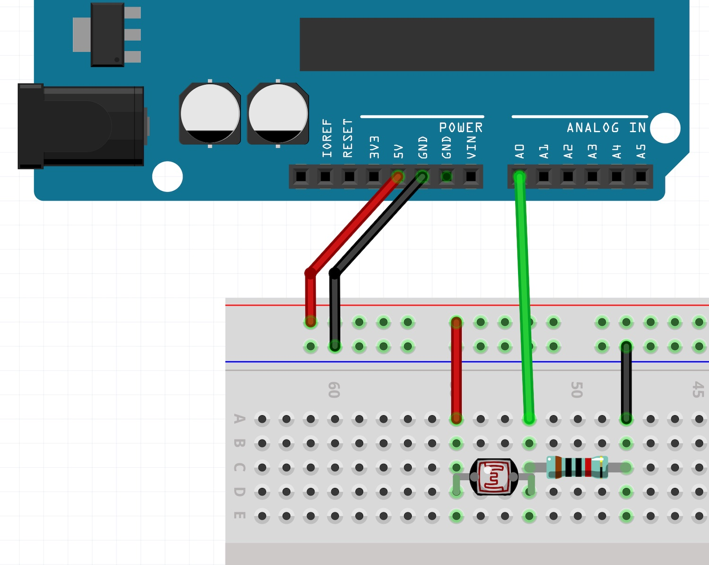
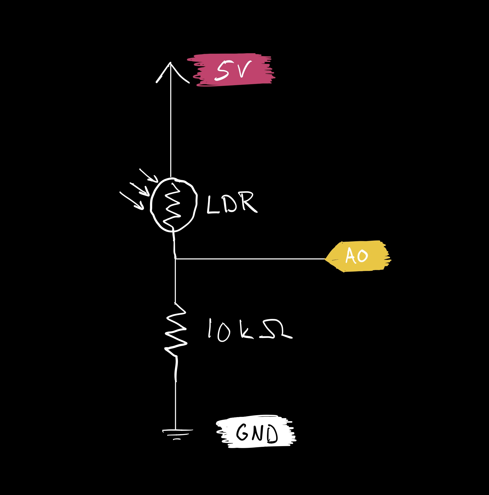

The following circuit can be used to read the values from various sensors, such as the light sensor we are using.

[](./images/ldr.jpg)

[](./images/ldr_schematic.jpg)

```c
// Read and display the value from the light sensor.

int lightSensor = 0;

void setup() {
  // put your setup code here, to run once:
  Serial.begin(9600);
}

void loop() {
  // put your main code here, to run repeatedly:
  lightSensor = analogRead(A0);
  Serial.print("light: ");
  Serial.println(lightSensor);
  // slow down the loop
  delay(1);
}
```