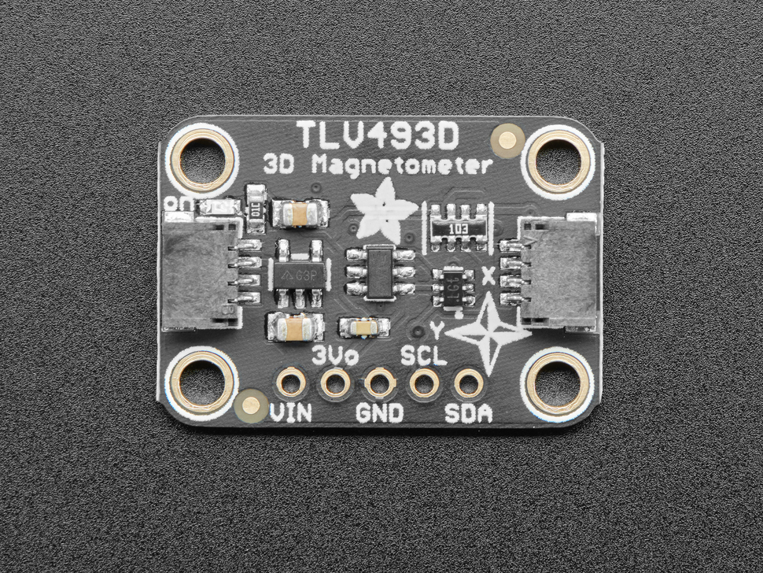
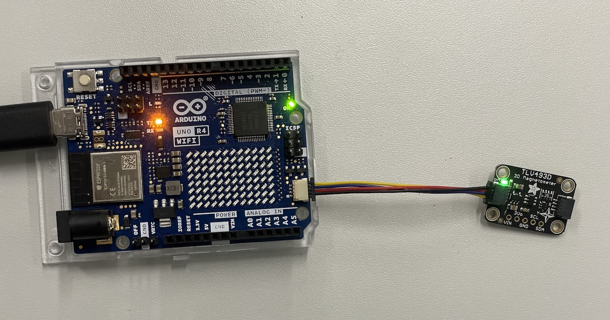

[](./images/tlv493d.jpg)

>The TLV493D 3-axis magnetometer is a great little sensor for detecting magnets in 3D. In fact, the manufacturer Infineon suggests it could be used to make a joystick! You could also use it for other cool things like detecting objects with magnets attached, like the lid of a box, or maybe a statue that unlocks your secret lair when placed on your mantle?
>
>The TLD493D excels at measuring nearby magnetic fields in three dimensions. It's not going to make a good compass, it's not sensitive enough to pick up the Earth's magnetic field, but you can use it to track the movement of nearby magnets in three dimensions. 

- Digital output via 2-wire based standard I2C interface up to 1 MBit/sec
- 12-bit data resolution for each measurement direction
- Bx, By, and Bz linear field measurement up to +130 mT
- Excellent matching of X/Y measurement for accurate angle sensing

## Links and Resources

- Datasheet of the sensor
- [Adafruit tutorial for the breakout board](https://learn.adafruit.com/adafruit-tlv493-triple-axis-magnetometer)
- [Adafruit product page](https://www.adafruit.com/product/4366)
- [Arduino Library](https://github.com/Infineon/TLV493D-A1B6-3DMagnetic-Sensor)

## Connecting the Sensor

These sensors come with a very handy connector that allows us to use it without any soldering or having to use the breadboard.

### Using the Qwiic/STEMMA QT connector

Just use a Qwiic/STEMMA QT cable to connect the sensor to your board. It does not matter which of the connectors you use, they are all connected together.

[](./images/tlv493d-qwiic.jpg)

### Connecting directly to the pins

Sometimes you might not have the connector on your microcontroller so you need to wire it up manually. This is also quite simple:

- **VIN** - this is the power pin.  To power the board, give it the same power as the logic level of your microcontroller - e.g. for a 5V micro like Arduino, use 5V
- **3Vo** - this is the 3.3V output from the voltage regulator, you can grab up to 100mA from this if you like
- **GND** – common ground for power and logic, connect to GND on your board
- **SCL** - I2C clock pin, connect to your microcontrollers I2C clock line. The logic level is the same as VIN and it has a 10K pullup already on it.
- **SDA** - I2C data pin, connect to your microcontrollers I2C data line. The logic level is the same as VIN. and it has a 10K pullup already on it.

## Recommended Library

Use the TLV493D-A1B6 library from Infineon.

## I2C Bus on the Uno R4 boards


**Please note! The default examples do not work directly with the Qwiic connectors on the Arduino Uno R4 WiFi boards.** This due to the fact that the R4 boards have a different I2C port connected to the Qwiic connectors. We need to somehow configure the library for each sensor to use `Wire1` I2C bus instead of the default one (`Wire`). Each library does this slightly differently, I try to provide the details for all the sensors that you have in your Physical Computing kit, but for many other devices, you need to figure this out on your own.

[See this page for details](https://docs.arduino.cc/tutorials/uno-r4-wifi/qwiic)

This is quite often done in the `begin()` method in the libraries.

```c
Wire1.begin();
libraryName.begin(&Wire1);
```

**Sometimes** there is a specific method to switch the I2C bus.

```c
Wire1.begin();
libraryName.begin();
libraryName.setBus(&Wire1);
```



### Selecting Wire1 I2C Bus with the TLV493D-A1B6 Library


For the **Adafruit TLV493D** sensor breakout boards, you do it like this:

```c
Tlv493dMagnetic3DSensor.begin(Wire1);
```


## Full example code
```c
#include <Tlv493d.h>

// Tlv493d Opject
Tlv493d Tlv493dMagnetic3DSensor = Tlv493d();

void setup() {
  Serial.begin(9600);
  while(!Serial);
  Tlv493dMagnetic3DSensor.begin(Wire1);
  Tlv493dMagnetic3DSensor.setAccessMode(Tlv493dMagnetic3DSensor.MASTERCONTROLLEDMODE);
  Tlv493dMagnetic3DSensor.disableTemp();
}

void loop() {
  delay(Tlv493dMagnetic3DSensor.getMeasurementDelay());
  Tlv493dMagnetic3DSensor.updateData();

  Serial.print(Tlv493dMagnetic3DSensor.getX());
  Serial.print(" ; ");
  Serial.print(Tlv493dMagnetic3DSensor.getY());
  Serial.print(" ; ");
  Serial.println(Tlv493dMagnetic3DSensor.getZ());
}

```
