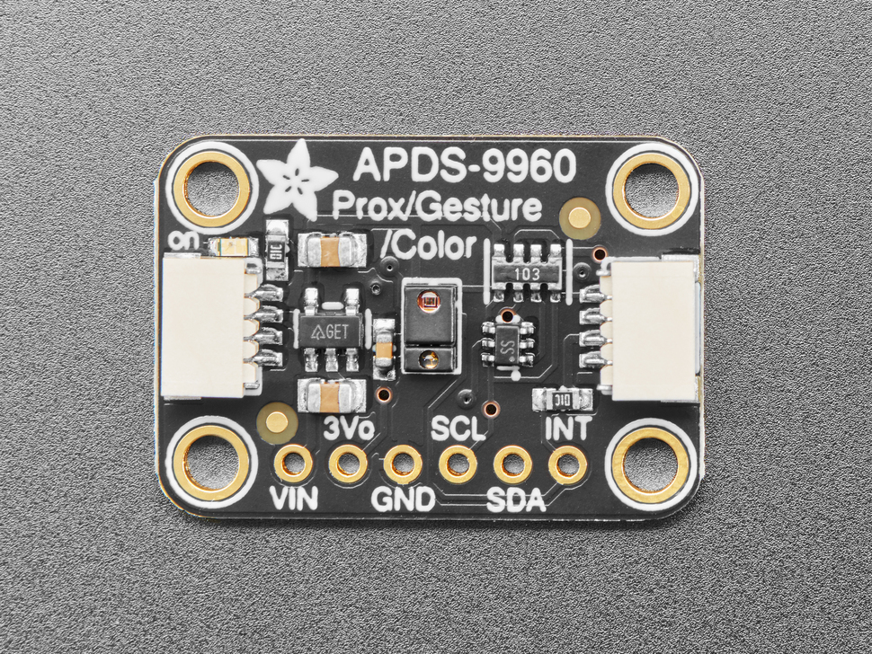

[](./images/apds9960.jpg)

This sensor has basic gesture sensing, RGB color sensing, proximity sensing, or ambient light sensing built into one. When connected to your microcontroller it can detect simple gestures (left to right, right to left, up to down, down to up are currently supported), return the amount of red, blue, green, and clear light, or return how close an object is to the front of the sensor.

The APDS9960 from Avago Technologies has an integrated IR LED and driver, along with four directional photodiodes that sense reflected IR energy from the LED. Its proximity detection feature allows it to measure the distance an object is from the front of the sensor (up to a few centimeters) with 8-bit resolution.

## Links and Resources

- [Datasheet of the sensor](./files/Avago-APDS-9960-datasheet.pdf)
- [Adafruit tutorial for the breakout board](https://learn.adafruit.com/adafruit-apds9960-breakout)
- [Adafruit product page](https://www.adafruit.com/product/3595)

## Connecting the Sensor

These sensors come with a very handy connector that allows us to use it without any soldering or having to use the breadboard.

### Using the Qwiic/STEMMA QT connector

Just use a Qwiic/STEMMA QT cable to connect the sensor to your board. It does not matter which of the connectors you use, they are all connected together.

[](./images/apds9960-qwiic.jpg)

### Connecting directly to the pins

Sometimes you might not have the connector on your microcontroller so you need to wire it up manually. This is also quite simple:

- **VIN** - this is the power pin.  To power the board, give it the same power as the logic level of your microcontroller - e.g. for a 5V micro like Arduino, use 5V
- **3Vo** - this is the 3.3V output from the voltage regulator, you can grab up to 100mA from this if you like
- **GND** – common ground for power and logic, connect to GND on your board
- **SCL** - this is the I2C clock pin, connect to your microcontrollers I2C clock line. There is a 10K pullup on this pin and it is level shifted so you can use 3-5VDC.
- **SDA** - this is the I2C data pin, connect to your microcontrollers I2C data line. There is a 10K pullup on this pin and it is level shifted so you can use 3-5VDC.
- **INT** - this is the interrupt-output pin. It is 3V logic and you can use it to detect when a new reading is ready or when a reading gets too high or too low.

## Recommended Library

Use the [Adafruit APDS9960 Library](https://github.com/adafruit/Adafruit_APDS9960). You should be able to find it directly from the library tool in Arduino IDE.

## I2C Bus on the Uno R4 boards


**Please note! The default examples do not work directly with the Qwiic connectors on the Arduino Uno R4 WiFi boards.** This due to the fact that the R4 boards have a different I2C port connected to the Qwiic connectors. We need to somehow configure the library for each sensor to use `Wire1` I2C bus instead of the default one (`Wire`). Each library does this slightly differently, I try to provide the details for all the sensors that you have in your Physical Computing kit, but for many other devices, you need to figure this out on your own.

[See this page for details](https://docs.arduino.cc/tutorials/uno-r4-wifi/qwiic)

This is quite often done in the `begin()` method in the libraries.

```c
Wire1.begin();
libraryName.begin(&Wire1);
```

**Sometimes** there is a specific method to switch the I2C bus.

```c
Wire1.begin();
libraryName.begin();
libraryName.setBus(&Wire1);
```



### Selecting Wire1 I2C Bus with the Adafruit APDS9960 Library


For the **Adafruit APDS9960** sensor breakout boards, you do it like this:

```c
apds.begin(10, APDS9960_AGAIN_4X, APDS9960_ADDRESS, &Wire1);
```

The `&` means that we are passing a reference to the address of the variable. This is a pretty confusing and complicated topic, but you can read up on it:

- [Pointers (Wikipedia)](https://en.wikipedia.org/wiki/Pointer_%28computer_programming%29)
- [Pointer Access Operator &](https://www.arduino.cc/reference/en/language/structure/pointer-access-operators/reference/)



## Full example code - Color Sensor
```c

void setup(void) {
}

void loop() {

}
```
